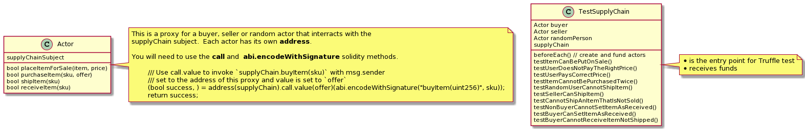
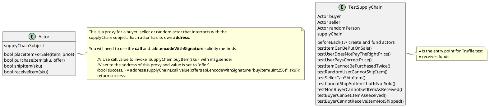

# Supply Chain example Solidity

## Truffle Sequence diagrams

Sequence generated from test transactions.  The hope is readers will be able to
reason about the contracts easier by having a another perspective besides
solidity code and test output.  These diagrams are best viewed with [pegmatite
chrome
plugin](https://chrome.google.com/webstore/detail/pegmatite/jegkfbnfbfnohncpcfcimepibmhlkldo)

  - [Javascript tests](./truffle-seq/long/supply_chain.test.md)
  - [Solidity tests](./truffle-seq/long/testsupplychain.md)

## Solidity testing

Use a proxy pattern where the proxy communicates to the test supplyChain
subject on behalf of the test runner. In the diagram below TestSupplyChain is
the test runner and multiple actors can be instanciated to fullfil the test
scenario.

TestSupplyChain

  - receives ether from Truffle in order to run transactions.
  - creates a testChain, buyer, seller and randomPerson proxy then registers an
    item for sale on the subject testChain

Each test will need
  - a testChain (the subject)
  - a buyer
  - a seller
  - an item and its price to be sold

### Proxy diagram

