Test date: 2021 Feb 07


## should add an item with the provided name and price
Tx: 0x603d5ee749c28c5fd47962ed69c42f8340cf02b8d3720a72ab1e6f53afa77feb

### diagram 1

[SVG :telescope:](https://www.planttext.com/api/plantuml/svg/ZP9DJnin48Rl_XKZkBIYg5xlTqHJqcLNz5Gak5VUzJYns7XNjXSb4Fvx9o5KAQVwOdliUJplExxsGRemhNl6v1G6EwrRT8pvHsD7wUGQUboYLJzazxXqmsHLDVI3W_EcRkggPkpAXssFSyPMA1KwU640juCppuCDib_qPcdNQ0DXTA2ZXi9lX75oOu_7qBrvHeWIsjr9fOnTGiJPAz6_lkFV-J-jDyjLyD1kuS5DMXE31HDwX8UDXLlfLpFWcup7AaNCax8JHPTgbUHb9b1bPPS8NSG9xpGNRQ7YN72P2zb6cEaqbbhckSQMtEW2LLd_Me3qS4Rp6ID3WkdCA4dF_JIE_RPQIMD_y-XmXs-IigYoDf9HqMHbsLGB5QL9Ysc-K3ojagGfUL55efsTP9ynjd_aSluHUN4nWswmFhXfNygdp_02JxAVaFJ1A_jmc_8FcCiPa5blJMDt9mKh3DBqdbqTM_Vb_8RVSCxdkszGKGiS2GOhrmWKe2Ouz7w_V49dj445kx-fyztXhHtvBBAuRaLJ5R6GIS5p4QKyYWMFerGtMCUBh6WmJWaAt_ybdDH_8FslTqSIoJkAf75Dy_uB_m40)


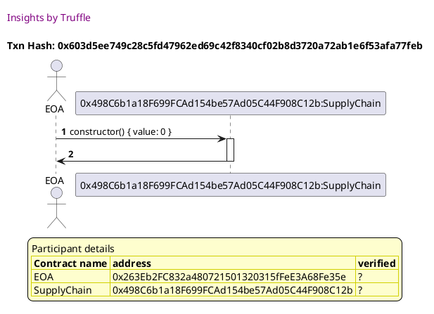

Tx: 0xe2d9a4f1c3697f82170f4885eba09a91d1f747ae7431d7c465341038ac50f811

### diagram 2

[SVG :telescope:](https://www.planttext.com/api/plantuml/svg/ZLFBRjim4BppAnRk8ItIeAIUfE6wSMG9oQa1adj0IPHDMAO4YYhinFdthcJ7S7EgBYjngDcPMVAsSzAwVbiJ8dlNc7wRAqj8jz6cbLPkeLOhPSexMMnMjkbDcJHrO-5BbcPfaX8owzo-LdD2ragMoi8R0RXlh7vjZ9FrejOhirN68Ktb4Cfm-SZGzhQjrMdfIRygO05-FSgor6O5Z99tPF_nGV_1_s0wlLgx3l8zFDk-gf23EErg1Syx0_UoMq-1xfHN2XbKhF0Z4LVSOp6j0iv3bKigf60bg-8WbYeEV5R6HH25Vi2epsKHqeepXcaK3bMclnSWEvXWdH0CnEb2jnBzFFLjM--JjTJcXR9n3zq5WYTHpYJZMIH4bYnA5WQv2kD5ISCa2391USAyV7hnzuIGeSdD_3FbzVKKC8m7fxPVly4R_95rhz0Rl1FJE3KcUfx3xFJo_LJdXv_Wzgq2h4PknpeIm84Se7DsoFW0BqSChlAcsLoDMA-Dyy9e05khYm5bb5B4y1Z0q9cGJqfH-sZXPWeugEE18OyNOPNAILrt5ogNT8caWye4nsynxBDCz6nLrusAbTMLLYKsdvsDZRqEEECeuYbVPbwLBcBgYuM_z9PIn3mLTx772f5mNmH9o77phtyPBlIFJFyxjnCJsZkPnESMwt1z_W80)


## should emit a LogForSale event when an item is added
Tx: 0x0ba4dd70ec994c7f8ea22c4091044e2576d24b194d8c9715b084d686e71f9442

### diagram 1

[SVG :telescope:](https://www.planttext.com/api/plantuml/svg/ZP9DKzim48Rl-XKxuT8EPIh9YZyoD2KOU-YfpC2z8rlhH8CZUsIPII3yTpOXT59ErKNIIljettTrDGJjmxXk6TDZwDouhj0pDZnQrsklrz3Y4fsvrlNZqdUZCtdNTXxEog8iyeAnoo5iMvmpja9jqCCB0xZjl7tkND3jehLBjqON2DC4EYef_4xeHz-tU0pTssS4eMXtfusnRWc2irUYV__0V_1_kS4kLs60QWiFVcmQOh1WGulmi75mguVL3FY6LrePat2iiqpLIPEYbh9MF1DSAPJJ93PILI9J9gspH4mhdYeJfp4ceicKakH67QZAulS2z00JcYUC30csjhqcFVTZtxVRVAMj-yF5uGxV440kD4_ZJ8auZaGUtLoRMAM9oYAUgIGIYrfAZhEJx0bZ-qSkvf-Hv-Spg3it13_kI_do5LxWIRSZaZvuPPzkK_u1Sp43CkkzQUpkf623GTjsO9V7rdqxk-4tdFFvxWVar09FWi7fDG85g0aUXs6_V49l6ui6TdzJvxl3MploMSPHKSaoJoEfLSeJAQPSH997OjgKM4IBE2qncX8KVlvBEAd_GFfVxuuaadSKIUEAvlqNVWC0)


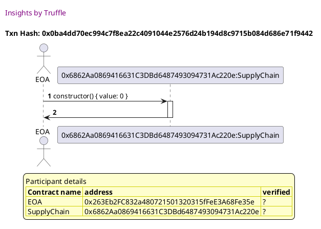

Tx: 0xfa960b637f85b598222924084e622cde7535fee8354a3178f6014ed6229f00d4

### diagram 2

[SVG :telescope:](https://www.planttext.com/api/plantuml/svg/ZLFHRfim57ttLrnr3ztKLJC6Z8coh8GGjK-hrBvN3fZ42XXap9IqwR_lGj8ewzDukU1ZpZtdNFkkSzAwlgu8aRrhJ5-lb2MasshJIYjhgDHQcM8ky-tQDhqfqgPgB7nPPiiipGYPTcvVgHaX6oKBPU6D0DmtLhysniaggVJQrCeuf2aTGajSFZAqlMqhTLfwqgyAl02_7cLHQBC6Zv9tPF_nGV_1_s0wlTwu3bPxUBPzMI87STfL2fvt1kvbjva0tPKovdJ5_QWKuIgC1MCiPW4LWUACvOMAGZyibH9-64ZVYqJ9gHUe0i6ufBG8C8tSeShiTmAoWokiLmG3SJhNhKG_JttRLljq8xLveTwuX-wuu2oHLF0uy3ZtlTHVp0iUY2Y8VHe7aUybEMDKJIx-lY9aQ78x-qnvSpC13EF1gVhhDtY3FxBg5Ng3Ts8QfyP4ptEOdbw-d-hiy1FSlbM0rSXwh2C17CW1EcU7Z0_mSiJWUjKqs-iHwxLnBEG3s5gT3wX7AKKCZm4CdGdvf1IrZnPk9u23EXuOydWHLg6Sr5LteN915qWwg4nn_1R3Fij4prPrtQXOMLrgLM3pwTdOsEk0C-PSP6AnP6MMHDIF4t_15ZAEH1RF8-RbSIhyE4X3WPj__SjmeV_8z9zpEp6XlPD9VEwm3jVdBm00)


## should allow someone to purchase an item and update state accordingly
Tx: 0x036b59b09a36849220b276431c8255f1fd9ae9896c20e83a3a6d676c007ca1f8

### diagram 1

[SVG :telescope:](https://www.planttext.com/api/plantuml/svg/ZP9DSziW48Rl_8eTvz9EcYaV4aQUr8qhIvEUcfdata4IifbWf44eOoVEV-_QSJfkJkK2BEp3lkzoCqGTuhXnXEWnTdxSL2OGCZnQt-kWD-3ColZcXwuVLw4RVPDthWjmKHPbaHU4N0znvyoSaBNHZGdmGW1kks2VEn-rMpYxyXlZ8sBQY4SbXjy8_HXwPqwXU_jiW2MukzDDO_qA62MlIF_wZd_d__I3NQtZ0DKE7iBOjiWWqKPdu67huLOFwndGBHMoIhEAPbf8bMISqufFPI9OhNYQjgnjCcqobScQKwE45besSYfhIgUrPgr2D-g8LHQ_5g07cE0y8MX8jBNjDUgv7_lUxVArjlutPSSxT9kfkkI26ffdIvMegbeADHL5jSWbozMoOGkMi5BosLdsX9338rVpZyZBondKdHzY60-bVFeCB_2atMXG7xoI3xSn_uYvcW6QzTOqSdTMS6EYjcuWrwVMVRbOqYMbTBx_1Zcs8A1Wy7fZ00FOX626uR1yCi6srZIm_viwtn_VsgFFNA8yNkPAS9qeEkKifKnmAbZQbgOG2wbA8rA4mlT_2MVr7qd_wzs9XF9E8d7Su7pumdy0)


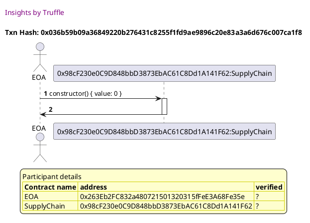

Tx: 0x2a1c1ca207852f5481ab6a2d1fd30358ec113949a0787469b394e2f8e7f6b70d

### diagram 2

[SVG :telescope:](https://www.planttext.com/api/plantuml/svg/ZLDRRvim57xthpZA7hgfgsO30HDbMIaNjK-hrBvN1anY1GmoPahQzB_lGD8ewzDuETZ7VEUxcDlU2cE7fYP43BRLGvDBGqY_LReJHZHGoxNKvPqejclJ3hgCsxery2LBipHE2LdsTb_B5I4RAKffu8q0tBT6lRRQYZggrLetKbk4gIosCjm-8dI3wMfvsdfIhnAOXwj7KPPAhu5HyexeFpxWF_0VTA_M6zj3leTdCrGLOX2hR2tXUQVXNlIR1T2T8rZ12k7GWC-TQkvn9d9VE2MhIfUwSouBnjpG2mKU23m_p74XdOhBeFBpW9ReHc6HPVex0j733EkCe25M5QeJgETfwBfw7s-4qY-KJMVeBkH5vhXKqZXCkCVpF75vuAPv5Fiivad98kQnp7SM5r_F21c7tAm-GrvVBm3DUB2o-VeDtk2Fg0U9sk2TwDRAoT5p3ilJo_TJNHr-Wjrt4h1gqKnr0e03EK1lpUZn0LwEFRZAstPxDVK6fQqpzyTcPrGnTXcb57ju3M2SJCWdfiXzad2p00pgU678uuLPfRH2rVq5ouGc23goZ35-WsQVQQ9c8_j-OYoDgfGiSVZoB6oQTS2CVP-dFCcSAeq2weQHcpY920EUXdU1muemvXXgFETu-DU_21Vy9wJ_pUs4XF9E8l6vnJh-Fdy1)


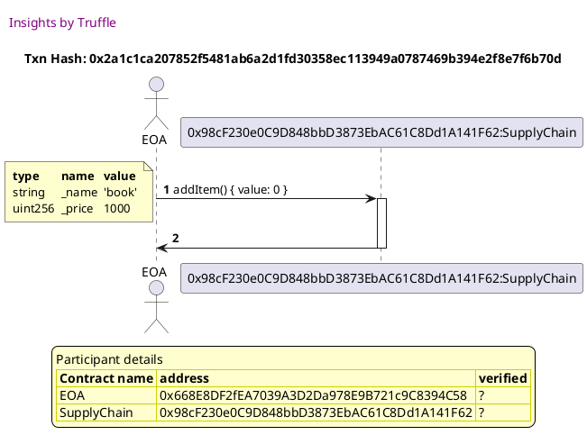

Tx: 0x8287f504721680fbb1acfe9a87396a524ffd8c264808f9f4767575b85d0528cd

### diagram 3

[SVG :telescope:](https://www.planttext.com/api/plantuml/svg/bPHTRvim58Rl_IkizMPJ5yqO0mPrMIaVQgzMgRsRfibWEx5A308pDMtwttT2qopjD2tZWWF6v_5vNnzpFZZHkt7L82H6rzfnLQaUeU7Es4xqOeKRjL1MNeZwRj6tevLPsxGzFYcBiiWAXCu6jsxK7A6b4bBr-15XVDdsvg6rJZHfOnPsfQm3Z7RmgOJXPq8tzbsZTaCtva5XZy7RjP3Is0Ns27e2-gSN_0l_oWvciNG3hjRujX-r1WPonZKAtzvRV2c6POB9FQSyqW5X4VL2JdHLUQBMAXOyykDG19HfBNbDGyO9rx5cKHW5KL3nG9A0ybg26xM3AeklAHO3VWVn7G93dAbD9q3FpTXrpJfR2cD_46-QG-vZNfVK9ufaSSuPhwhSXmMBAir2B-Evz5AFUML8auFirrWmM6bZbVmD3KDUyBoakaWZuiUfdzDSn14luWjGLySPzsEM1JpPv_uLINT8cEsfgeoPJz8ee8KMmlUPOcMKXdN4WZIMJB8uE4IYhHMp-LlXfwS9hiRrbLEhzn_m8_ufcb4bc192y1EohLFJrkyRvcpty74NvvlFsAqxXI5QiPhYnC0RjC6ZiOu68TxWuMw4Eu5Hw4QyvIBqffJPjvD5hvJz3bM-yZ71XwLvpwKTbqoFIvvFZJAR9HWwzVd4eEk3FP3A2TCC1-fpaWDggpw3_k-Xs_RouGJqQXWc9rHlj54IP9_j3PlM0Y-EtaQO_EKruQ3-YNHiu_v9sdirSOxjrNzn_bCPsBqp7QvpYDl_sIy0)


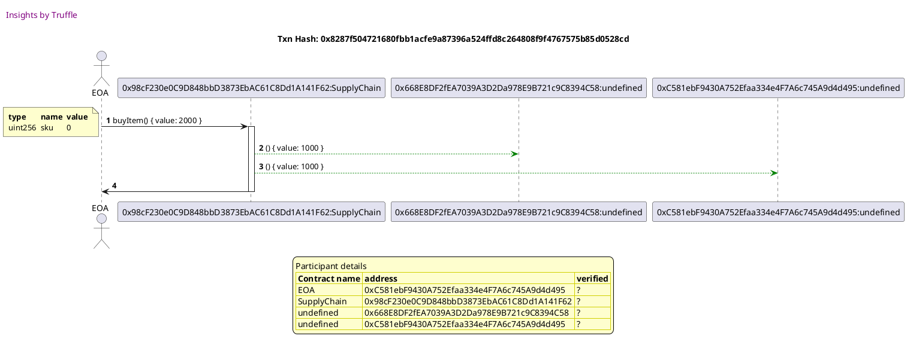


## should error when not enough value is sent when purchasing an item
Tx: 0x5ce3223b9dd2c31ac342b1453212888f73e7995906581dfe6c861b0a21ca84f7

### diagram 1

[SVG :telescope:](https://www.planttext.com/api/plantuml/svg/ZPBBRjim44Nt_8g1iscH1kL33yf8tRYsX7JL0Cc-e4JA9a9J0aK5TkByUyUEKxXPLHkAGywPkNTuCqGLuhXnXAWnTdxSr2OGCZnQtwkWDk3CodZzGpMFgz2DNYywrmMugCggN9I4N0znvyoCaBLHsWHu8G2tNR3FdO_ApPrT-Otn4J5jnACAms-4VWozCwVGlNqsm1BStIcjhLy1e-GLwL_VyU_ydtwmgtKSeDx1GnZR5XaaskWCF6mztAfXFGMwJHiZE1TreJLl15EDI7ZDabHmngMKRIvCNXHfGRDKCjsQh94PgwdYh54oQNDqeudOPVbh3cg02QuJWeP4szXUePxxiU_TRh5Mrl-cx7Y7RbaXPQgRfAcMZF52yZnbWkSYFHHAbdEfqapD4pCzovuGSYXoDVk8lBoSGjFv8ORnqCgdp_02JygD1lN1A_bm6_EFcAife5blGoDtPmrh4vLr0xa-ZUxBnP8kAQMp_JTOu0W22WQlDWOmW4C8PXWElqycsDOQ3Vk_gRFziTOUVUQPA6jUBQJWAf4qvoobA9aAbhQLASKyavKHAKBX-x-4i_wFfF_rxaH2UIUH-DtWUdZ2Vm00)


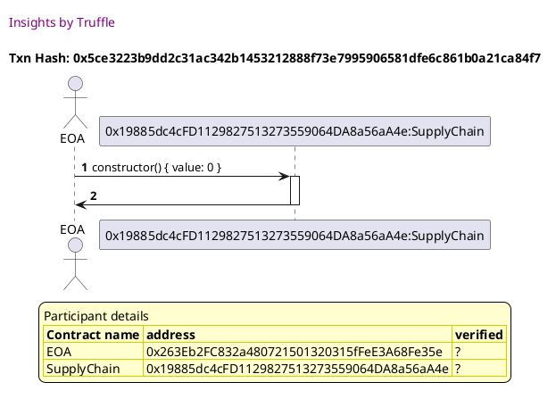

Tx: 0x170803b701aeee6e07eb0b75126f0216f001a47654e876667d3888142034e598

### diagram 2

[SVG :telescope:](https://www.planttext.com/api/plantuml/svg/ZLDDRvj04BtlhnYbXxHAeoxVY-Mw8GOhEJLISeyM6EoLOK7BKiM9yzyxOCToSoe71lOjRzvxizpqLXexD3LZSh2j7feS3MFzLkbE6jb0ZMlKvQqijclJ3hfSjdLhuCigMsNBZB5vRtSrBXZRe2pHm1i3k6kDUcsrbNLIgxLkK5kYgIn1Are-C7I3wMeyBZsgLmJ7fxS7MPPAhy7Xx9tOVtpGV_3VwrwjDxQ7V0TFPgWguc1MsHhXwKN3dUmtC-0lJiG5z_A8En8HG-GHvZoF0iSDA-uwT2F4ZyB0Hn65OHYLdX32yLtk-HZ4Wj8eBAdCVYSWUxYWUi4e4AiArKdoypXqNRrRRgJIpzoPzb3NM8YWBFnYbJgE6mkN6dfkv0L1p4C_JOGCGfduE3lx-eAniSdruZFbrTKCA8nxYytNR_06VsGz87c3TwPRYrEYfpdCZm_VZtMn_mbsro5GrRAPwaG0UxQ7tfenupqy7p2upDjsUpbXWzBM3S8Hx8mgHjJXd1D6nm36penzKahQ9mlNCw117GuCUpWBgqGhLTsVgKnvIgIZoYMDtr3O9vdasM3VJuhHg4fXIStd9sDJhptDE0n59jALMsL9nBquyL8tbN4ailWsSfqYNWelzfU1eCs__cKuqpyn_U_SZanaxsYIhXkgu-_p5m00)


Tx: 0xe6187f0d83406b0fb1ceeb9e0bd1895b55d6f92256be8dfbeba3c332147cec05

### diagram 3

[SVG :telescope:](https://www.planttext.com/api/plantuml/svg/ZPHVJzim5CNV_IaiUDd4OCuV9t746A5914z3WhTfcfpufhL8dSfnK0lbktCRIjUo5_AGspY-lzvpV9JBtadhXdbBY1nSPuPv1PQG_a6RXRHoJbkOWb5NidwOscumQjArdQN7PL4MauAGyzwjMhWWP0PIWQNFXDBhpkgdpZZPPgsUcZaOXvZ6uQiIbzy8Yy4kMjWktUade5w8JxTIAMscr6Fa1UdVt_7l_1lJw-dCzRHQqNixD0qoYDEk1Ng_DFHQzhEKiYL4NX8tJ2L1oAAADPLN0rG2MAMyHF2ASnKrmlTvL46YcWeg6TH1u7jXN4FDEBfHEvoo-9LHsTCZh4S43N6wrWk9Ukw6nQ9TJMPIcx_C6_UmfIUIXAiwhClSytoH-37t0ZyEE1Si2lCiaJoIMGZfNlSX5Ws6HXjG_w1Hb1H9NlfDaSKi45cG-xaKSLA8gzZtQZ590X5EU9BkUey8sSnzUl5nofEJb5R3wiR1_CjN-amVPJj0IZtwGapdO3oatT6URtzyszQBzG_gLWkWM8sSZtK4q3LPqq4RXsxIDUqV1hmpNCNSq0sNa0zpdFu-dbe0ymT7F52SqeEv66CuseVcvIbseRwKMdW4wyxEpeW2F2xzA573uMuCpbk0oUsUomgSr6s_9p5dEVxPHk84usYHjjE8WRJGzwDSiBhHe53R-SwLCICeU8bdu45LYZ1WMSpzef4o2488opYBwZZacL2X2WN7pJyF2NipZwJFvkX_qixDaVFPw6mvQDFMBBmkiMu-2wy0)


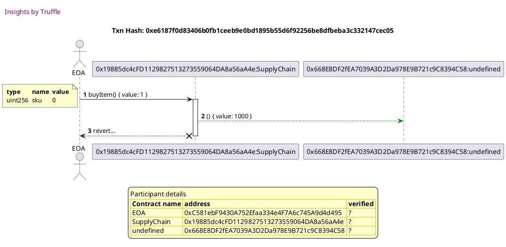


## should emit LogSold event when and item is purchased
Tx: 0x18f4d751374243fbefe48e58f7e26514d4287dab30b31e97c98cd938036fc5c2

### diagram 1

[SVG :telescope:](https://www.planttext.com/api/plantuml/svg/ZP9DRzim38Rl-XL4UjdG5PCbENQ2Bclc3tId5MZlWspHYL17DcIvIDhqluz9qo7hQRxGeiH7V5_gPWZQXt7JCgR7qBbnKw5dR7YqhjTURw355JhpGzUFAz-DpcHTstcuA8koo0h6heUmQt71s1grGGyl3E2sy_QvSq6tozQkt0PT84mJQAkaz1kX7ttVuYbrRvyH8aMhEssCTIk8E7ib-jTt_3l_fnliQXq6g7RmuCUc8GOBDhG83ri7jtfOpu5lexHH9eaZcIYXP5DXWoh5E6qI5DCuKaQ9D36wahoI4SwIUfRMPYPJBgTD7TU2tAW3TLdyMe8UO49nmiYGO6lRQz9pF_PzkylMshhVF3gUuTiupZA9kSgbYdbgCeeYASGiALIIobY9V2fabJJpi-e9OuTBhXOVaPUNSwWxDmG_7bhvz1bUu4ct8v8-U6KVJbFz4NCr1pBhRMZixgnXWq7RTc3Nfz5zkSXvpZbVxBz1HYFm91YStY1GWeRWSHWElq_eRMFHmFvlwM9_l6jFFekfB2fHPgaKMgKy4L7C8ocuZEAcn48kfsc9CYOeVF-NSDR_aVI_tfr89EyaahuRYeSd_0S0)


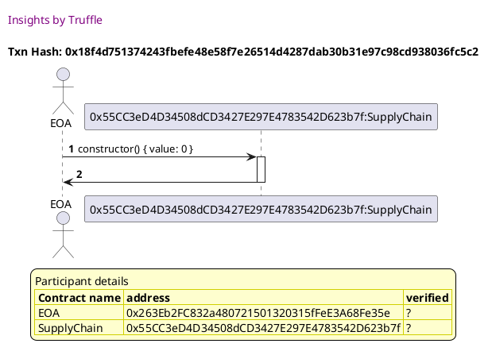

Tx: 0x1b681bc7ed6f25aa21f147cfeab1d628fcb3be40af8d27b9fea23408db3572df

### diagram 2

[SVG :telescope:](https://www.planttext.com/api/plantuml/svg/ZLDTRvim57tthxZA7hgfgmRcEygofa3KFgrI-ruPR2TMm21ZfgIb_tqNaaPPdyRB1HzpxZddshUTPSRsTKK8wssZ-xeGXf1kftJB3AkX4XkX-HqhTnlJz9gdJTKO-BBErtcQ4xBexA4IIqAsWd5Xu8q0t3T6lJRQicfLgOskXRP88or2Qrm-ChIzQIjnMdfIhm9S7xyU6UTARy1ro3ko__YW_-1_q9tQR6q7nG6UJIybSX2hR2NWUQ_XddNREJXxjmXZjoWZmKD90yQeArq_AgLWXSj36ikoy0hXEqp6d4P5WW3rV2VcXHT4b4jCexIeCl-z0jR13EkCO21MbQfbwEUfRzlga6wPqY-EE-rnza6Gffx8_Cpp0-HAiT8efqcK-r7i1JxDGkeLaPnV_3qZP6noi_nCUNqz1mpZmOhwwpTuWp-iwWLwWtUY6okcHCzpM9nUlf_gSlW9zj0AmAfPFTM900OoG6VDcF40BqSChegcsLrDMA-qfK4uWgrHvOYwZkCWXiS0niw4V5AAsYSBDtF0GHqF37cy28iBorJLNQZCd0n9HvKfZjzWs6UPwDc8hfiK2wEa4XoRByx6fbu3pZWCuppErbJcgyZnafMNqOmbKPmdTn5rooIDlSHFWnWt__gNuKB_nFI_SpineRsJINnkiOxNvoy0)


Tx: 0xb2b63b2ae3d6dd11ef1a30388b2a51dc9d127b77d087b70e3e1c27459b5203a1

### diagram 3

[SVG :telescope:](https://www.planttext.com/api/plantuml/svg/bPHDRvj048Rl-oj6pQLLQdNPvLkf6mUmabCZ9RUggXRlOA-25mkMAawS_zunSLmdLLMN0mF3piFCko-STqwrhb_MZAdUDRPVbjWorjqPkrAjMaADSxJwGitkvctJMvqrTTF2oRIO5bd1s5ddrZME6LkWqjZ28mEuR5hpq5YdwabjvdQ9rX6cSlHeIkbdmgflLpNkKZVc0S7pwUvQQMti73pEdeZ-wGN_mh-odPalN0Vb6cxRlgg8mPnnDSBjlOLBrIrIuFUbA4DP2eLIXrfx7bQUabp6CUK2JyyIxOceZ2BDOmeS9Nep4Vb1KWQ2I-MH6ZD7NHPV9w0wU4Vn7ID1d9cPbQ9vRlhLgbvd2sNi3-uDQ_Xz46IPnDpFfH_mM6SKHLI892hyA9Q1B_9Go3AgqeFgrrWI62jZKV-6Xc5SnFbKLCKauZAPo5paAedY8hc8X3TBibWcVXR4wRxshqYnGz9g3yjfuai-YG9HL4f9wQC_ZIRXZ5IO9DhNVX8S8jbMYj7uxU2dfocK_VhAuVBz1tY4dwhkCGN1EOSdPXk7mzRl3NEsk_YuY-FDPt3h5G95gvP371YmOHleZNKY2643tLrFPqvPSYDikOozQMNqxMJU8jhlrEKh7LCuRCrxRksuOd5SyNWmocYK0Zdr-OjXrmTxeD4fKtS7q-Sy9zHs-epytvBRzkFJ5z1YrmrAO6igWvh6FjiBDhoBj3Xw6sdnbzU4W_u7qh76_PEqrshW7ElLVt7-SpAIUoSw7USKj_-pNm00)


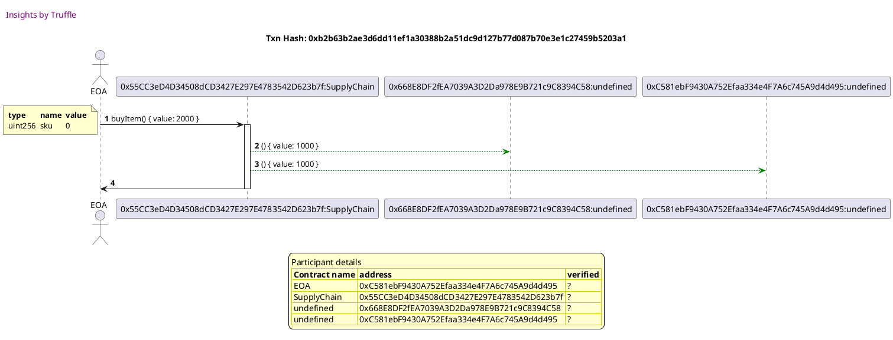


## should revert when someone that is not the seller tries to call shipItem()
Tx: 0x95ef9ea7dc3aecbe6826d587ab84f952676a9db49e8e8a8f13eb35f85c8b0f18

### diagram 1

[SVG :telescope:](https://www.planttext.com/api/plantuml/svg/ZP9DJ-Cm48Rl_XMZSc75edM-dGgwD2KHUreakA-SPDnQf4vaEwY5yj-PbhBgSjfS78yzpypxZc-SbzQFwuunEVhUZEiQBMFkIPj1Mhc63fTesa8sJqlRZwPTz5rluQmggt9HCdRb_BR36MChb2rQU6K0TxtLBxtnifjtUcdMQ3nXbAUZYi8VX66qGuV7q8D-GGXYsjtBjjLc2G5dRqJ_yOd_vFyoJYzNta6zXKSxAaKCvhNl41ut1kwaMqs1R_84LOuoQvj8ObDZAiAqJKGcQn6hF0dJB9LvMySv2XHIg232EagKI1fHSnK8SgFnr6NvUmxImOJM2ID3l6xq84dFmpWCtNQnajhyuS7X3jzal4XvMSoJ8i9ytl8wBUACIiHbg8gaRAIAL5W6oVGaUyBOliZbx2louc8AJM-Sj-E-bVDly0hFiXkHzC4R-tARyW-OoocGMHz3O_Sd3RVefUuSkpgExllPBR_bdCzsrx2W4LWI34Qk4IX0Gx3etFxt6QrM6blO_KsTxGwrTkHpc4Pb7LOB4OKo5ZmBWuG7KSYZ854Lbj4y5HL62K7Xvx-4a_uFfF_rxaWYUKUHzDtGkd_2xm00)


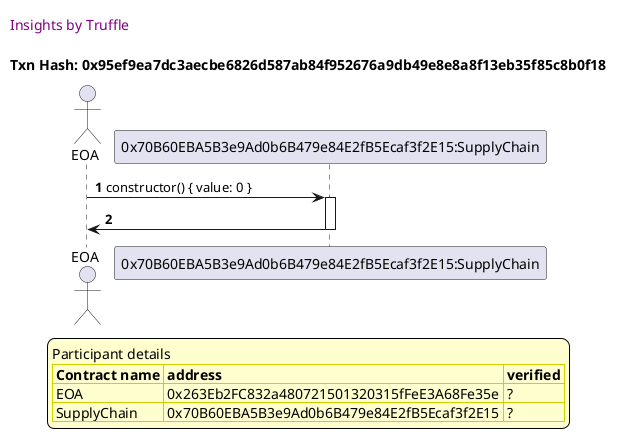

Tx: 0x1360055ef3a7c2c952f75a43918c1839f3d3ff1910eeb94956c9599714499aee

### diagram 2

[SVG :telescope:](https://www.planttext.com/api/plantuml/svg/ZPDDRzim38Rl-XL4T-Y6hfZaRmLPLZjnq9vMeBqNYYqbGcpPaEKXQTF_Fjf9Wwod-K9Rb1--BodTTKvOrzSL8Q9tZUdhbRI4T5jjMc553PLSIrDcejYkRTERSjvKZOKlotoPptD2fftRLt96o4QAKbfu8m3tZTMlZN6YIYkzDhKq3Z7AOMg9oqT2szksagUb9_qgWGNuzIZAKfirC4hUaVxZ0__1Vp2TNczS1wizFDjUAMGGfrqbuNbdu5vqcmdG7VCZIiDGAb_4XLVmq5DnA0AViwHWYS-LN_fACSweb2iUy332FPp7B0Wu5nAPed2eCl-TWkZW2kCLmOOuNUXMe9-dlcsh_NmZj7cXRDn3Tp7D8ffdQPZvagSbNKLP47EP1BcdiZ0lXFALbxDmSl7t5I53aTlPP-JDpGIm6GzErb-_mHly4LKlqHky4zCuENRqF8VfwUNxASuEFy7jMmaOZQZ7E0BWG0xGEJlq-00lnnnShvfcUptcUcsS5qP3ihMw6BACKeevF0OmL2RaarBKFbgudG0EwdXWoED5iqhfXAww2vKBka3ee7AEuxVOxBDCz6nbrusAfTLAonABJy_6nbe7d74K9NcoM7egJsFgyzHVU0l1uoJdMUonWiznpi4yJ73phty95_f7ql_ExKH2UoUJ-DnX7AxFNm00)


Tx: 0xbda185f9c097827eecc1a6626d18a2fd7ac9075bbe1e58b81c4bb53d44cf0560

### diagram 3

[SVG :telescope:](https://www.planttext.com/api/plantuml/svg/bPHDRvj048Rl-oj6oQLLQdNv_b3g1coivDH8oQsggeKTx5NmWc2fuiJvxnaJnxNJL7KvCB3iFCoyyy95PqHh-cN5cEXDhVjbZYrZtPtIZMZ54YgSevQfAExcRTrhEQchkeNJMJRB9XbZvvrPLJXcR852OWkF3E2oRjL3hOseaahDzHAr8KnfwD6Cbby8JTys5MwNRjG3WkNItRMGKkavM9mz4VtpA_wLVwKxDL-O3l8LtBPzMHA36MKgXDjx3PUYMyJ0xtCfhD0heu97GMW7Y4LX2T-tVMc5mYvb88g81rwUeuLUc8TMuUQvvqZNBKhk-PpKA0nLcNrBG7HmGl64aI165QeHrCzDtpJLQh8GIl_arh27tmSyzNcM9bxgO9H8dlkf6qGOkfbTfbvMYD8fxSpouhtiGom9ZANIA7z3VJ_CmkdCBhCau4wKE5DxAgYhB4e3sogYIUX4xiGBurtkNv7s5acxBSndaUlm9F3ih1J2SLnqPq7Y5u7h9P5qfHjv-qYsaM8qVjlusLaCUR-wChZyy14UuPUeUenfV9p34zErmM7qEyESRoy-RUDu_GNCga6WgCLoY0C3rcmDlTB6zdnOGtVNqvdJAhaHDbp6tfGo-duwRn7r3whoGCSOtYdjk6JxJV9xcUF19QDH36JJby-5NUyDGA8HgkhsMf_oAHMnQNr2vc_9QhlUoVujTjqW0xQgL2Yfv_ETMiExI8YZPqYRlnuIzkeVICUwza_IJgY1SwnH_yNvpyv8xgteT5nGtFpCdW40)


Tx: 0xd7bec76059db339282fab82a03d752178eb98bee1bd98c582c2ba3f17f4f935d

### diagram 4

[SVG :telescope:](https://www.planttext.com/api/plantuml/svg/ZPDDRwCm48Rl_XMZx6LNtMRDLu0ecosaHErfAxNtbS53OWKCCYPAslI_TqBJAErfENZmC3oyCw-vwQmmjgyhnaHl6ztNEHh6ketIhJ2YXWfNg6KgYitADBsMYwPg37nRPijiaJ4sw-o-mZbZQnGI3RmmWBl6gET6Mr4bbLhf6hKbJ6dfqPBIxuIsDss5fzIZUaPmVDez22cLNe73sIlHVttWF_ZtkbEhjUqWtyEJwSkI6CmgMo4yxJJSYMuz1RwJOOv5EE51B7FFYzt8BKKUkO9xCWnS9ummZwCSqSbb71L1v1PkBhpI2Kk_ZBr0qZGAIogplmc83aOKHum6ObMXMa7zFFPjM-qNQw7qF-uCDNmNydJ2ipG9KW_ZHF9yalfXZ96VkMKQP8KelTBDd61wyVQ8iUD7hkTVaLTNK-ZMghstM7__0I-m5LMFr1oyCjrO74PwDc9sklbvYlF3Rx3x5e6Y5lKG1m0Ss05wfQqRJE00tQQdbLEMN8OZbx4lGdRN98uqJi7W5eqTZyTC8ir7RGN9-5nDJhsV6FPmCIs9LgYgkr1vosyvvqUL2_BV4Eqiaqw0mQuR5ADHfK99ycRdnWPJIFDk4KGEvilOztX2hcQb49xdexyCaqaH-a4IIr_wSK35VpuJBZGFfFyrxaIYzavDqdL3yVZ_l040)


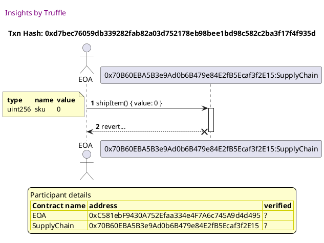


## should allow the seller to mark the item as shipped
Tx: 0x7decde7824c6080c8b0c14b81478b876f42b4a6b36a0f86e82f7d77ef242e0d3

### diagram 1

[SVG :telescope:](https://www.planttext.com/api/plantuml/svg/ZP9HRziW4CVV-HIdz6LJLmsmOxEeovgwjhgdLMhV9smV2Ih15iPLqgRVVPSqdR8-ZHVWu7xS_tzS3L67EAuTOtgCdH_NDGR6XaVhUntq6XmkqRVNkdbSXcxqRT6vBi1PLLPbKJ9sESIjmpbZAzGj1dXX0BTTiC-TZzejd5twDVf861FfgABm6w4VG-_m6BgtpmWYfTsTRblhbo0uUoNwrtVyE_-d7-no5GUej_0GHcE8mQAD3k5Xu-5M3wiPy4tUOjDYhcJQP5pnHjMy4McjH9ghMkMPIMMTwgnECisDob19axTvZaQc4dcRa1jDf2hBNmlG0qnedZ0o9Dh6zfhqt8zzxxR5Ibl_cul37RxHtvAiIQGMPPqQioYoVAh4JJuLfIXLbgh5jUAoDDNi97l2sFwHY_b7vFdv39hE3p6C-r8-VOONUD9kHD87h-p3RSe_O2vcG6QzDOtTdHJSOjJM3UposBelPpVyXdC-tts7WbeGI31ulKQW03KXu33ibqyOhB7OmkvlwdntU6j7FiiiAMjP5OfKfuhdKaovI2HFnDHKM2QBJ5MOJ0aAF_ubdDH_8FslTqSIoJkAf755y_uB_m40)


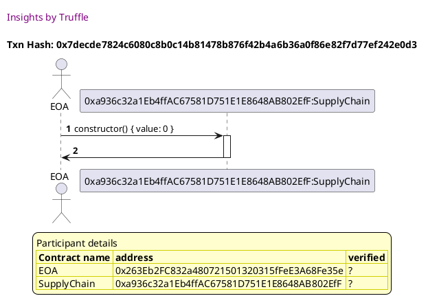

Tx: 0xee9406e4d4891f28c84ba18752a37f30d72f00403ce36651a26fe78fc94fedc8

### diagram 2

[SVG :telescope:](https://www.planttext.com/api/plantuml/svg/ZLFBRjim4BppAnRf8ItIeAIUbE6waMKPoQa1adj0IwHDMA84YYhinFdthcJ7S7EgBYjngDcPMVAkSyAwlgu84RrhJ5-lf2MasshJ2YjggEHQcd8kYktQDhqfiwPgB7nPviiyomcPTcvVoHaX6obAQU6D0DmtLhysneaghVJQrD8uf54EeIKk7ndQthQLF2qzwLS9BC2lHr6Msgo1KVAEx3y-w3_u7qodrnlNmMeFpxPN2Zc8qwwIyBmpS2-wpGJeJieae94Coe0dJ7cyuC5AC1w7dl1ZvTCozXIb0VKBwKTHo8GNAHbpLII1acN1COt2eShyTmgYWokiLmG3SRhGhK0_JttRLlji8xHveMpSGtSYyQF2zmJBLu5IQHR58MUBE6GvotaKy7JEgPUhvUJYxoj2XYQtiy-KDpSJm30UdAo_VeCt-2EgNg8tU2UcSN9Cz3o7wUdb-wdE3Z_1xLi9M8senpeIm84Se7DsoFW0BqSChbTDixqUiLuRvuNH0BPM5mFAAAM8uJ60eJCXdvIYzj72xGHmKCS3GnulmYgb4xhgBbGkw0991vKPZjzYs6UPwDdAhXiLIwkLbYKsdvwDZRqEEECeuZbVB3sLfp7razHVU0kHn3nFvh77YYJZVX9a8SVDl_vbkD0_Cltlt4vCQEza4fyxhCFr-Gi0)


Tx: 0xf8be90c42bc0dc9984b6fadfa85aaad09168f8a9195925286a2c2dc7fe5a0d3a

### diagram 3

[SVG :telescope:](https://www.planttext.com/api/plantuml/svg/bPHTRvim58Rl_IkizMPJ5ysOBnjrMMa2QgzMgRsRfkc0JMAL60HcQjhql--4fbdQQLh61GUCpyCvhr_xl7VGkM5L4mA3Q-omAdH7I7zdR0iTh6Yj5zgg2oZl5bqpM3LhwgQZ9tcMPxECaBFUhMiz9MIfGUcEFX9ABvlEF3JMGPtMPc5NsZh4L0u_vJZyJ6Y7hgtrRkZ6F6Zg1VXs3KePkw0U8qz8__I2V-5VsTuibgwdnPhUTaDL8OCuusfDR-yjlOH-cL1sNub2IrO6l2YPAgKKGH5Le2eG8G0e9hr8L0Aa9qF9GouYu2LNPLpf49Zo0TKe7LQPVKqfzFGTndS41N6cD2rWFpT3szRhsHAC_S6ySGwx1-b7fS_1ougWgj9P58V2cyUXbtcPY0AHNWZ6iofF3h9VOr5WNHchrMze58bCp7DUPMdCV9dwSpu76OjCNiJSA-LC-3AOXIBPv_uLoNT8dEtf8fU1pz8un8e0V3_GGHwdKHa7OIfLe08P7YB9Leh9z6tZfwS9BORrbTEhzn_e8_q9zQ0JoXbZz8dOnkbnwVU6ETizVDp5wUOpTUjMKumMLcCS6NH3DdGmrl4meXlQtmruPpYARgHRBY5lIfbyErbqMjllMEKh7HDwM9htNDfnoVouvEbebCaaeUZKvnr3hW_MG6a7fkuFkf-pEQAstS_G_nswRTy-xe1Ez_seXEvCPRJ2ji_sWet_GYsENaQS_EKruQ3-aNIiSVyaxRKQESTwzL-S_-mCvTw9ZjSvnkrvzWi0)


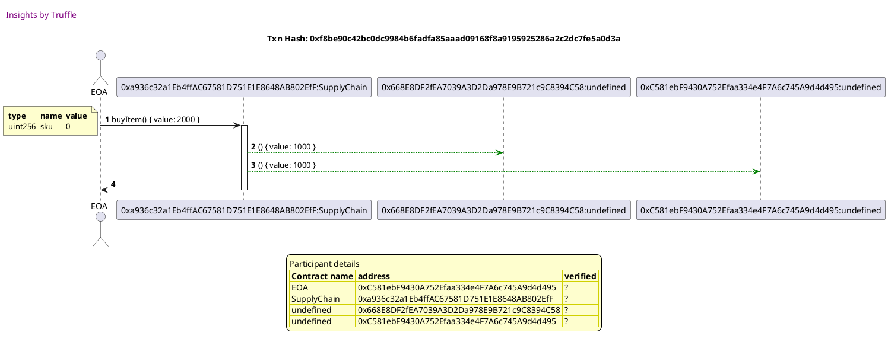

Tx: 0x6f1c14459411cbfa3c0729d17477c8dad81f9a5d1a1e42f4245eb48c975bdd08

### diagram 4

[SVG :telescope:](https://www.planttext.com/api/plantuml/svg/ZPDHRvim4CVV_IbEtSkchfeD1aoKPIL0r3wjKli-6MmIAs0Gc2bfq-_U2qsZh4_ZmGU7-Tt_xczk1oTxDpOr8N9qhHsRGlU435jZEzdB1cgzrbOjPRbTz-reLThMRGzVLlagJtD2veFRrtf1o4PBfNju8G1tRM-UM-jadTHcRHjj7M8gXwzMc7udT6FVrVgKUZJF6XZ7fmUfbB5hO9Iy8lt71_w3Vsy7izwu0OezFFLZLI63EEDg3Kyx2tTosCo0xiAAbOpp8EQCbKKb_P96NgnOnAEe54egmQfO1ef9fhbNSOy7kk2YZAEWK8eAd4RfK6N-Em4vm1N6Au83SQOqdSH-7iUkg_VfHXhxXx9f3zt9s0zBtvCiBtXL9MaO1O9bKS1obekGYsGfg9TNgzd5rrU478lSB3uZhwzdC6nCT-zqy_KRlC1VMOyQcuDNObkdfv6UZPYVRhwVukBm4zo-qu3HocQA4m0Ev02ZiSuBGZZ0i1rnfPX5b-789UIJ49GsARoP0VhmVXx8myKib7RIrCE5XencbDAZXXJTxN6MPn7eRw-7OTAZUrCPhR3u_2nxgdKuMXYAN6GhhygJYFfnucTU9kD8vF4oybWPfyAFUHe8tFphNyA5_edqlxQSIDZUgKcyRZ4U_uut)


```plantuml
@startuml

autonumber

skinparam legendBackgroundColor #FEFECE

<style>

header {
  HorizontalAlignment left
  FontColor purple
  FontSize 14
  Padding 10
}

</style>


header Insights by Truffle

title Txn Hash: 0x6f1c14459411cbfa3c0729d17477c8dad81f9a5d1a1e42f4245eb48c975bdd08

actor EOA as "EOA"
participant SupplyChain_01 as "0xa936c32a1Eb4ffAC67581D751E1E8648AB802EfF:SupplyChain"

EOA -> SupplyChain_01 ++: shipItem() { value: 0 }
note left #FEFECE
<#FEFECE,#FEFECE>|= type |= name |= value |
| uint256 | sku | 0 |
end note

SupplyChain_01 -> EOA --: 


legend
Participant details
<#FEFECE,#D0D000>|= Contract name |= address |= verified |
<#FEFECE>| EOA | 0x668E8DF2fEA7039A3D2Da978E9B721c9C8394C58 | ? |
<#FEFECE>| SupplyChain | 0xa936c32a1Eb4ffAC67581D751E1E8648AB802EfF | ? |
endlegend


@enduml
```


## should emit a LogShipped event when an item is shipped
Tx: 0x972b9c74659931d96b121950ce02f16dd6a760f3e7c92b31872a781d03c807e5

### diagram 1

[SVG :telescope:](https://www.planttext.com/api/plantuml/svg/ZP9HRvim4CVV_IbEwSkchfgDmK3KPMK4r3sjKli-6JWIgyGWOwgaJR_xBcawPNqQByPdt-_k_p_VZ5uxFsqwnlJaUpjjAdICZO_63jhf3NIuGjlyqFNZolMJRVA-wnrSb4LPv0LZrwFVTRXWR8swGGSl3E2sT-QvjrvtMMTMTeFM4wRrT5HI-8qmJ6xey1IwDyy88gJTdMuQOrSWE7ib-jTt_3l_fntDQkr7g7RmuAQs9GRpndS83riBjtfSpu5lqpYeqZeELPIcKZIfgaGWqeZNo8DMgAPHEbQybHZNQL19aSI1ZXFHS5adFCQ8tAWzTLdyoa2FCADrniWGRsepQD9pFmr3jylNsjZVN1ply6qRouWBdYqpdMAk8jd6XL0yJBCiL0AfI89APpW_ovunTYXojVY8lBoSGztRqRlfqCgdp_02JxgRaFJ1A_jmc_AFcAiva5blGsDtPmqtwBNfHdPz6jsNYoLVSiuN-s-GqmWS2GQhDmWKe24u7CV3xnCwqnfiOFytTR4_rjgJpu6IHHMKUI837P9pWI03PC2bYDeI2vcff4GP4HI-_qiuw_z8-b_lJYIITn99tmsjXoVy1m00)


```plantuml
@startuml

autonumber

skinparam legendBackgroundColor #FEFECE

<style>

header {
  HorizontalAlignment left
  FontColor purple
  FontSize 14
  Padding 10
}

</style>


header Insights by Truffle

title Txn Hash: 0x972b9c74659931d96b121950ce02f16dd6a760f3e7c92b31872a781d03c807e5

actor EOA as "EOA"
participant SupplyChain_01 as "0xf735010ADAa9eC653f7E16049AA461e8728e6aAe:SupplyChain"

EOA -> SupplyChain_01 ++: constructor() { value: 0 }
SupplyChain_01 -> EOA --: 


legend
Participant details
<#FEFECE,#D0D000>|= Contract name |= address |= verified |
<#FEFECE>| EOA | 0x263Eb2FC832a480721501320315fFeE3A68Fe35e | ? |
<#FEFECE>| SupplyChain | 0xf735010ADAa9eC653f7E16049AA461e8728e6aAe | ? |
endlegend


@enduml
```

Tx: 0x2626f2c4f33e5f1abfe2831af944d60bc10717d11089554b11c525b3c8a232a9

### diagram 2

[SVG :telescope:](https://www.planttext.com/api/plantuml/svg/ZLDTRvim57tthxZA7hgfgsQRxoZBIe6eVLgbzhqoO18hO90nKzAc_tqNaaPPdyRB1HzpxZddshUz5SOEJKs866ohXoQNXf1-gtGdZ6YWbckfopjHRDUc7NIPj7LhuCigMsL9HiYYj_jQBWdPI55A0sy4uBurwhNLLjHnhTQwaTeYJMKHMk7oaQ4RJ5VBqzAJUfN0NFnw56Mfz1eO9U_8_kE3_eF_GVTglR4zv7juDaDL8GUnojOIddSQxaM_cGFTSP_x5I_Sod6aLp6HLvA73XDLvBgbJ_E2qO059MCqZ3pFpHahFExbJX4Axd0HOHg5HPNPxnX43pEiCuA1M5MeJg2Vfw7hwdso4Kg_K3RjeRigS3pAQ9p68fA9xpbLa36Vkb4SkpwJOS13wOjOpY_-dX4oDhbPVgQylfu3Xl5WPVFr6xp17r4F4ht1Ez6jbLEYvpaiJY_VJtLv-0bstqd0gaKprOa03kG0lJLZnWTuEM9mbRVjzch21gKjz_mHx8mgHfHHIX73Om1ZPq8-AKNjauMREU2WZWU6F5w4LKehLDrVg4nfYgIZoWJ7Rp3iiqpqR6JVJugbKPMI9JPVd8rDlGuuOzyFip1TyIgB0-f4iPFoL4H1c4Lt0MT5b8HEv2PUY9j__SjmeNzY-j-vdPZGtiaaFhTOn-lp5m00)


```plantuml
@startuml

autonumber

skinparam legendBackgroundColor #FEFECE

<style>

header {
  HorizontalAlignment left
  FontColor purple
  FontSize 14
  Padding 10
}

</style>


header Insights by Truffle

title Txn Hash: 0x2626f2c4f33e5f1abfe2831af944d60bc10717d11089554b11c525b3c8a232a9

actor EOA as "EOA"
participant SupplyChain_01 as "0xf735010ADAa9eC653f7E16049AA461e8728e6aAe:SupplyChain"

EOA -> SupplyChain_01 ++: addItem() { value: 0 }
note left #FEFECE
<#FEFECE,#FEFECE>|= type |= name |= value |
| string | _name | 'book' |
| uint256 | _price | 1000 |
end note

SupplyChain_01 -> EOA --: 


legend
Participant details
<#FEFECE,#D0D000>|= Contract name |= address |= verified |
<#FEFECE>| EOA | 0x668E8DF2fEA7039A3D2Da978E9B721c9C8394C58 | ? |
<#FEFECE>| SupplyChain | 0xf735010ADAa9eC653f7E16049AA461e8728e6aAe | ? |
endlegend


@enduml
```

Tx: 0x7831213a29f5270453e6c4ed2b5ff2550a9e0d46e3d50314658c40c08c45c35f

### diagram 3

[SVG :telescope:](https://www.planttext.com/api/plantuml/svg/bPJVRvim4CVV_LUSrfTDNJI3RNwfoqeJelPfbTgtQPeSE1Ahn20mKzEc__ikDCtIJjCo7dnWV1_kllwQyyxfrlMhYZ7TkzhsgpcsZ7LtnZQwrIkeS86skD3vtQAjUrjCwgfkuMIMpR99njXPvzOLZXbReYwmXKS6S5ctvg6sJbTfPHPsXTOHfdJqQaRJpuIcRviATrCtvW71a_HqhOl2s0Lud3qH_TCB_eL_PJkpMBeEvckuRVko90PpnbK8j_SMBdMtJ83VXv7mV4zeFowL7tAf10QvnCAVgxBqbU8wHbx804MXkF1aeA9SyfpJg7AXIb8ZTrHbzZK5tS4xYkyO2U9CRXfD_TpqJLEj9qjjx0_k3MluVHaAnJsUJbF2Jm8boZ3p0YxZD9M1Xr7eHnZe59E3xDTO4XXBOx7u3Gs2A8kcCx_Cqf2BE1LJVwhZCChYYz3tydWIYLXEL9JiS_-Az7T8MktXV1PBmTDG-LcfjH0IvInCWpoKAeqBMSXO7IBPLehH-6tZfwS9pFlrbSFL-m_m23zrrMC2FkSSdfYj7GvRlpVCsUxcuowEDv_1hHi4YbQlXZWmOCCsq1lhV1N01hgxdaPEi-H6s78PUrFAwDl9eaMqtwdALpecS5YQzrpQSSd-SSdZmIYZKGBarESJmwuFzg10fqtL7NG_vLD2RRkVaFzRSjk-VJe1BNRTe0IsfZHOKDjdUy66Rv4MHsyZBVxocd1G_q0wrhX_alPQ3PnZlVelpdzsHdBlHAVhdEBsV_OB)


```plantuml
@startuml

autonumber

skinparam legendBackgroundColor #FEFECE

<style>

header {
  HorizontalAlignment left
  FontColor purple
  FontSize 14
  Padding 10
}

</style>


header Insights by Truffle

title Txn Hash: 0x7831213a29f5270453e6c4ed2b5ff2550a9e0d46e3d50314658c40c08c45c35f

actor EOA as "EOA"
participant SupplyChain_01 as "0xf735010ADAa9eC653f7E16049AA461e8728e6aAe:SupplyChain"
participant undefined_01 as "0x668E8DF2fEA7039A3D2Da978E9B721c9C8394C58:undefined"
participant undefined_02 as "0xC581ebF9430A752Efaa334e4F7A6c745A9d4d495:undefined"

EOA -> SupplyChain_01 ++: buyItem() { value: 2000 }
note left #FEFECE
<#FEFECE,#FEFECE>|= type |= name |= value |
| uint256 | sku | 0 |
end note

SupplyChain_01 -[#green]-> undefined_01 : () { value: 1000 }
SupplyChain_01 -[#green]-> undefined_02 : () { value: 1000 }
SupplyChain_01 -> EOA --: 


legend
Participant details
<#FEFECE,#D0D000>|= Contract name |= address |= verified |
<#FEFECE>| EOA | 0xC581ebF9430A752Efaa334e4F7A6c745A9d4d495 | ? |
<#FEFECE>| SupplyChain | 0xf735010ADAa9eC653f7E16049AA461e8728e6aAe | ? |
<#FEFECE>| undefined | 0x668E8DF2fEA7039A3D2Da978E9B721c9C8394C58 | ? |
<#FEFECE>| undefined | 0xC581ebF9430A752Efaa334e4F7A6c745A9d4d495 | ? |
endlegend


@enduml
```

Tx: 0xccfc0cd777e50b285c0e0c3c93ff59997b25b60f5cec438f56cda683dc078214

### diagram 4

[SVG :telescope:](https://www.planttext.com/api/plantuml/svg/ZPDDRvj0443l-oj6xgLL6dK1ysMvRWXW9QT6IkxLUfcrLuO5BKjb9yv_pvWubfjJEJ2mB6_UpC1DxuHrGrCp9WRNcg5PeMMitshJ2IiQg76DfheLShksxM2glArR2r-MvRBCIyRclTlNk61iWw922oyCuAwr-harJjHPhTUcGUC8enmzMjBoEw4RR5VZQUbHFoDuKxfx45MbpHeypbw9_kC3_y6_DxrURrmFgpqysK4fOZ2dNOtmj3Dm9_hD3FXEIYMvhE8unf2l_2IK7BaCP1ee5QPf6g_yS1Ln5KgKqo1HOIGh4IL19NcS-6J2X7HaMVxEGFGmeJXXr12dfUu4rVCuT5szppT2cp_S6_VmdOg3a7iyApAHOXw5WOfBB-BJDCkcaOT9x2SOYGnd5szF63ickLvyHbvTpQ3VwExUOVFr6xp0Nr4FICN1ApEjmx6bvq7CJnVVJt5n-0bkto5GDA8PumY00pl0e8tpmmWEq6y7EdDQfId3aSlO9n5I6mslPq1pUFyUsCD5BofqGjVzXKF12yxvqI6dwLhgvLc2vcknxqSVj5ffh2Zv_AmzvYAZNHGbPL8iVLLcCG_IB2ZyGgHnKgQtiU_9D4-2T9g72Mt-zI_Xmdya_UzOJYGgxrGa7JSKZt_76m00)


```plantuml
@startuml

autonumber

skinparam legendBackgroundColor #FEFECE

<style>

header {
  HorizontalAlignment left
  FontColor purple
  FontSize 14
  Padding 10
}

</style>


header Insights by Truffle

title Txn Hash: 0xccfc0cd777e50b285c0e0c3c93ff59997b25b60f5cec438f56cda683dc078214

actor EOA as "EOA"
participant SupplyChain_01 as "0xf735010ADAa9eC653f7E16049AA461e8728e6aAe:SupplyChain"

EOA -> SupplyChain_01 ++: shipItem() { value: 0 }
note left #FEFECE
<#FEFECE,#FEFECE>|= type |= name |= value |
| uint256 | sku | 0 |
end note

SupplyChain_01 -> EOA --: 


legend
Participant details
<#FEFECE,#D0D000>|= Contract name |= address |= verified |
<#FEFECE>| EOA | 0x668E8DF2fEA7039A3D2Da978E9B721c9C8394C58 | ? |
<#FEFECE>| SupplyChain | 0xf735010ADAa9eC653f7E16049AA461e8728e6aAe | ? |
endlegend


@enduml
```


## should allow the buyer to mark the item as received
Tx: 0x784b278ade28bed0b814a7c739289c862ec5476e4f616f6eb21916e2445c08bb

### diagram 1

[SVG :telescope:](https://www.planttext.com/api/plantuml/svg/ZP9DJ-Cm48Rl_XMZSc75ehMTBxU2Bcr9n9uM2Uuh9vcq5gaJsGvgeVntfgMikfms5yTZppFplkCR7xGBmxfbJ0-XiyEwHCUOVpAsrqwleSKbsdgkgwUbwmPRBxgsSt1Mv4M-o1cxyc7RufIn5UeQ7RmoWBlEcPVE1jtEMhEqQxI1C4sWeuB27uH-S7sBnz23UK4GCUtkTLqRkmJ1sHlHVtpYF_c_h3VBLV1GRk7H3Kr331PCQ14UDnRkj5zDW6yo5PSoKvGYLOarBvM8TLPbqLYgSQLIYLKIPod6JIhI9iLIYh58KSPnKd5LbkH65QZB_FSCj8SHhID6XWHJcLwJdeUXxzljOgMD_SF5uGxV9DMyv36lEHMD8bKreepKcCiebR68fCmBnMTyZfEJx15Z-oANqw_8Yui9L9trmGtxLiw_mIiywtP0qWTlxCjjoZzWBYT0PdqCZTsVD5nZqARrxEeukkzdj_oMSpxTNSE2Hk18C5YzHg003S6Xz_lVPtIcCLZ3xc_gT7UejIEVPHhbfImMAf8wLZoJ8k6ab4SYQGhCercg2emIWiBFVmad_Hz8_-lTaKJoZYBfkw5r_uJV0G00)


```plantuml
@startuml

autonumber

skinparam legendBackgroundColor #FEFECE

<style>

header {
  HorizontalAlignment left
  FontColor purple
  FontSize 14
  Padding 10
}

</style>


header Insights by Truffle

title Txn Hash: 0x784b278ade28bed0b814a7c739289c862ec5476e4f616f6eb21916e2445c08bb

actor EOA as "EOA"
participant SupplyChain_01 as "0x5cBb040d028b338cf1b3890236241322EF80A0Be:SupplyChain"

EOA -> SupplyChain_01 ++: constructor() { value: 0 }
SupplyChain_01 -> EOA --: 


legend
Participant details
<#FEFECE,#D0D000>|= Contract name |= address |= verified |
<#FEFECE>| EOA | 0x263Eb2FC832a480721501320315fFeE3A68Fe35e | ? |
<#FEFECE>| SupplyChain | 0x5cBb040d028b338cf1b3890236241322EF80A0Be | ? |
endlegend


@enduml
```

Tx: 0xc85bc1789c44b847f83cf6ec6b35d39f0ef525f568610d7d3d3a7e277745e8b4

### diagram 2

[SVG :telescope:](https://www.planttext.com/api/plantuml/svg/ZLDTRvim57tthxZg7hgfgsOm7oRAiYQ4g7rQfVQzCjWaLi0WOwQaJV_xBYIDiZwDbmi-vjnpphNlEYUiw-kA4D6xnlHrhYmXtLQRLbXHGwNMoiY5ABPhs_H6fatLMFYoobPPcX4oxTo-KZD2Daf8PU6D0DmtLhysnebgNkcrgPLnI5CwX5QuV6HeUzjMwhJqf5yLU05-FGefjLc3Hyaxil_ueF_WVp2TNczS1_aUdcrVbiX1d7QLWkUTWNlHRIP0TmKFyyABUL84GSw3kEIiA2DLH3aB9KjAgihG3yimuf57PIoPP29MVXp7GQXu7c0QXKELsUyvY0wki5uH3CJfGhS2_JprRLljqutGveLwunww2uj5JWCggSzpndXHUZdZ2VLPv0SUy_rinUcSBjJaukyhGeOcjxFFb3St4y0m7fogltw3D_WZgbwXDtWdfd5gJFGyX-dfvVkfpWu_mUrR1LYDgCSw4i217A1pTiZu02z73AxpfjbUZrYlZVF3Q01Rgui1zIYbYE4nWA4p8P-KelRHmkq4S5370qCUByAIoWbTTHSgbtI9f8FA5CTlCUopJFHiLTUDYfNLfLOIcq_FniPU1vnn5F6CBrT-cSrZof8vM_fBaSGyInQnxnL9obaIf277pR_-PRZGFpBzxznEJ6ZlP1AVEwp3zVaB)


```plantuml
@startuml

autonumber

skinparam legendBackgroundColor #FEFECE

<style>

header {
  HorizontalAlignment left
  FontColor purple
  FontSize 14
  Padding 10
}

</style>


header Insights by Truffle

title Txn Hash: 0xc85bc1789c44b847f83cf6ec6b35d39f0ef525f568610d7d3d3a7e277745e8b4

actor EOA as "EOA"
participant SupplyChain_01 as "0x5cBb040d028b338cf1b3890236241322EF80A0Be:SupplyChain"

EOA -> SupplyChain_01 ++: addItem() { value: 0 }
note left #FEFECE
<#FEFECE,#FEFECE>|= type |= name |= value |
| string | _name | 'book' |
| uint256 | _price | 1000 |
end note

SupplyChain_01 -> EOA --: 


legend
Participant details
<#FEFECE,#D0D000>|= Contract name |= address |= verified |
<#FEFECE>| EOA | 0x668E8DF2fEA7039A3D2Da978E9B721c9C8394C58 | ? |
<#FEFECE>| SupplyChain | 0x5cBb040d028b338cf1b3890236241322EF80A0Be | ? |
endlegend


@enduml
```

Tx: 0xb93dcd3735c0c450ffa624807ea58ab038d9b4fb0fa1c2306f372d5137f4d406

### diagram 3

[SVG :telescope:](https://www.planttext.com/api/plantuml/svg/bPHTJzim58Rl_IkEu6OJg-RO-HRhIDj4S3Kak9kcoOdjrY9rgiIPA9J_pcaeNM6QrkKY9t5y7f_p-dKkEYTQrozhGaJl6jilIzKIqjqPknAjM4AjvihAYQZkvctJMpbjwgQ5qo8lycbEo7ddrhKQ4x9GGgeM7Wd0PTEQXyOwKMUrcTkbiWunsk6d0eTV2Ak-NTLgDtHZ7XHuFhvT2ocDdOD7oHFIFx_YN_bNjZFpXUkWNCDjsskD3EACgnNStbku5DqY1NfV9bnMaaSyg6Zb1rHh4J8_ff4IGInAocEPbBukgHPUnJWDDO-O33mUQL_wD4GrAeTLvjyo41sSO3mXA8WpbLa9xEUcNwtgzNGXZFr9lM4ElG-gIKbzAYcBIyxZIdibZnFAEAxjSSRo8gOPdQZq8Fij5WLMsbWbVqF3CCxZMS5qdaMK9ncViPb8eZXF9X7pgcGQyyIV1d6wp_qhaksGEDjJPP7ud6PHm78j1EU-yeie2wl83x94eWf9S8WaMob6u_UDdvsbKFRhAwUM7px28_mITQzIO9HIU2AsSMhO-hrXpdSFdtPnlFa2RhrIWD6AvH071cp81dfZ7Gj2s41tr-ETuYYw4RPSGjwLClf-Ec-LiZ-moZSwfd1OclTIsd79xBZayM2KqIW5TEhBYI7N1tiWbHEcxWwwdz4PehRTJz7_BRfjtpwUW5PrtQ24QeqsIcBRvtl1XhLGYwEt4IT_VKiug7yW7MlSFqbxhGREiLxz5-S_EqEvTwBZTO5n-pzx1W00)


```plantuml
@startuml

autonumber

skinparam legendBackgroundColor #FEFECE

<style>

header {
  HorizontalAlignment left
  FontColor purple
  FontSize 14
  Padding 10
}

</style>


header Insights by Truffle

title Txn Hash: 0xb93dcd3735c0c450ffa624807ea58ab038d9b4fb0fa1c2306f372d5137f4d406

actor EOA as "EOA"
participant SupplyChain_01 as "0x5cBb040d028b338cf1b3890236241322EF80A0Be:SupplyChain"
participant undefined_01 as "0x668E8DF2fEA7039A3D2Da978E9B721c9C8394C58:undefined"
participant undefined_02 as "0xC581ebF9430A752Efaa334e4F7A6c745A9d4d495:undefined"

EOA -> SupplyChain_01 ++: buyItem() { value: 2000 }
note left #FEFECE
<#FEFECE,#FEFECE>|= type |= name |= value |
| uint256 | sku | 0 |
end note

SupplyChain_01 -[#green]-> undefined_01 : () { value: 1000 }
SupplyChain_01 -[#green]-> undefined_02 : () { value: 1000 }
SupplyChain_01 -> EOA --: 


legend
Participant details
<#FEFECE,#D0D000>|= Contract name |= address |= verified |
<#FEFECE>| EOA | 0xC581ebF9430A752Efaa334e4F7A6c745A9d4d495 | ? |
<#FEFECE>| SupplyChain | 0x5cBb040d028b338cf1b3890236241322EF80A0Be | ? |
<#FEFECE>| undefined | 0x668E8DF2fEA7039A3D2Da978E9B721c9C8394C58 | ? |
<#FEFECE>| undefined | 0xC581ebF9430A752Efaa334e4F7A6c745A9d4d495 | ? |
endlegend


@enduml
```

Tx: 0x81156a84e5d3288879da64eabc8a557a922bfe0c7b99680f13ee00fa0cf4adf4

### diagram 4

[SVG :telescope:](https://www.planttext.com/api/plantuml/svg/ZPDDRvj048Rl-oj6wQLL6dLPlXRBTMDZhEJKICczMc2mLuO5iKjb9yv_pvWubfjJEUp0i3ppphpBhNMgTqDJCwO6rvgXoR5dp6wrwLIl6gXnZQPSg6Axxjl1b6bRjpryMMMhBCqOcrgtht76s0PLYJsyC82xjjVFhN6gdjTwRHeqZZ2LerShIhyJkg7lQZob7lKpWXVGquCgIstMu77sIlGV7_WF_hsnUhrn5l8zFFL3LH63EUrgXAUTWJjbDnFWE-bvOQHaW67f2obbd9Gg2b3bXLHX6Aj4YBn2NiHvaaIILvwFo7cbU545ggm2caRXI6NsUmxAmXN5AqO3SRhGdQ9-7eUkg_VfHcdpXtlZ7huBYqNE0rvo8NFVbqNbvRvCkF0Z4NY-4DbAyZbVuEJYwol6ZaLkPf-HrzSJi1lTtJjildw35_YhwW6fENXbfdKuZlHinFHqy_qKPuUVuFOT0aMZcZ6E03Ym0mpQE156S02x7MZbb2MNuSXbx9CGaZOgl9a0-V1-7jZ3nInAT4hNzaB3aYyvvqSDARdRqopF8iZV7gqTzM2lAuqb5P-UPO-rID4kYcGcbojHPVEO-ydSNugbIcAP9OjOU4MIIZy9qb3Ivb__4YxqZwJ_jUL4elPEJT9rI_7uTxm1)


```plantuml
@startuml

autonumber

skinparam legendBackgroundColor #FEFECE

<style>

header {
  HorizontalAlignment left
  FontColor purple
  FontSize 14
  Padding 10
}

</style>


header Insights by Truffle

title Txn Hash: 0x81156a84e5d3288879da64eabc8a557a922bfe0c7b99680f13ee00fa0cf4adf4

actor EOA as "EOA"
participant SupplyChain_01 as "0x5cBb040d028b338cf1b3890236241322EF80A0Be:SupplyChain"

EOA -> SupplyChain_01 ++: shipItem() { value: 0 }
note left #FEFECE
<#FEFECE,#FEFECE>|= type |= name |= value |
| uint256 | sku | 0 |
end note

SupplyChain_01 -> EOA --: 


legend
Participant details
<#FEFECE,#D0D000>|= Contract name |= address |= verified |
<#FEFECE>| EOA | 0x668E8DF2fEA7039A3D2Da978E9B721c9C8394C58 | ? |
<#FEFECE>| SupplyChain | 0x5cBb040d028b338cf1b3890236241322EF80A0Be | ? |
endlegend


@enduml
```

Tx: 0xde1f2202f536e9e482a688522c9400e8c03b2b912ca5037477f80993ca7a3fd4

### diagram 5

[SVG :telescope:](https://www.planttext.com/api/plantuml/svg/ZPDHRvim4CVV_IbEsSkchfgnJO0eoqhIHEtJAhNlau4ZiG866LCbRVhTTw5fbFLfFFZWCB_xt_tDJUUrytrTCQPxtzY-pj0nrcsDRRNJDLIuHblCTRvTkwQtnQAf6WTVLilLSh5aRDhvVOKpnZQe2tJmoW3k6cTU6kjrbLPcRMkqdZ2bfrShIhyJsjwr5PvIZ-O58L3qzA2BmjWr19oz4Vt71_w3Vsyxizxu3h8zFBc-B8d1lF4LmjFEmftkDXFWkmA3KWWkob2ECK4L2psEur28F56SOvnpcOai2KIkGouZ5KLbp9D4vZhIiYmKJIFtf7BvEmNTmOZYYD50lCbDgwcVnxvjg_rYeutzmuDX3z-5-JpZYXTSn9cKSLu6cOmJBkHOg40AiLp5FELpd5nyFMBiMEHwzXbvTJK1XpcQPxptM7_z1g_mhAiUgJzuOxRnE4prxCNqTFFz56U7d-3tBG95g-iX3W0ui0FqndeHZk40tRQdbLEMZ8OZbx5FMaZT8F9w0cJ5-v5W3nVZAD1hKtKN6cxvBUVyg6511ZiQvra4MUomwmOzw4nfiA3YqxFieHOfsYt2EC1ibIZ9qoWKor9hAHMgLPIEyqY5QLAeGYKXRVxrB-52_q3wNsTE96hlr2HTDnIFFyXV)


```plantuml
@startuml

autonumber

skinparam legendBackgroundColor #FEFECE

<style>

header {
  HorizontalAlignment left
  FontColor purple
  FontSize 14
  Padding 10
}

</style>


header Insights by Truffle

title Txn Hash: 0xde1f2202f536e9e482a688522c9400e8c03b2b912ca5037477f80993ca7a3fd4

actor EOA as "EOA"
participant SupplyChain_01 as "0x5cBb040d028b338cf1b3890236241322EF80A0Be:SupplyChain"

EOA -> SupplyChain_01 ++: receiveItem() { value: 0 }
note left #FEFECE
<#FEFECE,#FEFECE>|= type |= name |= value |
| uint256 | sku | 0 |
end note

SupplyChain_01 -> EOA --: 


legend
Participant details
<#FEFECE,#D0D000>|= Contract name |= address |= verified |
<#FEFECE>| EOA | 0xC581ebF9430A752Efaa334e4F7A6c745A9d4d495 | ? |
<#FEFECE>| SupplyChain | 0x5cBb040d028b338cf1b3890236241322EF80A0Be | ? |
endlegend


@enduml
```


## should revert if an address other than the buyer calls receiveItem()
Tx: 0xcc58cb8094e7e647b4b9d45ff0a627911d4586ac1971091c8f2178fbec4b002a

### diagram 1

[SVG :telescope:](https://www.planttext.com/api/plantuml/svg/ZP9DRniX48Rl_8gHSscLHWNssqhTkFkXzDH8oRrY5zP6mUmAsCXEdF_UiUDKRaxb0WpCmxplSEE3S67Q64B450OxRLhb2F6Fsex2YGqOjL9M_X3TuyeDavNbO0O75qtTr6LDoBKFEwCMXAoLaCh12m6u7Pn-7cmGPcdqocwK3OZf0nur67uZZ9CRZJg5xlMp0XRZxav8gUqA62MlIF_wZd_d_xHUhzR1Gxk31pVrFJ98qC4eUDXQk1L-FGUwxReaxzgS5h7AL1fdRTmMCaxwdegKPmLZkCbJqR4YOxHWNTvpbkLzgxgufPGBTACBM6NzQmd2mmpd6K53WkxqA53F_JIEPbUkXRQ_AJlUeLjMoqocLS6vREECIyaevvGtIPHs5IyvZON8gZIPdsNF23ayShNuYBoyd4CtM1_ST2ZbqsTuWITX9eNwu9Lyk8tvHypL7D2ijwQHkxE2fGf26q-kJwtxSb7HYbAws7-34blWK31OiL600Mo2KzuVba_AwLuh2Vk_gOlzyQqz-ipJg6vvK-OH5t5ECyuIoY9E8vRqZQgZPPetAaeG2j__9PpLVoJzhtSd4iexYSHnW_FX2_y1)


```plantuml
@startuml

autonumber

skinparam legendBackgroundColor #FEFECE

<style>

header {
  HorizontalAlignment left
  FontColor purple
  FontSize 14
  Padding 10
}

</style>


header Insights by Truffle

title Txn Hash: 0xcc58cb8094e7e647b4b9d45ff0a627911d4586ac1971091c8f2178fbec4b002a

actor EOA as "EOA"
participant SupplyChain_01 as "0x1Ed7d6D922db472dd102202F536cD2C204aa7D65:SupplyChain"

EOA -> SupplyChain_01 ++: constructor() { value: 0 }
SupplyChain_01 -> EOA --: 


legend
Participant details
<#FEFECE,#D0D000>|= Contract name |= address |= verified |
<#FEFECE>| EOA | 0x263Eb2FC832a480721501320315fFeE3A68Fe35e | ? |
<#FEFECE>| SupplyChain | 0x1Ed7d6D922db472dd102202F536cD2C204aa7D65 | ? |
endlegend


@enduml
```

Tx: 0x45ea42b1c3367f8dd5c60017ae3e43ad6203f181fe56a3a7c8d49c83275807cc

### diagram 2

[SVG :telescope:](https://www.planttext.com/api/plantuml/svg/ZLFBRjim4BppAnRk8ItIe1JrDbmtZYGZEJL0SWzeah89IvH0KOMTEF_UbUmORaxLPIKEDJipIzvsZblNrnKXl7UDwUkLieHqMsrQRdaDbLeh8--usAvjqnkPDLLZuSkoM1PPGSYiS_jApGdPA2wLXJS2SDzO_TeOnwj5fTUcLiOXJUaGMkBoaQ7jRLkfqzAJVbNW1VZroANKPWqU9U_8_kE3_eF_mNHwlN4ThFRmRFkoH0xYjAiKFEyCtFDkCmMw2qB50xRoXEz7SPb86Og8KY_cobU1psN4g5zwYLUgCE8-ZqKYWrGaFel3XCP2O1h2eShYzm9u1nEi4uA1E2rqoz7FKz-srJxRS6rUg3VkeJklaB6CyfGnkGfY9gL76QDi6VgHo5d6QC1vd4VXzEBl2I53avlvPyhhwobW60zErL-_mHlyuLMlq1ky4zCuDIPwdiFizFBzLEU7d-3shGAiXjTZ7GdWG0xGEJjaV82N8mPNgwRPNerOhurZOJI0hTLYG3rAAM9u363eJCWdfQXzj70p1HpKyS2Gnukmf79SLzs5ofpcI3gep73y5iC-oqJFLdNTg5XPNMebiVdiR6piTS0PHr5I9FcIbSKYfdwwy7EMypHEYlGkPfv8iyHFWonCSFElVnakz8zC_pkt4nFQEvd4vnRhS7t-0W00)


```plantuml
@startuml

autonumber

skinparam legendBackgroundColor #FEFECE

<style>

header {
  HorizontalAlignment left
  FontColor purple
  FontSize 14
  Padding 10
}

</style>


header Insights by Truffle

title Txn Hash: 0x45ea42b1c3367f8dd5c60017ae3e43ad6203f181fe56a3a7c8d49c83275807cc

actor EOA as "EOA"
participant SupplyChain_01 as "0x1Ed7d6D922db472dd102202F536cD2C204aa7D65:SupplyChain"

EOA -> SupplyChain_01 ++: addItem() { value: 0 }
note left #FEFECE
<#FEFECE,#FEFECE>|= type |= name |= value |
| string | _name | 'book' |
| uint256 | _price | 1000 |
end note

SupplyChain_01 -> EOA --: 


legend
Participant details
<#FEFECE,#D0D000>|= Contract name |= address |= verified |
<#FEFECE>| EOA | 0x668E8DF2fEA7039A3D2Da978E9B721c9C8394C58 | ? |
<#FEFECE>| SupplyChain | 0x1Ed7d6D922db472dd102202F536cD2C204aa7D65 | ? |
endlegend


@enduml
```

Tx: 0x9cbdf317b178619f0fd928e313d48d20984bac4ea989d8cec563faccdd8b34a3

### diagram 3

[SVG :telescope:](https://www.planttext.com/api/plantuml/svg/bPHTRvim58Rl_IkErfjDNJHZFeswh9GFjLUhrDvDqsImIQmIWy1CJPl-zvtGD4ixJSkuu83nUJZdzMkV3rRqTbmrX8ZHjcPSbQedPBZJfXEzM46Z5ih82r7TBVfsD39jcxQ7ao8lyZGdv6omwqRD2Lag8LKFZmJWiktrGskiQ996BynA6OkOskAd0eUV2TtOTutQ3Tte1mMEXs_NGafj5k1GyeJqJo_u5_wL6VHYQGSert3RZtMD36ArRHJStXku5CCo1dhFgrBMhXEMJXW53gzfBJcBbEkuqeiaeppoIb5vIl28owXIbH-ujQWgAQFIzOIBQbGMgyo_9Y06U8Vn7K51hAvq9x2Vcx7hcdMw5DhyeCuqXzuxkGnba776PEc5J4g7CaPPuRj1bR6KKK-8C0ly-23xDHO5LhKsIlw61a6KHrd1wZm9gSiJDsEPu66KyukGEHLF8vTxgH_5-zo_8jaEYRCTLHRSSsaI-YolXN1TJtb5c0HLwFa9bvxqk7-895ifPlEtZP-Unb2EwokhLky_m2Fy5CseOc2KKdWYfhLgMlgzOSvs3nztSRxv37RTAS1en6gA4mCsP0EZDfRv0MnWk1lnJd4KtGXRBY5lIfbzErdqIfdlMEKh7MCuBCrvBksuP7PSydmoocmM0phrUSUGwuCraCeAtGm7tMSqGzIs-nJztwFRzktZ3kZLC4nAg5xNMabi-smlsFGlrEBePSJ9NruJ3kgVICSQzq_INgk9SwnN_yNvpyvGxfteU9rZt9vdlm00)


```plantuml
@startuml

autonumber

skinparam legendBackgroundColor #FEFECE

<style>

header {
  HorizontalAlignment left
  FontColor purple
  FontSize 14
  Padding 10
}

</style>


header Insights by Truffle

title Txn Hash: 0x9cbdf317b178619f0fd928e313d48d20984bac4ea989d8cec563faccdd8b34a3

actor EOA as "EOA"
participant SupplyChain_01 as "0x1Ed7d6D922db472dd102202F536cD2C204aa7D65:SupplyChain"
participant undefined_01 as "0x668E8DF2fEA7039A3D2Da978E9B721c9C8394C58:undefined"
participant undefined_02 as "0xC581ebF9430A752Efaa334e4F7A6c745A9d4d495:undefined"

EOA -> SupplyChain_01 ++: buyItem() { value: 2000 }
note left #FEFECE
<#FEFECE,#FEFECE>|= type |= name |= value |
| uint256 | sku | 0 |
end note

SupplyChain_01 -[#green]-> undefined_01 : () { value: 1000 }
SupplyChain_01 -[#green]-> undefined_02 : () { value: 1000 }
SupplyChain_01 -> EOA --: 


legend
Participant details
<#FEFECE,#D0D000>|= Contract name |= address |= verified |
<#FEFECE>| EOA | 0xC581ebF9430A752Efaa334e4F7A6c745A9d4d495 | ? |
<#FEFECE>| SupplyChain | 0x1Ed7d6D922db472dd102202F536cD2C204aa7D65 | ? |
<#FEFECE>| undefined | 0x668E8DF2fEA7039A3D2Da978E9B721c9C8394C58 | ? |
<#FEFECE>| undefined | 0xC581ebF9430A752Efaa334e4F7A6c745A9d4d495 | ? |
endlegend


@enduml
```

Tx: 0xe51fd2dee9c47385836fd1a30247c57c8311885c0dea2f05a1ba2646887bc7ef

### diagram 4

[SVG :telescope:](https://www.planttext.com/api/plantuml/svg/ZPDDSvim48Rl-XKxxgMTD5CXleJ7TUC0dkJKp2JtZeo4hJ48HX8TEt7-UzR4yRWvbOCM5l7ik_kA6-U5zKFR4286tvcXNIbBYDjgqmihMcZKMXbvAwhjsdQ3aNdNT1Q-BCjbcPU4p9pVDsfEo4O9gIoy482xpkhdpdZHB1gzDgqo7Z6rnrTBJByJ-i7sZJgb7lMpWY32fmSXfJPh22XvHVgF3_m7_zuulTvu1wizFDcXhf51lFQDWgUTWJlXDbEWEnK7jMHIgQoAqf37F4ng6OYGiYYjuhJYOH1m7bTKAi5g6ejW9LWI9PodgofLDKwZygYo_Bq0uM22SK9m85vNkXVOp-FGzyq-tmXj_j1Wt4DtGIbJcHGPOt8LfKpAW396sJ8EawfWEQEH46cHnDEBhoU478jSppyZhwwcu3Qwl_Ug_VeDNk2lQ0Q5pS4hCPrNuqZFHinEDzzFSNxu2NxVAy1eH3l64G07Se116y_Y10xWjWEk5BFeCXovX7mIWj96XTTJG1_UpmDvk9Y5L5xenbreA6X1AJrgoD5TYxCyYq1_hN9krAEihhMIM7nsbZtMGaMx9E4bBvQiBXSf3RD5MB12P2alizkK1LMMyp2ByfZZvb__4YxqZwJ_jUL4mlPEJU9rW_7uTxm1)


```plantuml
@startuml

autonumber

skinparam legendBackgroundColor #FEFECE

<style>

header {
  HorizontalAlignment left
  FontColor purple
  FontSize 14
  Padding 10
}

</style>


header Insights by Truffle

title Txn Hash: 0xe51fd2dee9c47385836fd1a30247c57c8311885c0dea2f05a1ba2646887bc7ef

actor EOA as "EOA"
participant SupplyChain_01 as "0x1Ed7d6D922db472dd102202F536cD2C204aa7D65:SupplyChain"

EOA -> SupplyChain_01 ++: shipItem() { value: 0 }
note left #FEFECE
<#FEFECE,#FEFECE>|= type |= name |= value |
| uint256 | sku | 0 |
end note

SupplyChain_01 -> EOA --: 


legend
Participant details
<#FEFECE,#D0D000>|= Contract name |= address |= verified |
<#FEFECE>| EOA | 0x668E8DF2fEA7039A3D2Da978E9B721c9C8394C58 | ? |
<#FEFECE>| SupplyChain | 0x1Ed7d6D922db472dd102202F536cD2C204aa7D65 | ? |
endlegend


@enduml
```

Tx: 0x101b32e5d9b1601076977a670ae433fe679593096fea9388ae6e2fc3c39d245e

### diagram 5

[SVG :telescope:](https://www.planttext.com/api/plantuml/svg/ZPDDJ-Cm443l_XMZxcLNBApZD1z6R9UIf8BJ8i5zvSQJrY9r8iUfMYZ_dMaeLU6qEMGIntb-CsDVTruvtwzgnbJl6zklvkWOwvwCRPLJAwXnWLRVgF9fuPhUwgof6mVVPiMio0h6hZg_hN72s1ALHWSl3E2sSUQviLxLqzeix0gj9qpbwTECXjy9RU_Q6Wz33-OP8HZJsxtIsjW519oz4ltN1_w3VsSxirZw3kPRU7HzLH63UUDhXCUDXLlLBI-1Rm8Up4E1aPRp8EO1JsAP92fEkC9n65OO9pAI8PTnXKg6QQemHb6LOHbABSOHCLNfoRBuEmNLmOZYY551l2bDgoYVXxvjwsssLCR-uy4mXrOjTABZN0gXv-D4Q1rm8RYOHM5SvY8JVAnKaiVHvSdV8yRsYvnFlYBFpYx1OObcZNSULzz_m0kiLTqZvGUlp3OUXweUUt5rUFXvY9FTR_3R5e6YLQiX3W3OiHtqndeHnR23xgcdEwTHQZJikOnzSTcSanzfxetMwFp5nGNJI2KoQqKQdsTJizut3Ri_APX6hqpTdLZcFEUSxoqpsWAEQ4TDsWGEksumHcSgWvhqhew93NqXvqqSfqMQpqHLJ1CUoccOYrp992taJIA2KcPfACTPbDBaFvy99yu3wNzxTo1HUeSawRgck3z2Rm00)


```plantuml
@startuml

autonumber

skinparam legendBackgroundColor #FEFECE

<style>

header {
  HorizontalAlignment left
  FontColor purple
  FontSize 14
  Padding 10
}

</style>


header Insights by Truffle

title Txn Hash: 0x101b32e5d9b1601076977a670ae433fe679593096fea9388ae6e2fc3c39d245e

actor EOA as "EOA"
participant SupplyChain_01 as "0x1Ed7d6D922db472dd102202F536cD2C204aa7D65:SupplyChain"

EOA -> SupplyChain_01 ++: receiveItem() { value: 0 }
note left #FEFECE
<#FEFECE,#FEFECE>|= type |= name |= value |
| uint256 | sku | 0 |
end note

SupplyChain_01 x--> EOA: revert...
deactivate SupplyChain_01


legend
Participant details
<#FEFECE,#D0D000>|= Contract name |= address |= verified |
<#FEFECE>| EOA | 0x668E8DF2fEA7039A3D2Da978E9B721c9C8394C58 | ? |
<#FEFECE>| SupplyChain | 0x1Ed7d6D922db472dd102202F536cD2C204aa7D65 | ? |
endlegend


@enduml
```


## should emit a LogReceived event when an item is received
Tx: 0x4680e397579b5bec52136284a00284934dde251702eee7f31d36e04c4b5f8638

### diagram 1

[SVG :telescope:](https://www.planttext.com/api/plantuml/svg/ZP9DRzim38Rl-XL4UjdG5PCiVoNeigQkZUwq0krza2qw4Uh8XYGNIPl-zp9fEcGzpGTBfiM7V5_goWVbmhZk65DZwEsuhj4nvX-D7PHJQ-XmYLPVg-PnwVhHwgBlUWTdLLcLHSdOfG_R3kUChL1fTF3206vxPvvx6rItwCpIhj46mhI1VbKKVYSCeniwF8RkpJE2YEdhJcbjx184Pwz4__w1_-3_ijuiLy53lOK7DxOjCLWmeKDus5YuLNur0xw9qvoZd6P9DgsJ6fia4ZADybXnJk-fZBN6A14PZn0nQwNGCaKUDt6Tj7agStAZ2THb-Ni1oiE4rWaZGu9fpA18p_qu3DssM2bZ_t1nECCtcPhghCtYeifRuYLQ9Fn6fDEyY9JC6w5uANDvtSnEiYUCxOjSp3yZpyzdqFJM1pVkM_do5LxWINKZaZvuPPzEK_u1Sp43CkjzQEpkf66DGPdEiylZwBwTtV0RplbyzmCA6e4ZmM3L6e42D0I7tk-tJ-XCQr33xc_gV7UejIEVerIMTLGLkOnKdFCi8iL2HboAfAsmb8iqhr0c18MV_n9E-Z-G_jUx8uda7KNISqNh_Wg_0G00)


```plantuml
@startuml

autonumber

skinparam legendBackgroundColor #FEFECE

<style>

header {
  HorizontalAlignment left
  FontColor purple
  FontSize 14
  Padding 10
}

</style>


header Insights by Truffle

title Txn Hash: 0x4680e397579b5bec52136284a00284934dde251702eee7f31d36e04c4b5f8638

actor EOA as "EOA"
participant SupplyChain_01 as "0x7a9d7f74CF8f36e5d150D1698C2a38c1a0E383Bc:SupplyChain"

EOA -> SupplyChain_01 ++: constructor() { value: 0 }
SupplyChain_01 -> EOA --: 


legend
Participant details
<#FEFECE,#D0D000>|= Contract name |= address |= verified |
<#FEFECE>| EOA | 0x263Eb2FC832a480721501320315fFeE3A68Fe35e | ? |
<#FEFECE>| SupplyChain | 0x7a9d7f74CF8f36e5d150D1698C2a38c1a0E383Bc | ? |
endlegend


@enduml
```

Tx: 0x1ddeba541a4e76bbb8ac225df158a752356997b5cbf513284ad21ba7d4e83e24

### diagram 2

[SVG :telescope:](https://www.planttext.com/api/plantuml/svg/ZLFBRjim4BppAnRf8ItIeAAUbE6wSMGPoQa1adkm4YcRi4m955N4YVFlNScEuUPKNLRYKBCpi-HDvz2wVbipXhrhJByjb6MissZJeiKjr6gbZBp5ShEoJMzarjIDXI_BV9bdEMFJpkrgDMDihL0g2syCuAwn-hKn3kjvhLTcgumZcieHjAJb0qFRsxPMnwL7_Qg0X_JrW59gimBkiNTY__51_y5_RpgzMhiEYXqysRwgY8CvxMe5Joy6xh1RJy1xuLAg0gEGOwYIk2WAWQNlHxBYaS0ayeCeJjEaYCgYYdZWYn2bpmjCPAX4eFoGqYWTgSn_pm4xkA1wmIWGfqlT8lbvxDkstcLhrERPu-CUxoN1L2PL4cPBKGMnYYIFl0MFKv7v68YIevS78hWj9sT_Np0sDBcUVQQykfe0XN7lrFRhDtY3FrZtYhp1EpEDKsEYfpbCZo_VZtMs_mbkrogWQd0xrf40zcmFdRD3ndjuFc1mMJJDvdB4UcsS7yK3s5fT3YZtF8ymEWOmT6RiarBIFbgudW0Dwd1WsCDPM58vr7LtfdBXBOXqK9dH-2s5VP99dgtgkb6nihhIIbBpwSdOs6jFCuvZaOl5qg_oUU85wJnO-0jC4v6djudFopGJGHfcaQ3Dl_vbEDC_Cltlt8vCPEzeafuRgiFr-Gi0)


```plantuml
@startuml

autonumber

skinparam legendBackgroundColor #FEFECE

<style>

header {
  HorizontalAlignment left
  FontColor purple
  FontSize 14
  Padding 10
}

</style>


header Insights by Truffle

title Txn Hash: 0x1ddeba541a4e76bbb8ac225df158a752356997b5cbf513284ad21ba7d4e83e24

actor EOA as "EOA"
participant SupplyChain_01 as "0x7a9d7f74CF8f36e5d150D1698C2a38c1a0E383Bc:SupplyChain"

EOA -> SupplyChain_01 ++: addItem() { value: 0 }
note left #FEFECE
<#FEFECE,#FEFECE>|= type |= name |= value |
| string | _name | 'book' |
| uint256 | _price | 1000 |
end note

SupplyChain_01 -> EOA --: 


legend
Participant details
<#FEFECE,#D0D000>|= Contract name |= address |= verified |
<#FEFECE>| EOA | 0x668E8DF2fEA7039A3D2Da978E9B721c9C8394C58 | ? |
<#FEFECE>| SupplyChain | 0x7a9d7f74CF8f36e5d150D1698C2a38c1a0E383Bc | ? |
endlegend


@enduml
```

Tx: 0xaefbba27d925691596cf79567fd7ce65c518c0e37b097d11d9c7945d125ee082

### diagram 3

[SVG :telescope:](https://www.planttext.com/api/plantuml/svg/bPHDRvj048Rl-oj6pQLLQdNvNDPAtH0CIawDbDoggbhOmLu5horOgZXn_dl7n76TL5LT3WmiEmypxxnmtZdLkdxHCAPwjxJzeiIMiUxEs9LgrG8QdA7L5wgwcxNBtkfisInRE2do8izoniuwjsvmmjWSbSOM7Xd0vR8r3qlhL9CsPcONQ1rXQaUF2bf-9gpwTjNWRkd6F21u8TrTAwsDdO77sHFHFxtWN_XNjZEpkUkWNCDjszSrCPWpha6ulRTmgRhv6FYzmheibI-qzADOUf6Cgrh8A1Qr5XN6KHLvISKn42MNGdkUbfMGOQGzFqBaYKzgL8wgpB-ce3fuH_4T8q6SgSnAKJyt_MhLhBEvClO7zuOz_5uegKKjmgn8wY16maLywiKooNmL99MdU1uamKKrFiX-ZIM1iJOMzMze72TvCYtyEay53sGQJFsfaYB9vONmlKfcII33B4h6-zo_8lqTadPxM1Oo37Wg8Z-lbGg24CD2f74bmYYLEjIXZ0wHR2l5QFAsyTFJCPJz-ihXulq7U8IVgkbn33xd79wONJeSHhytpDdkukCkJZQVmQrN21IjMWnnOC26RQ0trj40OGFTNKzdJglaHjXo6NjJokZRoQn5jD-fobSwZk6mDE-vjEEI_UEI9uDHHgCna5EVlnXsVJ03ZKwPfZleVigdXDfsdv7_MtBRldtw0bhika49R4rjK5FRPtl1XdUH5aUFaJP_UKqug7yW7MlSFqbxhGREiLxz5-S_EoEvTwBJSKvn-p_x1G00)


```plantuml
@startuml

autonumber

skinparam legendBackgroundColor #FEFECE

<style>

header {
  HorizontalAlignment left
  FontColor purple
  FontSize 14
  Padding 10
}

</style>


header Insights by Truffle

title Txn Hash: 0xaefbba27d925691596cf79567fd7ce65c518c0e37b097d11d9c7945d125ee082

actor EOA as "EOA"
participant SupplyChain_01 as "0x7a9d7f74CF8f36e5d150D1698C2a38c1a0E383Bc:SupplyChain"
participant undefined_01 as "0x668E8DF2fEA7039A3D2Da978E9B721c9C8394C58:undefined"
participant undefined_02 as "0xC581ebF9430A752Efaa334e4F7A6c745A9d4d495:undefined"

EOA -> SupplyChain_01 ++: buyItem() { value: 2000 }
note left #FEFECE
<#FEFECE,#FEFECE>|= type |= name |= value |
| uint256 | sku | 0 |
end note

SupplyChain_01 -[#green]-> undefined_01 : () { value: 1000 }
SupplyChain_01 -[#green]-> undefined_02 : () { value: 1000 }
SupplyChain_01 -> EOA --: 


legend
Participant details
<#FEFECE,#D0D000>|= Contract name |= address |= verified |
<#FEFECE>| EOA | 0xC581ebF9430A752Efaa334e4F7A6c745A9d4d495 | ? |
<#FEFECE>| SupplyChain | 0x7a9d7f74CF8f36e5d150D1698C2a38c1a0E383Bc | ? |
<#FEFECE>| undefined | 0x668E8DF2fEA7039A3D2Da978E9B721c9C8394C58 | ? |
<#FEFECE>| undefined | 0xC581ebF9430A752Efaa334e4F7A6c745A9d4d495 | ? |
endlegend


@enduml
```

Tx: 0xdf4d3a20d852f542fed74722e3572f31fa3cc772b48f189c79518528a07bf541

### diagram 4

[SVG :telescope:](https://www.planttext.com/api/plantuml/svg/ZPDDRzim38Rl-XL4TzdG5PE_8Zd8iYQEW_Qq0krzK2mf4MBBXYGFIPl-zp9k6cGzpGVJfkc7B_dQjpu85_gc9aJqeRLzirAE4ByrjXDED52hjR9oBghjshMzbKLRjmw-BCjbMPI4J7pOrsfAo4O9gHoy482xrfddrWPHpsgpjeso0J4wuACbfjy9NU-wMfrIZ-PPGPJYtOEGqjWrH9Iy8lt71_w3Vs-zMM-2XzKUdbolDJ98CA5MyBIpS2VyPWnq9tKg4n5JoRDOPscibMGfYsELP2pMIQH5KbMCnQkKwuZd5Skp24kve6o5zH5kemgeilmz0-7X2kCLmOK4KvbEu3oFVTVL-s8ZZFr3ew66xfZ89TCiBPPS9oELoIYZYsYKyo8M2QyYGSk49_DgVF7s5I779ZVJpyZhwp7uZUdkWsg-VeCN-2lgNk5my4fi6zImqhCHazF5zrES7dv2s7SAC5hH3740m84Se3SsnDa83k2tFPufPj5bE789-IG4fGqARyQ0Fhn_3-JXOXTI1M5gVw5XGHUKqgE60jrrkCkp2FJNAUy7FSePRPJ4vfEpxA4NAjgDHhpaYsMioncZIJvB5l52v8oN-Pp5KPKNFCdJ8kDO_EjVmeN-WVI_jfn8EDvfI3nkCHx_ZZS0)


```plantuml
@startuml

autonumber

skinparam legendBackgroundColor #FEFECE

<style>

header {
  HorizontalAlignment left
  FontColor purple
  FontSize 14
  Padding 10
}

</style>


header Insights by Truffle

title Txn Hash: 0xdf4d3a20d852f542fed74722e3572f31fa3cc772b48f189c79518528a07bf541

actor EOA as "EOA"
participant SupplyChain_01 as "0x7a9d7f74CF8f36e5d150D1698C2a38c1a0E383Bc:SupplyChain"

EOA -> SupplyChain_01 ++: shipItem() { value: 0 }
note left #FEFECE
<#FEFECE,#FEFECE>|= type |= name |= value |
| uint256 | sku | 0 |
end note

SupplyChain_01 -> EOA --: 


legend
Participant details
<#FEFECE,#D0D000>|= Contract name |= address |= verified |
<#FEFECE>| EOA | 0x668E8DF2fEA7039A3D2Da978E9B721c9C8394C58 | ? |
<#FEFECE>| SupplyChain | 0x7a9d7f74CF8f36e5d150D1698C2a38c1a0E383Bc | ? |
endlegend


@enduml
```

Tx: 0x8903a9e8607079706d3fa7c76c772d3c0c894fce50ed3ecfdf9e3cdf561b2e05

### diagram 5

[SVG :telescope:](https://www.planttext.com/api/plantuml/svg/ZPDDRzim38Rl-XL4TjdG5PFZxo3BcZensjCAjFT1aQX4Y2qRibmaRVhVnxXfaFKq7qIRbX--v2lVT5uutzSLOwBtZUth5Jh6kgsnhN2YXWhNQDMjaDkrQtghYgPg77mfb-MoM38sxVo-mXbZ6nGA7RmoWBl6cPV6Ub7DAxEsDLfF6EtfLKdfTqBRkxR2K-hHl2044Jqz2AMCNKF0sHlHVtpWF_ZtjZFhZUzWjOSdrsjD3EQDhn2UTXRkHBUP0DzbEGz5Zbd2KvxcAKzKg4KgqqIcwLY5aiiiZxJ4cACAKMgbSmobqd4IhCR8Ovg6zAHo-NiEeeCHnH6ZWNWZJIkedyU-RQjziH76_k71i8VlKf6hLATHKMOwJ31MGSmNGP9dnLY4cGm4NuPPU2id5r-F63iMkPvzHbvTJS2XHFECznxhhz_W5Pv5rIFr1s_CDXw7gPwzc9vklf_YxF0J_Bv5e6X5FSG100TsWDvOFuuJE42txMdbb2MZuSXbx9CMKZU8l9u0MV5-9DZ3nJWKUc6gxaB3WYyuvqSD1HdiQ9nd4MInmwuRzA0psg2YujEpxA4MATeLSHRWgioZaC_JUBpKGeHXX56Ppid8A9xdAb9H7jFcN_yIBlGFfFzrvaIYzavDqdL3yVY3_0K0)


```plantuml
@startuml

autonumber

skinparam legendBackgroundColor #FEFECE

<style>

header {
  HorizontalAlignment left
  FontColor purple
  FontSize 14
  Padding 10
}

</style>


header Insights by Truffle

title Txn Hash: 0x8903a9e8607079706d3fa7c76c772d3c0c894fce50ed3ecfdf9e3cdf561b2e05

actor EOA as "EOA"
participant SupplyChain_01 as "0x7a9d7f74CF8f36e5d150D1698C2a38c1a0E383Bc:SupplyChain"

EOA -> SupplyChain_01 ++: receiveItem() { value: 0 }
note left #FEFECE
<#FEFECE,#FEFECE>|= type |= name |= value |
| uint256 | sku | 0 |
end note

SupplyChain_01 -> EOA --: 


legend
Participant details
<#FEFECE,#D0D000>|= Contract name |= address |= verified |
<#FEFECE>| EOA | 0xC581ebF9430A752Efaa334e4F7A6c745A9d4d495 | ? |
<#FEFECE>| SupplyChain | 0x7a9d7f74CF8f36e5d150D1698C2a38c1a0E383Bc | ? |
endlegend


@enduml
```

