Test date: 2021 Feb 07

Best viewed with [pegmatite chrome plugin](https://chrome.google.com/webstore/detail/pegmatite/jegkfbnfbfnohncpcfcimepibmhlkldo)


## testBuyerAndSellerAreDifferentActors
Tx: 0x9355e8c77bd50c133760c034d355f94cd70f549fac0cf146824e687922d73c88

### diagram 1

[SVG :telescope:](https://www.planttext.com/api/plantuml/svg/rPPTRzis58Rl-Ik8zg8jscBy44NHoB9AihNsPWkGt1L3G557jb1PCYYgY5ltluzI7CD9xCmBjelwXf9eFNpVStXuzA5pshf-MIEaUzSs_J87Yr3tfMfMskebhc4EJP5eysLksxufqhPkBNwPpR9PEaFeh7Fh6iuHMe0kmEBl2EEFhQs-jOtJTLnNysO9ZVEOqlcfp3--9QnwkwfX--Yo-WQO1lxkGXT5rSmn9UY7f_zoXx_ZVsgwQhvm7SxN-ChsPUaPo5Mk1dnrq-2FkbjCCBbHN0Y8Z9Hv8OYXdCkG6CA3mZylLM0AIKeHg58ROaeQX14B88oaOgoGt4IHZuPnNkNipnZh3h_mumla0-8gKwsqztC5dRliLwjwdIvqrLmJElwFtCZC52BKIWQUaui0qbWbaMHKPM4Q9c4Soo0k0pDvGBYFFuWEoxnaWiSabBdGYXfGiHSU1g4Im1NNF6A44JavYhsmxSrwJwla932vK6cIq9cSIYcq9BdWGIQdQbg6G4b4XPcCxnr4iIqg0IwAr71GKparaZ8VxzpmAEU1f63In4YXfkef5BzJHHKBQCXAAHa1eMGPgeIfYCWYId8VGfwaEQNf7GeDINf_VYWbRzzES0vbQs6cpUBr6_mTVzLr3twBu1_em0iUSm1XsgPpjXzsn4F6u_SFKTzFy97LTXdvXtMQri5OHBlIEzjUlDkEvvjViLkl0FknqSjn705uWpOOR_2rh_GvE7zr-bR2h_Sal_4aVnRWGGj2E-NFzSn-Mi_isPxvJ-kP_rlFdr_EBK3prtx29tZVRt2q1kzLnQhM1ZuvM6QjlTGr_DSXywaOEiu6LtwDFyPf_EftMBuQP_kgSKo4s-aBMvbXdXyjXGF7XszfW_p_JVTrSrpqzUgWuYT2FYRq-SKz7iR3D4AtdmxeOk-eBy3fgkxsd4x9b10oE4tzXu3rRNTdrSVDGjUDhi5MPGM5Dt6s2ywurh3BMSXdESlIY3CT-3x1g22KCyAfA3EOyJYCCj-VXZ3yTf_mmCD8ExM3FwOz99rSVOz8O_nlrPpOevzYdDgSdzHnObVUCdpYj-dtlmz-73un_mO0)


Tx: 0x09c9158d41c51ab87cb9d7edf945603f1771f9550f1c076364b7cadaba5e42c1

### diagram 2

[SVG :telescope:](https://www.planttext.com/api/plantuml/svg/xLVVRzis47xdNq6a3stH1ID5YHIDBAiis-YU5Y1vBoZoP0kL9O-Y1hjr__THye_OYLiuGJeCM0tOf2dUTtVV7K_7zurJrhNp4Y7LkhfgvnbOX9fFHRLGLirn2LEep53fJrDRjvL9wxAs-DLaF1cdOuIk6hSguHgX6IW35dz167-eRV6vhfmgaxAOLdEed8V9dNyqySiRX4Lh5oLibswBpu1fwF_TA6EAQeefGLyz-gyx-1t-7rLJJ6UkmTaAtzasppq6SeKh0TyjA_n1DRC19aiYjQHHR4Ag8wgoMEXC6W4cbs742Skf43INKKHogedWZ8UPqCgeJ4KG1ffwDhJpLex_JB1gy8KVBv0dn1MwM2ZlpnqqxhPTBCfLEbD5zP7GVXzPYeas4LTIX4p7MHH2ciXXB08g9ppbGvua8apoK0yU81p39qq3rZq3TIDu2YmnnaBJt6Foc0U98Z6N8UMSqPIDXeQ7iGWb8p8KZ2Ow20WCZkHFsnay3_COxCRMozM1puAHK6UHJ8T3EXOZ8I8bI1QnS296SfHpe2IcaHxqSXS8TS6wl3uLcdVl1jZvvM6x0fjKvXRAqayiZ8ey1-iJDEd2tRnvYx_WlrNPWayY_1MTWF8AxeFJuLQr6__LgjBB8Z-7FjNt1-HgE_bbErwlVyDkjG3inqhD-x5NYDTeZV4QA_yboo6moAIQWHo9aHOqu4HdciKP2mK5dGwrYEH8wfrKrakTorWlrJZR7RGrdlkeggat0B_EEdwmgWnkUePmCwlRqk0CiDanzTfB-uhG-UsFtZqNUs8E4kqdFuye-HPD7oqiQkjUWgMihajlhKTlI-SdpcuV_8ikNLuEy7TsTXMZt_8qNn_vk7NjSJu6twW4FqJfwJAnBsTTUAVWxfJrlmzBp7xN3x2tJtgUPtaGiOHmaKLAKWqoYOEGXrn6m2HJB0v8G0H-Sw3wxHd-7PT1UF4pVhRXHsVyILAd3eJkNCH5WzqCiEjZzjIIzt_ZuZzStbx6Wv_LhE-4UtK8RQu4wEQWTJFWL54s1vf7P4G8wJIdli6tlftUXr9jAEoj0Lla1HXlmDNUs5vNbxy1P-CicAGn2rGO4z_kHeIoW30QvHCOiuJ74zy8T87-_HZXWG-Rj_-PFVHZj4qO_Bg__q1UL9szf_SaEzVm-Rtmy_JrxuqdTZKzXW_TDe3-yzwFtUNl7m00)


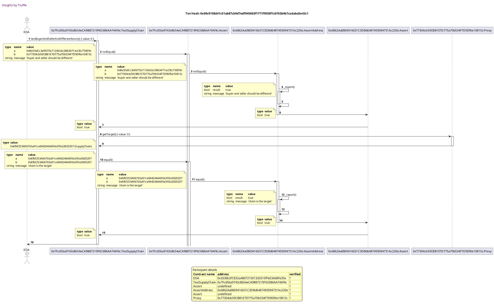


## testItemCanBePutOnSale
Tx: 0xe614ea0eb6df13c5d2567df936fc9c2ab5f6fdeedc68c2b5604ddb1a837d15f7

### diagram 1

[SVG :telescope:](https://www.planttext.com/api/plantuml/svg/rPRVRzis4CVV-LSGxKDRjCNuKwACBAjiIsjVjW39Mr44b7YoXSgIG553tBh_-oZLyPp4JhrWUwXVAEdC3-zxn-FnNUUqTVsgGaZthgdxLGOMeUvpMRVQwXMkO06rcUhyyy8sVMrcJTLO_3nDqcIM87JMkNK5vmWjGHkm-2l2-7rZoozDxNGLL-MYNa7jFAPmtfJwpzy9RM_R2hQVBiilWAdmRnVQcB9UO4hGDq__vHP_o_zGT-LYwJgShV6LxOl2Cv0hNGNuwgR6xtMtd61o0m4Le0baWIaepwLXCWXD4V6WoAESwKmMGM40J1wed6Ko8CAOZ6h5GqDb4VfevCvxcVmPOztXPtvyXdn0N9cNhVPwhg1pbttRLklPKfVrDQ7Z_yXDcEP61ZeA1SzL9WNCucYgGaQZD9W5qo2EGn4N8f_S8zp57qIdXGW4n2nKgH5na1eMC3gNNCJSY6ZAfQ85X64wEOgziCtD-XyWLrh975X8bP1Igs2k2bsecAgfOYoLFCf8f2IVZFCEejWMHUPgLeWacYKvp1cV0cCo2HaBWOOa8lF442v9BXv1yItA-0YHAGL6LIHY6SYKCwaf2Gkgvc8AKb19b8HR51gIzFRyK4fUlvxW38h6GgBpvSjN-2l-IrSz-2s2lw434ppc029lwixPVjWHznaFvn-YlftW8wljClA3TUh6mLX4kz8xspwysOxdcr-nMxU0_LZhrJYE0Bn16umt-DfN-WASVpfzA-6NUow_yYH_5k315uHsdZzLC_jfDRCdQ-O_hMR-RpL_VBwm0FMd_OHFyBvUSRG6xrH5M-aSFZXOfOszr1Nyro7pgHWwpWQNVeq_HZD-yJkiNepMlgoTRnvRyuKjyy7EZvR2WUF3jxJ1_V_Dx-lwkDFNxK6F7mdvcD2d5_Tu60zcXBvV7T35tb5lmEcowlQKpicS438edVcBWFLjToVLnyr2rusgmPP52SQBEDi5PrnhsEKiu4d6qfdYJ0j5VBELX796k6_bAIGy3bGAN0vX-EqkuPw6aNPg1tz8kqywkVeUaCRuZunJU_HZZ5ERysECKxlobk4Jlqs__xtput35_1i0)


Tx: 0x928f0e797c884cb0083207544168fb91003aa982ce33e62998fecee78209ad0c

### diagram 2

[SVG :telescope:](https://www.planttext.com/api/plantuml/svg/xLbRSwCs67tdLsZIXxIptQcGk0XFcYvWqzsdpOpJvqJ0Xyq4Woj49zxD_lSAV7TmOyVn9jd6Bm9PEZhdkmdGXr9o8QjHfccyaaLUZK8GcbRUfFcO2pv26GmWZpqUtGn4KUMnNsI5G3y5lQ3dzpJjh9IJ3CurRGWy1e6-QWXzB4JwfSWbpzmi7UGZoAM2IQJwAr3TKuHn9SOPpBhwwHT0kg7kBdWSf_a0wLZxfj1_cyFFyJ_bPJeOoXA54tGfgYHH69fCPGReyZP77tavx21ywn2MOB0TEsBCY4AC6INODWr3jrWIEZh6b7E7aGWe1Oiu3aiW0h0PmGwFSQIi4Kd5ilVPHRn49wezqPH1P1gbOwxqN48f-zLud4ty8K_pAwmtu_2j7KInQN77DcZ4GjC0ttKyPXFT2IpVyYpNjGqtCQBE1i8wV2jqa1YM0IwnMH0RhXN4n29wrwI6IsF3yQZ9z0HiE-XiXNNB4eHy1Ddfn3Qmlz9y5T3qJ3iW8SNTHEz5hEimnYpFr3tJTPXbcZncXejfPpcvdI5v760RM5yA5L4h7BaJsubj-05Bg0Lch9kugriEymcdBD8vxb56lRdewVHsblHna6rWRXmBACibJOjPnEMOMOuAMelgFkrwiMKmst0eTWoRwcv428REslnsdiRZC4yqhKw0z-TjuVxkNGT9rVr9miZdkGSNbVoSzta6F_-2lg9_U5Q1IaNqJMkPh21Ru1AGqR36sqJ82mbD2LaKdhFPnQ-pzlpkToGdOq2gpVceQHi0TAVTeKh56J4jT8UkofjADLXrgxA6Qc1Dkq-kZVBx3jgJo990sGIHMlZqJnYTRd326_UqzV_wufOopim8YAqpGyK-ixeiuGbpTUOnGWAJEY5sc4cNC_2ElpM3j7jiMJrgPy7V5S-KevxGERp56E6YRs73aOfpFe3QcdMmeDgbQOcYGWY8vEcQaYNdXO1vnNfj8kQyMuLS2HWNGZw5bB0eCaLBLPCga-f2YiqWVaBkJLPj6LFl0WTbtKp9JC3ze237IFLjYtxNd5guYg_Ld4LtsDwzwLZbr1exdhiscpoONSlTzlKAMchO8kjgka3PUmvvUx4zOluyRANdh4bFuEcLsjGohdxwEsfreZziTLhVB6dBPad_sxbZaKQmHr7w3bl-SLIyt3t_4F9lc_xBV93kIwuOgCfv7HG2bUfLxlgLFatlgEJbfjUX0jvIx2WfDe_8VLwhcrdX_hEsnaPOJK3KiQ407ypFbUzA_pzBh8ZVPf1dpV83-QyaUTl8-hlVKVFS-F7pVDyFRk7-ixP_Le4icuQ77CBixlhv4_vLcEIbP_vJ2Nah0SqPNRESfaqFAxMBbIEG62HFit9bvIxkgesbNjalSYbu91SUvLCJDcn0f4aAiI9mjY3Rh5L7Cx5eBoI1poZX1iCsqKsiKuAfRYO1zAXhiG2eMVlxZtM43GqDsgx7SFVHDf5sFIAyZpHrgEglyXYIDA-Lju-fdoUdj7SycpjaiVuyWNO_P3jaENSU06Ztmx8zrbF1EGjHzVkWslhW_Ly0)


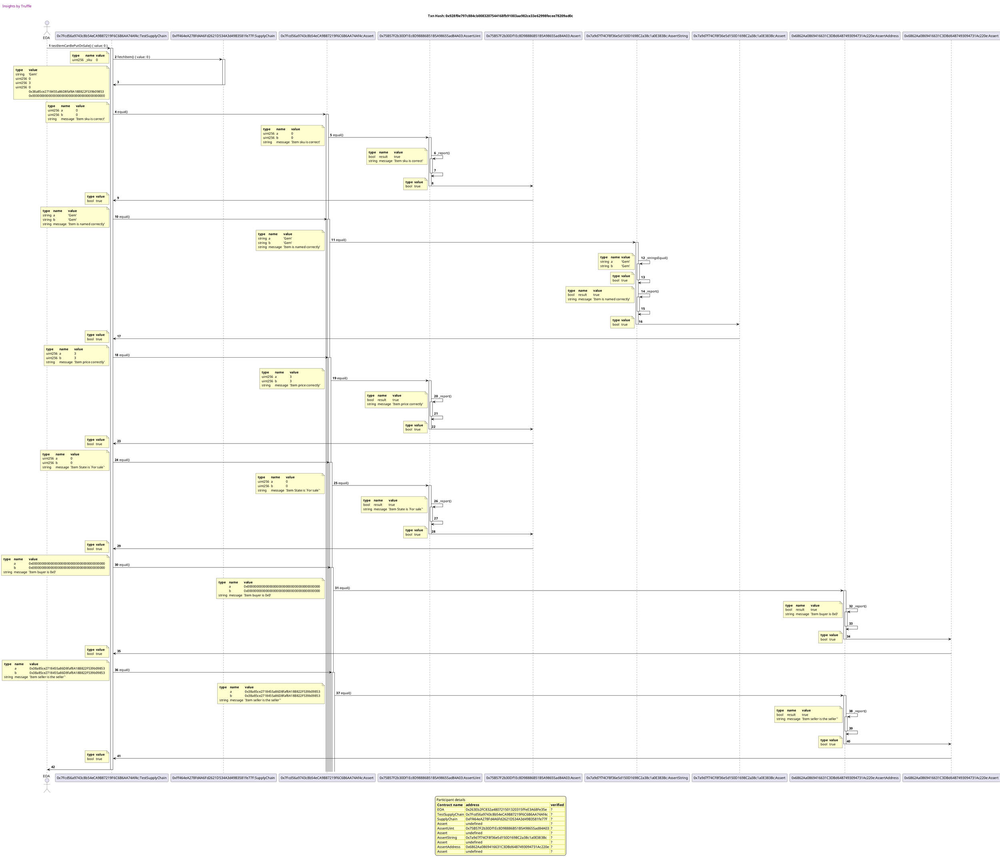


## testUserDoesNotPaysTheRightPrice
Tx: 0x6e30107dbeb201572750a29904db3f788094100fcfe685b20d3ec0cf468e3b84

### diagram 1

[SVG :telescope:](https://www.planttext.com/api/plantuml/svg/rPRVRzis4CVV-LSGxKDRT4NvInHbP5bbMLhxiWL8teOXeAIJBLIM18eQujRztqSfgkSaTkO6xKFzGbadVdZVEnwFxpghZUtN5KAwjqtThrCm27KVoxhLHgzn1KkeyxdEFYvDqzTvr5IDmS-JE8cZ6A6ppcugE4Te1Je7WpyZZDytflpKr5PNOLKkwpNKrc4Awqo9UtrBQ7lJLZ2zkYm_0QR2_RlGULxMIqm9-kBeRx_Yl_8_r5svNDaEfnjyPVgYS0naIri1lhgfyNlThMQOt4ZWX18_Jo5bX7e-ypsYMH0GaQUyy9KYWQ2455a1Kddkcvn3Hh92I0KyLS958xFEo_ZF4EiEFtFZC-G2OikiRBNJSmMTlUpRjjf4ArtMruIEtv4RFyboJ-h05pnJgISW2eEvyXaD4Xd9kGn3NuI5o6Rt27Vn1z69p7WHC2s5bbnAAZM9WH4TSA62kH-JC25ahiJiAFR2D3UR_u2CKH7vZ0alr7wqo1JBg4zzuc2CAPNFbOjXb6QpSTv159jGCcAC-9xdL0QKgBJWUKn5h7mD95am8TAKB3oFFOBY4uepI7sTK1RaL1PKHKKUX86cYppn5d4HK4c9M3YP4meDINfpVYWbhr_FS0f5Oo3MsUhbA_mP_wEh7jmMmL_GWGaESm2HDNLdJJ_iYFkCX_CFKT_Cy97LTXdvdtNgni9OHBlIEviUVfd6y-sls6vQm6wizNeSHm3UeYt6MtpjAdq9rZsTlfNmopsNNpcIEmlmu0j2Ey-Vgfdzj9hPapNpdrOp_rRDVprV6e3wx_s4p_2-Nd6q1kzKHLlf33vOM2UDkTGLVE-GkLGC7MUBIxV67wCPl_WTrYz6Qr_MbdboCb-OCXli_6Wf73W-N4iRtFzXVb_Nnvs-RWzw_4Z8nuG-lRZ7mtWm8tHxTK0NUqTz3bQNLRUdT44MX911QUGk0iQrtPrK5pS3NJUg1bCM9UHEnDakEEDQmovdaiSfIoB5cHQAk6Rh4SePuTGh4eXvA5K2t1l2yDjTmZqD8-tK3lwGTfzqSlKz88tnlzLsOez-Z75gStwCSMfNdXWkyLFwtU-T6uShvhy0)


Tx: 0x510c190be07e3b88efe534326058f8f01fb582b2fcae52fc8184ba605130a3a3

### diagram 2

[SVG :telescope:](https://www.planttext.com/api/plantuml/svg/rLXBSzis4BxpLs2IWzj9xO80GK8Qrur4aKqkhQPsJfsE0v9BYMEAL4dG8oNAV--IalKo7IksF6br42WG-FRR1tQnUbjgLUXgaXg6gdIULPC02iCeRv9igWer8IcC88lwAhmP5NcLHMwUvWLvxNk-vtg6SLxgUGeNXZ465K51FXk4lCkBv5EUQPNsqcIKJI3J21DhVENZz19XMXNJ55PJbyad8AQ5luOgYf9iH4ngV47qd-_Wx_3VPsKo6kkI17DoLLHnZ1Y6JdGAv6gMaNUg77S9dGcJXcQ71a0Tu86K48FW5cSs5JAMCJNZG4WMi3XK8F1Rcj8A5BurELLSSRH6g96bzqUFg9Ayml6LWGRHIPXC5Ufp1QM-hARJTEwELP9TKxDPHsUE7qR2LXt7ug4CX0LkhzEN3ZCxlktQVRlNSwnUR8NTFOHT-66Hp-ORKDjbZ3f284R7f3A8UUIPbYST1TGVCCiA0ZeGWdMRVRjGhInzE-HnXodRKZQtRTDMr0D6LOTRijDtFDhpAUrBg_iOGxO2PCoqN8SnI_IKumv2oKBJCHsAO8n96VMbIHqt2DiOzieI2lq44outje7ryppT00hXkXm6re1RWih8nP4v7kiudkL8BYmsi1aFdBYxsTpEa3qDi0tiGv9jgopwml5PmEaWDhrG3ZfIIhilpBxeTQGjX8garQEykzdSpf0_3V2LOTIXVdhH5jXltdI9nkaFk7AGG_bxheTgNbwDuS_wB0wB98GVVYIVoQrAAy3ZHxuOBJ08lWxh6X8pG3XM9RpNCDdVdkKQcfonpZJdguUVLkF5uXUYvrCWE6PgqemD05aO2rAXWPYmoOAKDnL-qxtPF8uncIm8mtbCRwIMPnXhUaYrnGP1DT_dobw8wuRJlX7_UZqg0BA_DzPaf4ksEN7ajAr9cojEk-GRUM_u1dWya6QiqXA-HdLskkNnBYdW5WFjxEpCY02JQtAhKFpkbWUYPfCVQYyafLzBHesVRVcL9i6MDkW4NTG5Q44cK9PgX9Fa1EiUXijG9H69iIea60KdEwflAAxvtgMW_pZdEvgjlAyBcEQ5FYBl0iegrVYWY-hbk3Vn_S2Q-i0S8_vN2joF0VQ2X-wUqFOJyq0I7u6k4zYbngDt39zkCjSrpAOGQeWkMr9OEySMVZ7eSFoovU3wa1nxVFUjW_pajsKeRtFQBqwyzNtzSF0rQxE37lXvMbGzooYx6ZucVRSAm3-LIeyRmwh55S5whYrDrQ5Aod5UfH49W7pqy-9IfV3nqTfmT_dxNsfoHxvLc-zLCOwYm5RPkBUclbg_QDdWtxziD2r0BSumbcs_CTngCIBGAadBBSa3Ei3CKKjsiOaly5QtTYEsyUYuic43HH8d4261ypNPHbQJqMpk1Snt9MVAaXIxF45DpYWtHUo3ntksz86Bsic_xYBiwT2W7TewtaThBgeDng7DzdsCVJQ7TjbVOtDunj_7M0OMpjUtgJZ9QW-qh-ale-JmllOvmkgJjVJLWItgDmZ3a5q5BdxUubZ_iVKl)


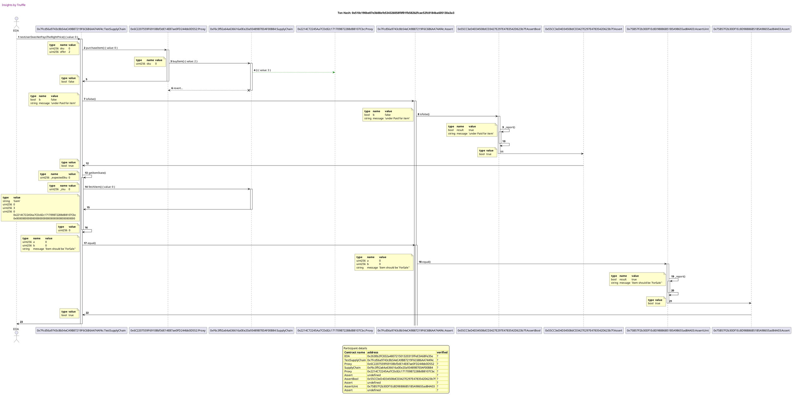


## testUserPaysTheRightPrice
Tx: 0x74102737df8f849117d48aecdb9ad9d5ba7829c2af37e18632724de96b37adaa

### diagram 1

[SVG :telescope:](https://www.planttext.com/api/plantuml/svg/rPRVRzis4CVV-LSGxKDRjCNuIo9bP5abMLhxiWL8teeYe4JA5YfJ0aKDSUl-xwDKntCIE_M2xQ5-eQGpFxpl7O_7TxsJrWsh1W0vkDOCgq9R0FhFjUcabIlOw8KsAf7bvuLj1wFIjcajV9vdUPPc09prRjteSm2MMYfjuLS0uVlMrbzQusGJD_N2hBHn7bCvRyhzv--4Rh1TexUVBkil6cBctowaKhLPG8p0Dq__vHP_o_zW-dgnT3qirl3A3bNb6S3Lhj7mwiR0zx9VpY2wuGmZmYbNbQW4Yp3cYWcfIrL4KaKgA2GN92g9h2ZNM8IKSCAKZiA2SgcazD4edVSo-pE6ieVF_FWC-82ukgmxwVLSwTvT3btNhDEbhCqrmjF__CfvgO9GHfpHKXG1qsaS9O8J7ELX6YPX77CMLwoStIFSnHz4Pv6AI5oAM59USXgfHA0i2JF54bw4MCeKLzYhcXt5NjZsPlqFC1H8v65Oa0J5ALOA4-m3X-SqI4M12Yfon1A1Yzaqxo2AR54u24d0vy4yO097ME0I8IK9uJnNE2dON18LLf8_Wg9RL81fX14cGZ144vQmKEGi2WIASmz74O-euAW8Rb5WJDBRyqCfUVrw1WjTjLPdibo-V0M_mhzaCsY_HU0tS622nnn0bAtfdHt67N6VyN3-8UhR6JoosYuZFrZ7j4vFHRGhlRFjmvljUBxv5Rfrfw4VZLnDumI06x21S0ElVQKljFDFfsyb-7BFvLUUvCy2EFe2mCxpfsecFwrcycJDzAVLJF-jve_F5rPhysa_uJEuhvSThS4xLT4rijGVd5xbhRsKZVwlG-PJCNQS3Qpz6dzCPlZYTxrwCLc7sZWIX5lpXQtBqKwFbiA1uyEtjD7z_ytlQtFSwUlkeCUFX7nAwDEBUpgCHpC0twyEu6Blg5VQoRhfzvJEqHmXD2fD_KN0-hQxa-hZPdNVJwgrhQjQAo_YR1USQQrnbvEGPWN9Kq69z1t2Dzi0OKeGnK6Lwup6leDe6enX-EqkuPw6YNPg1tz8kqywkVeUaARuJunJU_HZZ5ERysECKxlobk4Jlqs__xtputZ5_1i0)


Tx: 0xc3dcf0a8c33a57bfa7147381b58d897eec42016c94cf099bbc92cd2f88234069

### diagram 2

[SVG :telescope:](https://www.planttext.com/api/plantuml/svg/rLXRavis57xdLsYIXsqdtQqkN8HdkmrWQF9KJtVprEbiX2HiPZ6u83hhnFdl5VY2JKZNU-jE_60PMUVJTouwHuUtbMAbgkUPOR1Q5NazZsLf6DLDcYzOoUOWarEP2v_ncsbPrBa8YgmemUieZC8WD8ppIYqpUM4OCyc4BC5d0u1tHPb-AdB5CYzBf_bSvah394h_5UdfDSAYBXUPt4nTffyaGAP-cZ0XqdmA43I-QFIVj_1R_FTvbKvdgWBn4boLTP9e34EbAfFWwZO7xrWr6m5uoudW2MIK4y8i9qwOWqo7K1HRL53NaPAR62ARkwPUvhfnp5tC1KuenSI4jgkjmPLc6Vxk0LQ1LtfyPMY3g9Id2wRrkPALkgmNYsmPp5YQNqFKheEtJiI5PJFNCGcdiMNAm7Dzwc3aHdPW-xRdEQQNc7pKGpY4dvJ5xR83HPQDBMTiZIsJ8XTHn24K36F7YGJoOtFCiB2ragDMxX1ga6Ne2XTxd7gCEDmXhl0f37qx5ARln3PYB409mYuVtSKGRm1j2cbasp7seHSW8H16ZedGc5W1ZM5CQ0HDNzj_YA5NLR9K3p3XMd08p2-Ah0Eqh20WScoEYMb1AW8zOYV4hXEQ3YMMYSSs9h6JZ3hXOORuOO13O1_IV5zboxUS2CS4ZXCKSZfsAQMsRo7VybngMnOJrFGW6NN2mmp9mm1V6KOJwgSNGu7zviq8A3tzGQ-Si6LrDPD_D8TmKgPS_l0Z-0p-OLajzRa3Num1UOswY-S6InzzFcELVA_al2-U5qgsoMANOiutFtxQZ1UhNu1QBYJGOyxcxTW2W9Mn0hMs3BPii0BLJQs_OM-sI1ATHLR0rFCwhu5cFyFOqTDK1vIFwsMVg_bCN3jEVIF--NfQIfd_rLaJWn7OvqGqfxkbK4yA3KZjBJuz7O43-mmvk5bpFsjqLeZrQTFAgx9zxlGV3gGkLpIEIIjT0veGVBGlDYpYZedsYYgRKhG2SrbLRAedmSc4fGAecGIyA4l95LWqX-3ixEpaW7n7SyTvcvA-0zvRgeFShqkvA4hrXEHBMTMP-dyqQ4Fr6skQ4_KieRm7_zBdvnlfVIfLa-4k5LDF4fPTQhkMjmljBIak1tBSCCS1VebKVFQyzUBwc2JyzExRXVh9Rt9-qkFKhrwazupQvsRXqHUmJkBOI-N3ekfHHZdKy7urGVvTi-nfOvZjJDtDnRkveMJLX2gePaMT2H1ByF6ooCJ7Eql4zaxu_QcnPJweoajLZCUptwiMNwrfxjhFMYt8orUBjYTejZECzNi0OxBNSmYfM9fLUpkFuHX2sEmSwAw-r3tqpeUwhzTUgresiaoJL0fDu7n7jjshIKlO9c6Ceu0Ip4mATTjdGKGm9CXA8XaIpwQH95RZuLyF4Newj6Z7zf9VexLttdicoZv6dysnRVT_iJa-qVSnre6bv-jSo2JD6myCh_7NKN9ye_kOpPgJjVRLaJthFJRJ8Ri9NFrvgyVcJTU_)


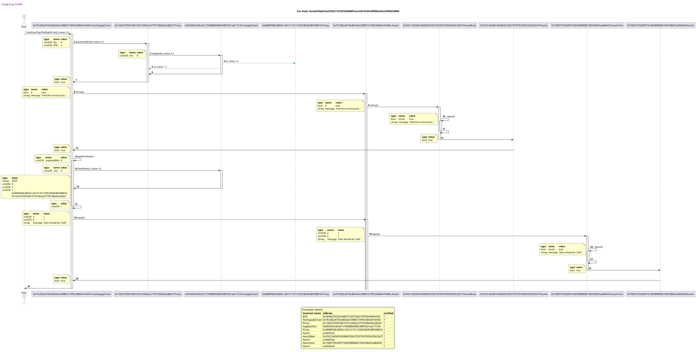


## testItemCannotBePurchasedTwice
Tx: 0x25f6727da7a35936d7bd40bc946c917c091781e970c5071e0166084dec7575bd

### diagram 1

[SVG :telescope:](https://www.planttext.com/api/plantuml/svg/rPRVRzis4CVV-LSGxKDRTCKeKVnbP5bbMLhxiWP8teOXeCYJBLIM38aQujRztqSfZkiaTkO5sqFzOCewyyFxtl5uVDyvtRf-MI6aUzVK_JA75g7kSrclTAkNk88vr7QgpUTvs_IrJPggQV7BBCtI94Neh7Fh2iuHMe2sqEAl2ECFJLj-QMgdgxWgv_KIQkSnXVEcpB--9QpwTbN1zjLb-GLm4FbV5zhQifxZWA1ldlxp7VwE_x7kold2TJXVuwksBmhFGAvq5U2hcnf_qDrYWibDo0ekGc6rq9Gfogt8RKHoeo9kL20CyLyo02M8OKG4G0BEYOmi6C44owsFXd7Uo_HJZ7M7N_Zn1V81SQKfLzhhkOBENVQhLRLE5hgihqam_e_SYCnOnhKI4JKoPn4aiPfA4GOgumcVyZWMKLn4PlA0S1z_43tZEgSgqonD26M1rwViDE4yepoMAHZ2f8f2mIT7iHTjSxF-3WodYbkbP1g5e1W9kGm30xEKAAAPZ0pB9Pab9fYCymwYmYqAPAROD1QMfve9IOMCOvrobPiPDLEg8pgbYXJq2HJTeknCsm9o8bd0Gas4414F9PKs3q92Oy8Y7qZ5oHqA3KbwTtue9M_VJd0EHTD2gitYzHly5V-bgnxy5i7Vq8497dC0OPgwSsq_x8Y7ZCVp3r7VJV2HrNOP-OTrwiR1M4IxqZlRFloq7Sytls2tNW7sOwsNupW2y0PjCDxWQr_fSt3-wVIjX5_lkVp6a_nPW0TV4Dfv_bpDuG-hENosPlh3QgR_LlCVB-SjGFtdVi8dU5zlTBG6xrN5gj86FZfOParxgIluhqFcKp5qd0qk_Hg_ZsRywZTOlXgjVLcxaF6j-Q8jpM2dHqlXmF7XMzhW_l_cztLztEdhrK6FdmZvcD3d5_Tu60zcX6wl3kXYxwYtu7HPTNjAPsH621cK9luYqFgskvFguzP2rusgeIsB4gmNSROBphZMiCj3JjCyp199Gnr9ufij8m7rpI9WHGOfZRdCWB8X3B_U9ppGCD9ExU2FQGz99rVV8z8O_rjj9_RefnYdDkUd6ATsvIt39twRVlzvxyVXYlat)


Tx: 0xbec1ce47c9ff4d058a3e8c8adf506f7a632af995bd2c3dbb39b54745a498de8c

### diagram 2

[SVG :telescope:](https://www.planttext.com/api/plantuml/svg/xLbRSwCs67tdLsYo3sbdcnGG0k59qmKCtNrgPfm-TJfPWOJD18CB8cllUlzxF_05csKtpctJJEk7oCZwZivtqP5GtfII5RAQfeh2AfbdrJGKXQAKrqasOmMRebICHSPT5bsFYxpAk9UdUO5U1NxWUxwYd9LoaOfpHPa8naM1FYa8lSsBv6EUIPOwQJBEfYAJ01DB-2c0xXN2h2fcgLXtZPAF0ca6F5qmpfDiZ3HL-GpeFs_WD_ZliZ8PJsI9mWMwBAeu1Wn59Z8Lw7AUeRUid0oGEWz5f4N2i28xZWsk4igme15bF2Qg6LlCn3gBRPk4N8ym3qDiXyIm3C8Cct8O2T689B3qVtSGAz4Hj4SA14GcKJ9ZuC-bAEMecitIXJTXINQbQiquTMu54IScioq3HnH0XUVOBhLqpGvCptHDnx4C9pQYGGTX7_wYoEUB5bJGm2QkOt7JPyIYsAAEmtpJ3gCXZbpC3EnYMutneB7RX-fbEJGP-1mmudig9fgbMpPtFTCCiEbGNqGGCTlGBNDm6qDz3QYxjibjc_g6BcoYwYRL8G53NxLLHgWHaP2gGo_I-XWwPIaAUOyGhWpxmDmyJrj0GZmFYw4nn0PHAVUWrIrVjotVW60IGn-QEWwjUD0QzpFKxmVO1_P7akswJ5nY1Ng8rM6i-H4TsfHIqoMQInoRceGmJWr7nOFMk9yXlX_WaQBKfNvotbVOhryFa8JkTr9CFPPbkNJ5HLL44rOAVlaXYSGFFw9Fw8QbbO35XpuhFI00lItg6d2s1gX1k-OmWsWKOwipP-ilFwtRy-KlI2vc0a6RiMdJDW1egInH1U7HYOcMgBokuA_QwStZ6AHaYGpe1t53zNoAigK7L7iY45QBBbVZYRYsdBf1_FFLk10Y-wkDfeu6Q9SJ1awtMsaTAwt7QcVmoSa0xSMdBy7rcBj5eur224iEd9T5yzpwtrz8hM3KYKbAs0Zg4dnmBjOimfO9P4KMzNwqH5DHbcmCdUZuWYKSoOb0KLuK8f9eLi0YE3qzFTuZtzBSSjxeqWlWlQ7Qo_sg4BEya8z8lX1bbShluq5JgbyPKw-e9odb7VZdNZ__2_6TXVWxY5_Cqb9yI_td9pkv6y2AkO62WjfNk83JQdB3OFfzamFrCwXdVcGXsdZJluv7axnA6pTHA10BuVWkSyJpglu62KOiGmaa-Ow2-h8S-LSgx9Cuz5yNtAySgiUYELEF9ApSnqXqAs5NOZw3xL7mKO-MzNFiuHSB6KsUTb-uEkJK-_ZfsrR-yM-hKjxbrDsbSETPQvxhWGU_zhOMXxxAtw-g7XIKVG_lTWWNVrSiVTmQPjjGjttXjgzFk-fIHULAm42yte_obB-_TGlPl8c_F3Ssp7jTUQuDvE7iTtQBByRKDnnFkblWvzyjcfkOUZf5MTs-AXSxDprSI9QavSxCGtMegcezivTdie2pu3Q7Z7F8Mjcm4KKI9u83WRCjsMQkHiXCx8Twu56iCuEgbguHLSEwYZKI1yB7Zaa3WKcTuL_t4Je-D6Y7tk1zYTOSR-yeb5sCBfj3Bpk_nUPmeUzYh0eB-gkCYpZ9wWpqZt5NLNBuzU939gjNrYfN1zuKtc4oADbruSBd3RJr_nV-0G00)


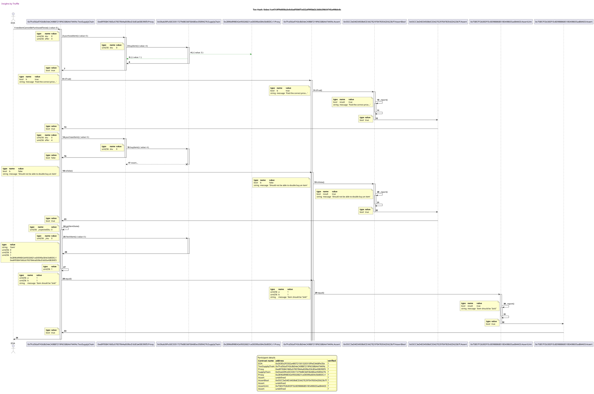


## testRandomUserCannotShipItem
Tx: 0x72f23fb05fdfe1eb7ead3ffcfc70b0a103bfe904d20f31325f220422b9f94504

### diagram 1

[SVG :telescope:](https://www.planttext.com/api/plantuml/svg/rPPDRziu48Rl_1L4UsYBjYX5wjF8PYl9qhQNRO3aLYm2YXhQGcN9eAX5tBh_VKUAxJg9dVK6sqDzeQGn7yuxm-7mVMUbiVsY9aJsjctwHG66aEvBrIobaGjQmmoQCf7goyoqVLEcRTqQ-ZpFyYpD23dhxAg6SqBc84imz1kXz4DhggzjOsKTrzMiMK1Z4QCjcdByV4jOzcPPm-RJPVKLgEFYsuKiowgPKOUHxqX_jyLl-H-RhfhDRKUB5RqolTR88BQoDT2hcuP-aDryGjbDm3KNkc2UBZKuK0GuMsYjj0fOmQJ3HA4XOcx9cHQEu9xcdBcS5v6EN8-v60rbqSliKqnbHv_X-8nWG6obggL4FLVGsSj-kQnNwLnMpJLpnl_XohagFLz6WIjKM7Wkf76KX05tejnF_SIFuy2DjQiczmXtyGVHKJaDF1re5l4iqN6KbtcfaoHq87LLd4IH4-HUwXMJezWBqzwiVW1vgZn7SwGoxYHH09c7KGXvuaWH-ifr5GkrIFF9EEyWYczHaPibvLJfH3X-0Pb8OuXzpIDUy4o8KdA7XJuKZw34DeB0fPVpI4NScGekUI80e8nStmV68FQODuqodsrHP4ZIs_D3ANdzUa8BqAs1JAhvorVq6_rRrZtW5g7VoO49Y3c0K6tJMTCFE-8-u-7yGzIt4tfajLr6_cMTfhKm5j6kzCus3sysu_dwDsfNIw0uDd8nZYE0hicQqZMznagVWSMdqxSIVRddyYiauLb01ry8sNd-LCtybzNCdwnP_BAQnN_L_Fdvp00qV-qdV4BtzRf7Q_1ELInhgU2ZXKNUcajPm_yTCap5q77MjC8r_XpDzCKVi7WnMlkgiTppD-OBKwd1BewMme7Z0rlQuFvFy_kwEUxqzVAWnu-4V4pequjxF8m7Co6tLmToiNVKbs1bLNTxIgTioXWRbAPu4J3OTdTICMu6kcvK3QRI5PGeucmNd76jOPTpNsG5pzCGkuKRCcos7iEcpeJZwHnxKUo7EGXl2CFlTmdtD8oqKpluGzfzqidLzu0qnlzMsuaz-b76YStvCSQfNNd3mCHlqe-_zpWELyn_0000)


Tx: 0x27d9cb35de1b2098cf3a6cd994cfcb33e526670b0f00ad78e9a526deead55eab

### diagram 2

[SVG :telescope:](https://www.planttext.com/api/plantuml/svg/vLbTSvms57tdLsYI1xUJEXKIucCdJGCiD7bfFNNorEau0brscR2m1U6n4-U_zuAzotg3axMphfFfFbYBLZewz-j8o2yQBMlTBWh3aAskodQHG6qOpRkyNCfQBaW1CoXL8DDtixfgInLMHLMJnt4KHs5a6CyQVLx0SyEOWrHGamy68I-hEdzVbLeMVf7FoWMK6c4oZJ_5s7s9i6phPG5NNSVvUo2cXKz7Kgcyd16J6XyH_USL_0h_LTdaixbkI79ENjTjbY66eNDT07bzLfANifbF23rZZlBIX0i5PiAevwOPbtQgFCzAC-pd89XjEpIX6QLIEIvu4diKu292W4pG6wb6bj4VFf4DUOJj8mCTelCqNqgqvpKq-hXTBelpS2xpyeIQ_JXwviIf4hRq78kdRY8i27qlS1rcUh4Tse7j-uxbPrOwsKAu3dzKLsVd0oZph2XGqpGBk6ad4F7G1z_EcCSI5d6k93EfQqCowUTTXnfbwQcf8p8denwBWiptOXMhB0XS4q8hzGFFCvrOX2APV8aXMp4CKs5c354fCmFFWKWmQhaiC2LtxTIoKkfcF8p76FfD0xM-Wmil9uw11LLL3812X267gJNbbg2k2h5bJiGy9x8SbmkBJMt64oUR39F76RAx0OvwZg-i1IP5pBpKO-QKCya23W3AismRA0LVK37r8flUxBatURdfFH489sO9fzFCZ59twhckQmV238JlkROGKhcMJ_bac3nkBByRu2F3wAhcyFbOZJnvCY4Qk_-KfQeMRt1yACkoqiVpVFbAm-A77ya7SYgB5h2AoKTZ10A1rzNHmQ6Gf7FPmDXqH8PUUjQ2zUpgoqzNxVEBNuW-NmB1jfIBlkq1o8LnGLfq3XCskI3DknR_qgtUAijGaow8XVseagHRpp3Mz93gYFr9UxxDrRedhWEdRIV-zNXM0vH_3zvaP48sEN7azELPvjOiSsJMnk33mmcvvf-n07TZRkUDmGi9rYuQh-l-UR1_F946vUa2apUuem1QyzMnk6AH34mmAhhkDhOBie2caJFi90T7CbT4pu6aLLr3gicopbDu-lJfmJNo0yqrvvN0VGUyLrH7kP_KiAnglKVoDJHjeVyR2_fKlM5CLr7taieRy0zTF-kjh0jbSuE6tw-mhIcCY-t3axgd26MoQE1p4dzsk16W2PR5AMOD9hYX0C-s-Qd4vQzFsL4ausxbFQlDofhnOlszAaa3HO5xRTeV5_gmtb8ZlsNQtwH4xe7-_rqVRpW1pq1tcdIiiGRt4TP1Z4xWR8cx6QZZ4LKQvpZ2BmETpkzNDKzsEQJkFtphF3_u3HO7MvosJ_Tywzdidxk1Ex_kRipOyHN-RbdrLKwvRk7jpipmJokB_UQmNBjww4lMVMDArQKgYbFL5WgrRO5SoTlZgb1llxX5h5wTlqzJLkn7pNceRMC_5cpi79-CwGzMzxbpy8VVEVehb6uvmxYyWJMEDgve56YP5yt6obCwfPHsAuTLgMiyuQtZA9N2o3Kz6wZpB0U519wjoVPhzH9byoXXSUXo9YsNEimKrEICSbDaCIgMRxinSD55-TVh25isz6Yxtk9zYjOVMcyfcjiOssnslV3yB9kTHNyRupAniByj5MHvsKLWV4nmcIMxNp7URR71g5sl7szQfwlEIw0ThmblGHZJ_YhvyVC2s-x_5Fy2)


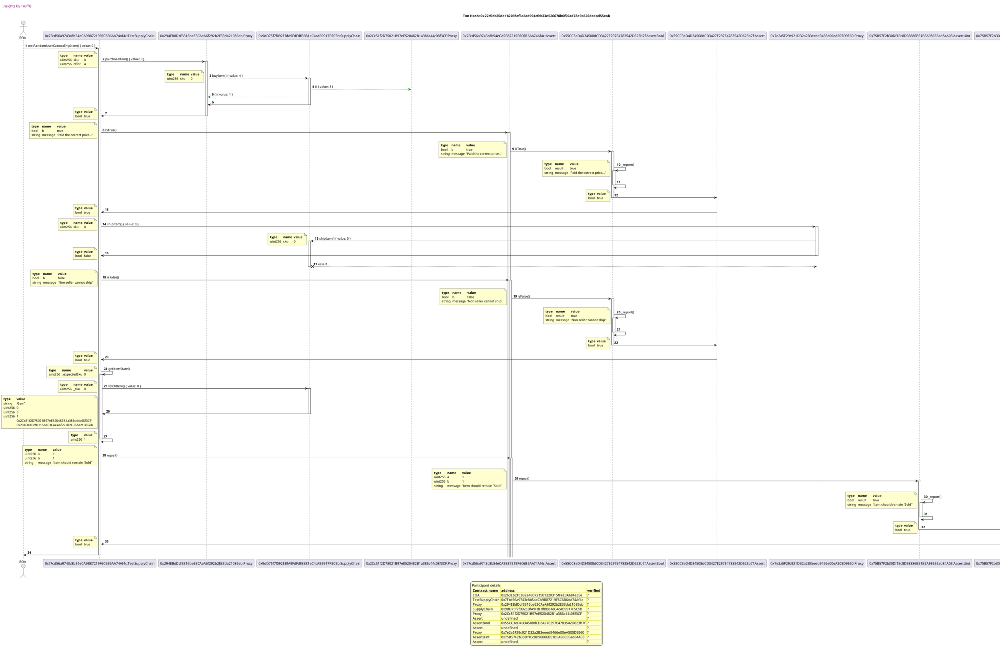


## testSellerCanShipItem
Tx: 0x89675501a6fc294f42afd2865a252bed3309e9d6cd9476d96c1f49e94c468e81

### diagram 1

[SVG :telescope:](https://www.planttext.com/api/plantuml/svg/rPPDRziu48Rl_1L4UsYBjbY9NnADRBRwtFQo6o2v5KL0KIDRg2mP5BM8M_U_BwKwNYUnKs-mUwWlb3JcmtbdE1o-wwqoTbWs2Ad1TksmBC0Wr7-ksvKoQeaRc4DRnaf_dfjkQCkaQpg3d-TPdYKPGcUzNJTmZj02L0a6VqKOl-zC_QLhhMgYffwtIsYjmrJMcNBt-JjXDPXL0zjFb_KNm3vpRnUgBEjsZdqFVNFqNsxnj_mFRL_F5xR7nHfVcQ6g70FPsZQ0hsvQ_5xrYndsRa8f0iuzNubA4yagHbHLab1mHJWfeAJKao1BeKl90b5AeVsAkIzCCn52wBjeQEkypFwCiEhnCpS-GouWjjRrIZazLz3Ros6rQjR9GjNjjUTF__DkWboNN2WPCAh3WZD88Xc70V5bBX8HYoWAM5GnFRj7k8i_YCvINyKI2DMQ1OdCWCK-8N4eAvz4N7XXbP60IZOxYhqmtStw7w0iH1AKMeKneom47Sf8-fnJ2Rda0HSiI3tbHsespJk88bjKclenPofDop0kiYgKSI6bKqt3jF8bIVmifq4g-ICekaNHr6Sv2SeiPvcNnK4WH9G5qWNEGNmkGYLv6HDzYq9ZajwU7qh9wzSpN43L6SYKNhnyXR_YlrGpWDiY-1iwCC5X3Y1qr_RM3EEEkCzuEFyGzUqC7rbjbv4VhDDs5gOYsfNUsVRXpNOyt_oAxNe5s8sjMaxZ1C0RjC5uWwzTfS_1kgVJjn9-kUVoAqToPm4UVK5ev_bJDPEVLZDvicRwqsgc_rRpn-Tp0z1-sa_u3E_hPKThy4vLh1gbuOE5PTwPIzN0VnqobugnusnmxTRuOpBZ5x_3yiLa7UhM4YwsvWjJwz5EZvR2WUF3jRJH_V_Dx-lskDFNguCUFnBoAQ5FB-xfC1xD27s_Eg2BlQE-1AlgfjzJcdgfvtcZqiHT18nhkpkfBcu6-dvI3QQkQYYTYBDTSAQrnbrE1CqAaYSX9Og5dcixhlLJub6VLpbaD19X3fIFOVZjBk6UXebsQWT_IBjFEhdw7f2c-4-CKtlqOunJc_DZZ5ExyfRX4hzDl_kzS-DunVmR)


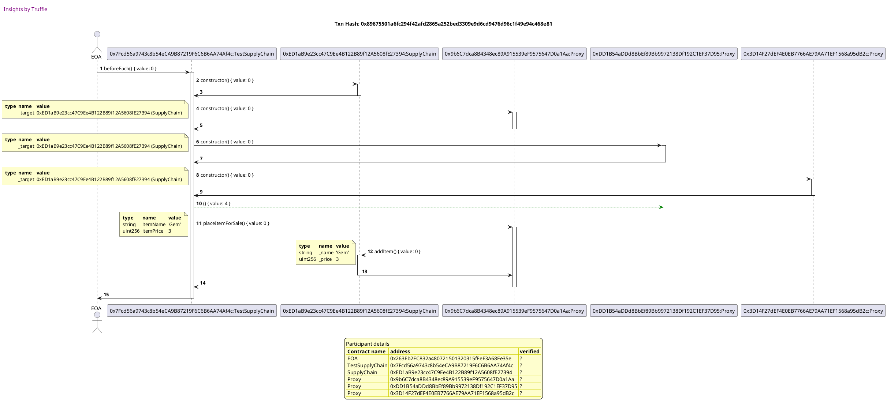

Tx: 0x5801b4e4946e5bd8de4fc48e30b9326f7f7e813eacb6a41bb78990d8c2fedfea

### diagram 2

[SVG :telescope:](https://www.planttext.com/api/plantuml/svg/xLXRSvms67tdLsYS1xUJsWL9WDXntN3R9a_rZDsdJiSHyB7Bc0KA8kDDDl-zWhsmIt2yjjTrCgqVB2FhEphVHKUNDvNWfQXdgQBmMkHPFGkWL9Jg9iaANl8PIc42MUJmy6PIvdKMkNcQb-ZLs1_xhgyePvMOft2kA5FW4PJeauBGsxnCFkQPuAcT9fDi1fcGCB6G_nhBxYL2KPT52gkko-GZ88tAhmiUHKasGPggV9ReFw_Xr_ZliYgPJ4M5WZcwAkiubXYAI4GAwEesGszvDHqXzLPdgXPGe1OrG0yY5W6DGyg0g855i16RiGbC8y33mE1K2mAJMPOQiH374CN0PJH28Ldwlzk8L-X8jaUA38X8mgJWqfyhgCHbNHJft9to9BjMjNQSUckEmqWtk6LI4h90f-3QbiDCh5bZmpKSmxPDQiSq7FKGTk4lolnste5wdkReb7jUn9p0Zvdb19ObCGdpOit2hkQFYUbP-gYrsuKQPEbx6dSim2GCgUbQFb17mzXXLgnXMpTK5llO91OTtSSGhm2jm73DAEJCeKJ6EMIMRMcwJYmOMxgf6zJqLAxPV8YXNLLGYaU4S6au1ERaUTe1whhh4l2eHwYkiiYLBJPzR9a-DHdHAVOCJ08p7dN6mmpnum27mFv8icsNTKStnpWWgaoe7pBFOemPZYxJRblCq7KUCMghPDGP3pCaZmCyKfIcr4_EXmhxzUiH4aqtf2cKBiykfqdnJi3iXn_H9_I1fpN8DOS-AmEs4d5JomsENFRXb5SmP9xb0bgXsCZBsUgFdrRj-U8N9EO58DbcVDQsBG1QA0jKowXWtK0BLDtKyhVQwytZM2h80b7PBpKDDVCfoeQUf3hWU53F-rpfCt7jEFM3-EUhIGcG_TL54wCHskP49AVxhRIUbJPWjJNuv6I4Tk8pbE1cpCEYqKKXa2jDEY_AzhlpVxYGEfre4fDKKlz1UlFaNAnO11qJcHLHDjlG0isWglX4TgBZ2vv4I4m1XNbPGYXGKIOXd9wU7k-GxsXkEA_bw3lWlQOwoFswX28lnG79br3LgVXtF6XBzOunpOfwbbBUWd_fzREHZYQLrHqQ_hp2jg4mBBOlG-ehaTfMGFo_0bRj2K2cAQ_J20M0U20FtY9l4_UDg-23kN-JIdWuB_xhQdZ7GNS2eb6WIy75GSgpavvhk2tatWNHvO063NCSu1U32AVFgv7N-udaeTEtAVVZts1stEFKFykJtZTklvk1Urz5EujzhzUFgwed1MNNmuVj3_1tpTF3rZ3VXBhh2pPzGuBLbEgMNBrlxeu5HE_ltItM5-JlqfCr-K5lNchlE8W3Mzl65sEQvuTdtJR8osyRxJD9CvsYB9z6bOkjPvW814_IQcjcJ_LKLMrcTlDCb5nUNjPfv54a4rUrRA1CuWGYIU1iGxQTgz4dR10_m6EN4SmfKwKowQf6i4eqFHw3Jso3ZO7eJP9_tKNe-T2YxVkyzYLQUn1-e6BsCVfizds9_1gR_HM_Zx4iBDbVPn74ITPaO7YCiwoI_T_-dZ9PixAMkThp6Uy1aycINHMk_7aZs-Rn_ny0)


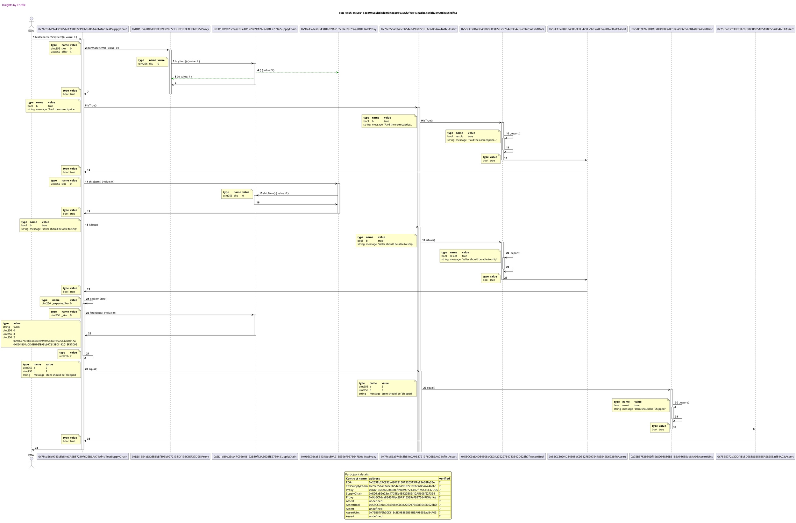


## testCannotShipAnItemThatIsNotSold
Tx: 0x5c291b880d17e8a87c1dbaf610ae3cc4ba5acae53033e01d71479d940ce763d1

### diagram 1

[SVG :telescope:](https://www.planttext.com/api/plantuml/svg/rPRVRzis4CVV-LSGxKDRjCNuGwGe8yigozBQbor0ybOK0KMURA6oP4ZK4BVk_pvATJmdiLCls1xg5qewyyFxtl5uVDSvtRf-MI6aUzVK_JA75g7kSrclTAkNk88vr7QgpUTvs_IrJPggQV7pBCtI94Neh7Fh2iuHMe2sqEAl2EFtJLj-QMgdgxWgv_KIQkSnXVEcp7_-JbZrxQg2xQVByWjW6lYt2srjMSyn9UYRf_zoYx_bVwYxShvm7SxN-AhjYy8pa2jT1VZgfiRlTRUOO78Z38jehXInD0IbLMYepNKXAT70ZGboBRJH83ZX70Yr8Gt2o4O1CH1ARgcFXd7Uo_JF6EiEF_FZC-G3uafJhhJNSmMTk-nNgsgTB7HPNnCw_e_SX9cnGkee3BXHkGWWYQEf2XcDCfd8gOpZC8YBm4pk4UxY3w8PYG91upmIdBAK12nJCoxo99wnN0asfMecZINfv2Zsecrkrly0fQ8vX2hMwOo4XaSPAy8ep6HePKfia2bcf8XcoMISTn35RcKBq84bSKO39caiQIfOpBHYEKkbaY9cAIiImnz1yIrAXJAA0XCf4aPQ2QNiJ0X2x3HaBEE4P7aS9IgERr5eIDBRyqCfUVrwWdCecXPIRHOlN-6l-2zTzU2t2Fw63apmc0C8qzITQ_jXHzndF9n_YFfsWe-ijil83zQf6mTZ4UrAxspxy6Oxdcz-nMwz0kp7MY_7SGJW3TfWlC7NljBduFpJwLi9lznp-PKd-RC03xuWjFFygPhPJwkPFLap_saryt-h-UFpUGjGVzfF-0JlwmsErk2TgbXLsi071ykiQIzr1Vzro7mgXewpmQLVuu_HZ5_y3iiNexKlQyU4t9elsj8CTdwq50uS7xwb3Ux_RtvVryUTlbuTzFYHa8y9VNfnZuVnO4Re-zK1NUmTzHQSBgjkJ-cCp0WXWzB4NmHQttPtKdtSMkYwKJMqPL62zIBETi4PrnftkUHfph94SQO3tpOO5OHoHZWLHGOfZwNAW8iX3B_T9TpJCD9ExU0FQVT99rVV0z8O_v5nQez-Z75gStwCSMfNtZ9yuhVfzxztVXokc7y3)


Tx: 0x1fcca307c5a98fbcb08d15479ef09706c97045982f154480d0e943235bba0168

### diagram 2

[SVG :telescope:](https://www.planttext.com/api/plantuml/svg/rLXRSwCs57xNhz2a3sbdcrH828GdJHTpwUQbpOpJvwm0OJF1u8B8EBlP_zu3lZjarharitwmR1bzv_lEEJhIySTQoqetqnmXsUYoQAQHgX2gRx9Y9YivnRaQgo8PolXcN9LDaNXbNbRufp080oz0wApMTxawHsYYPA8g_1LX_AciiYzbeMNkvjcucAf20qoguQSGfXS8iwQQvMevDSg-A6oOyErI9abMZB51q3T0_sq5lyA_AEfiFD4rZkxmLTMaAM0WdUbSuQjvWJ_9UZB0P6waSImPiMCk7P56SKH4Od3JTbHA79jOCRoPt14qXLbJa8GensIKyIYInB04U2FMm3BusyMonaSm7Y5mYCxYR2P1pvMgzQYPpV8xRoApufeOtNDaReTnmYtfs2QBHSHDvRdEKDZKS4BBiuQMwzgccvhnO0zX5_woAkTt6r1B696oXIi37pGn9wIfxTYXPITMG18p53IskEDxWsxTBbGlIqeSanjkv71cq82OD1G-YFTSdqQ2qw4XV2jEI31ubA5RrwhIpz2zMDW7DYpBV0F8kUSnvPi-Cpb4puEHsW5rxC2q1UCczItA8ZiTR1RtCwJF0-m3-oShjYNp8RT36Z7YfqOG2zyHGbX3RWovwmYBSva8qoLii5dSpv0z3_08eJO_Jyxxil73Xm7MCEt9eYZrQ9BDtE92g-dLHEgB-Y-OAlFavr_mLtmhyqR1fi7VK0yEeA-JiSMi0Qd5sLyAHbItozUruMpvuTVbU7x_EzPtCuLXBEIq6pi0V8_kSGFUeTp2zxY-QU2Tm2mK7jpY8hIc07HwXBu_gJxFdGpm4nbiB4UGpc0mbNcjTepk6PcVR0LeW2jr2ubnUdgA4WKLBBkLO7vtoID1tkpdrg5P7RQMmPylzk5IIRIb1jofgxRAt-EfgcivXabylCZKBfOuWs1Y3QaAJF3diAn6CbUVJuztNB6XlEQ_AY4_c8OLxLuTrvMQbPL-HHsLgfjSmmTTDV-Vbcu_FF9CMwLVOxyi1JtC4Vg6c_I1qVuTzaYH7YlTbgwHXgtw6Z7UrAnhDP-fMAjar5Ey-Zdsy4kLZYTlMrol-whhGGvyKVZMIN_yfveUxt4YUzzPx-_jXuDlPviLvC3NyxBgHKxPLVWzwxkdXlgtaVdhvh3i2KMqdkihMssgGj4gcpo1GZS5hfk2zTtpOtN1-s7Lh0JqAdgla-JLH6mT8G-UQQ_HRtg4iFS_GhhhVciEeKLVZYwtseb4QPdbzPPbd_XGHLhB7dJP5Tm8rw64FXk2LtTiL9MbcKg0mDcQR6UhhLNKOa54GqymAg5JXewE4uDHmWoUXYfWhYL2nNWRw3zs4VOqT6Y7jeaFqRfBxXFhxJx6Ffj3s-27I8kaWFccI5IQ5Qtt-fyPBY9yUF_v4cFjhbZu-S1MyWd68DsMIGUlZp2s_nhz1m00)


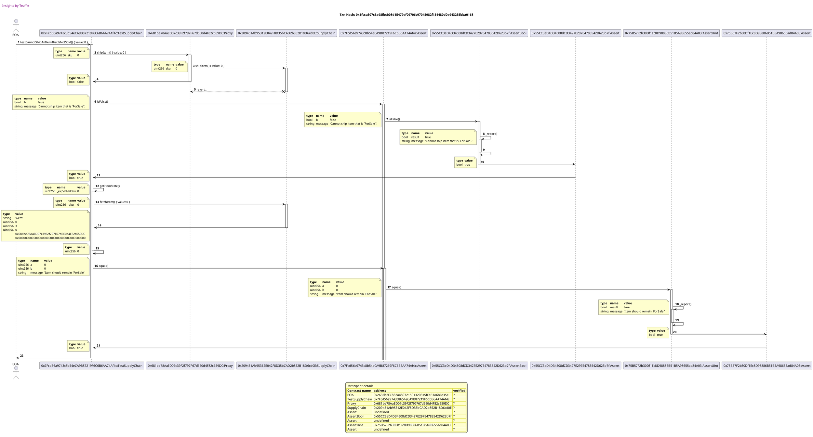


## testNonBuyerCannotSetItemAsReceived
Tx: 0x0785aa9ef408991625d436d00f1e2bec8e3026b8cbcd07b91273ac3eefc2d9ed

### diagram 1

[SVG :telescope:](https://www.planttext.com/api/plantuml/svg/rPRVRzis4CVV-LSGxKDRjCNuGw8e8yigozBQbor0ybOC0KMURA6oP51K4RVk_pvASGmdiJCls1vgmA2iCp-yxnsFnm-TKzRroneXrRkswPS5M8IwBrMpKbOjSGrpQCnKwIzps_QDITkwjVXbdkLPcY5qrhbr3US8BK0PiFWxmlXZQwjlRUDKdTJLl5b2upocTDwK-zUtX5LlLpLiNrrMtm3JmF-wKCPKpHnJWdvu-Yzt-3l-fwQhvWlNuMADhsnVbfw1NELgm5St3VwekiK4aniIoL2f6Cg0o3YcWeKcuC8GKb9W1MW9d31HI5reGw8YfYpYIdE0KZCJW_7HqCvxcVsPODNX5tvyWNn0NAMhbV9whg1pb_rgLQ_JXQgQQqB7_v6RADSc52gE0gvb4GQG9l5KHep6kKZ5L2H952Hbe2SF2FVn1z7Ukr0MJ1ckOcKYBuiMqo3AM2RzTmPCfZpZ4PaSnLxOzcQz1mn2FOkqr2IaPiQ45gAWF4fL6ayf2s8HH8R5Ga_6UGTHx0v54a48ZVtCa40q5N58Y4cB98aDfq6QC26D9FG95D-YgEHKXDCWbMdWanP7D9I4cTbC92KX15JcYIgQtQ7GaAJtvuTIylRj11TGjXOofHUlt-3l-AkgU_1R1Fz01oPup064RflEsNxO4GyPZ-SVehwVu2EhxJBo3-iqhOEnY7QbTxPzUBSTppU_OhTU0VPZevRZE0Bm1cqmtk1hN-bpSFxfzAs4N--v_CQJ_5c01ryGsdd-NCtifzNCdgsP_xIQ-R_L_Fdbt08qV-qdV8BtzGP7Q_1ULQngfU6JWsNUsajLmtyTCf-AeUDiSENN-6CqurU_m_BLQEshnh5GRCqNjjA3dHyjXGF7XszfW_l_cz_NpN6dhrS7FNuYv6D2dr_Sus4yc16wlJgWYxsZte1JLTtjAPsHcJ_K1wMflmXOttPtKdtSB7JTg1fiLLPWl8YpNN36jOPTpWJF2fQdaZCLIEARRKWePuJJiCmXuucGEV1m2CDlzmaFD8oqKpluOzf3qidLzuWqnl-MSMAFVf9nOdD-Yd5gLzuoVEAtwVUV3tuShfX_0m00)


Tx: 0xf4993ab47421d5350f510223a0a3a46061137005bbc15ef9ae0c6e2752e09026

### diagram 2

[SVG :telescope:](https://www.planttext.com/api/plantuml/svg/xLbRRzis67tNho3QXsxeqb6ag8lHTPLbU-tB6ipTqp2abFZ95YfBdaHbSPl-ztsIBx9TfNLIfqcn1aXaCUJX-Mw7DFcyrBBGrImr35dfFAjc8HI6KRvDihaiv8oaC85CzMNqTbBaLQQ2FCqByd0q70s3eM4yBVKYXMU6CGMfe23l3K9Uv4NoBi-qJFqqcMGpo3J2n1h_DSBc9SAyAkOfh9h6oJiWfeLlfrAf99iGaneV4FtdDVmQ_sLM9fEfBacu8A-BAeuHmz29Je6yliZ82rbEUuHUn9RdSHbQZiLC9RYWiJ0fOrnIoQLbKziqkKEf2CF8511x4cXa0tC40-fHPgCt8eqiXwzy8alo09yF37I8Jg9aBj6Urr3gSJMVfujWAfFiZ9fDFthXZ28bREav5e_SK5WG-5xVTPZfZUp0xjk-xrX-R4MzFOHT-DCYlrYqe41zcrBJ2xo-eE3qRKzGgeBGzpt5JIlmcUqgbvgzPjmkL2TBW5Yu8PEAIqygnpDjC-nRpf0DNVmT07C3FaGFzJx7aAq1BH4DdCYDg33LWDcHROVeua0YPPDPdcqvYdbsrCNGBqiez0rSk1pO1TRFyxG55288E0oi0RS4TLM0JuQsUixGSbmkB3Qm6G-TkDSExcR8RWROwJc-mZ9TRjgYRmLkO5dSzXnJk9IfmS3sOqefo266M3g3gpttPv9jUq_qXJDY8QU3s1n6xi1pNTVk2xClVC-rXP3AjNpAU-tWRcFvpG0V64PTDIVFkchayUCUqTZyUvxrgmKKWSooN8z1lzGmyyi_88Ba7DGFFvBtv5oc5M0namz61nBYRugaHaKzYQQoX1feVpXE0Oq2RNJhwUh3JwldiyjVY5xCWU0paxFcsG2GI-EILEWZ9cnoISgt5VwbUwrv7ACqNH8Bsr4iIJsVOMpe8TKEDuJLOf-hTKjSMqxxJlphuQG0oFvklSb8ZsnpuiZfywFClL5cnwYjpYSdFRBZdwu0rtskvutM2o6MC1glY-QzjRyxaLe1gWEJbBYm05hpnR5OiGXR9XWLNTJhsoMPGLdA2JQIHwSoKKHFWKHvKK2aoRn88dZovCcZ7V8jpGtdjSvz0xpNL3kvdnKmpmjzHF85b5Mgluu5JQfUqQUkg5j9vItukwwVZNJKeIodoVnhYV17Oikk4Dkx8VK9Jsqh8FkkW6D8Krn28vareI89nWhhKchoBsv2oZnLzrqBRsZ1lLJ5OzloNHzNE_uwgCLoZtjd4iclaCXxmUkMuXJBj8HFIVF5oLQOQb-SO-xWDi1G82ETd4kSVdV8WK8wgcS-iWwjhUaktbTPkgY_NAmAU1LMWX_hChwcYduBzE-bX1xHZF-xUbvnZ31P7XgCDTRcCSBRYjGPNCpnkm2eSOTQTNFiu1U3ZgQtgwPdXsqwZns-JRu_-csPojkSziz6-DuxQzxhZWUV6MwDEF0Sz6PPzKLEsRNmUljj-AUIwN5pM6vStRQ5cxOknQfJ5RTxUPKgbAiPSYLlnhZxcuDwyzbLOtq4-SrQipQWqwAxMaIEPiJM4l9HdsRdTPjB2B_x9QGvaAwdCupbVPPnkdNWhK3B92stPXxG0QMqdZd8CrtW5d0JIgaK1gzis42Hn0ae9F1qGxQPgzOgPlDXo4Q1ovcqNEemKr2JCyfD4OzWo7tR7G4NTQ1_tKNOiw51E_HEv6EqPbTxJVNSnzXdS-ZrqIVP7Ap--nZBnCBsAbCG9raTWUu-_MMM77vXSxF9MgCElSovQfwwEfVnFl3IvHg4CUrNoOy_p_5Pt_h-1m00)


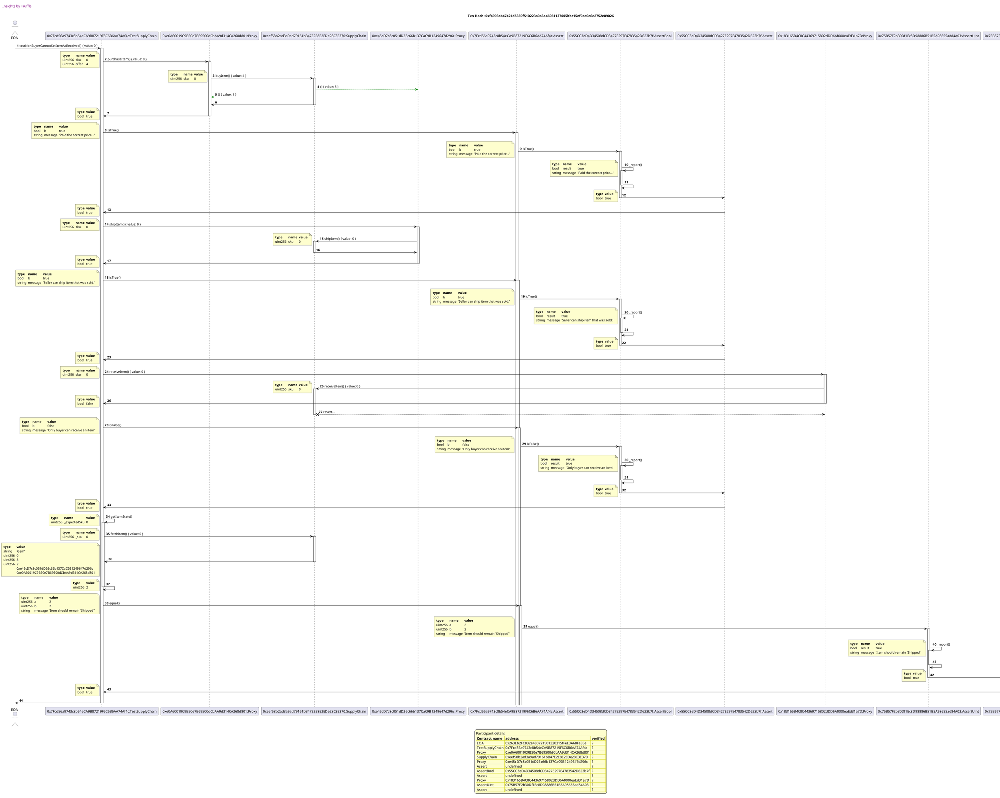


## testBuyerCanSetItemAsReceived
Tx: 0x25b4939c723a9ca975574c19384eb538338c3a6c04bdeed360ebf969bef41cf2

### diagram 1

[SVG :telescope:](https://www.planttext.com/api/plantuml/svg/rPPDRziu48Rl_1L4UsYBjbYANvACRBQoB6roQGCajw88A6fa2vKbWQ8MSUl-zrAgupg9dNg3tKDzeQGn7yuxm-7mNMULiVsoGaZrjgdxPGO6eUvpMRVAg2MkO0vrFbNwyzmqVPt7JTKO_3nDqYHE43hfxAg2KuGMe78m-2l2-AmnvPUcjggAgd9UBw6s3bDOPqhTvn-4jZTj1PjFb-KNm1vtRnSgpyjwZZs2lZdw7xVuM_vvtPNpXUrmji9NfYyAnq2sj1NWgviQdwbkCS7aXegCXopKFcKgr2hqXV2vza8MSCW42nWBD5DI4vxb03cJ1B8Yb6461VTqGLqqj7LU9XyYh3hyp8tFa0k8BNNPAgVd2ZfxsRTjjOeNggolYJV-ZzpugSw5T2jofeDCS8YZS1hur0jJ6SkfZ2AVHmNNatk4k_YzQAauAQGCfbBdd34_zuCe2XadcIzoe2cBg0WBKamEOYzCSxFw2Onzud5EAKjdkGC0T_C5IMQaY0CYfjEf95faVZGPv-r5qGsg4BwOXI8ZWQ9UoZsH5J6D1IVfBDCGIDzddaT8y0YAtKPGKfzmxJpXWWeHnruYaYJtCXrIeKNE2uy9HlWj2Wr9UdkwBoMlNq-mIsbZ855wyV8L_eh_KLKFRelWRsZF18VPWz1DtLdJ3plYFkFX_7tKjnDyOBLjHdwnJjrO68jeMtedcuStc_5q_IUsgnQm6skr7CSHWDTeZV4QNxjAduDrJyTl9Vnon-LNZkJE0ZpuWj3MywTgfh-jPlfapUotrSp-hUQFp-S6eFwqc_09tjNB3zRWdQfeAwNXtC8oRSobgk2_3fbBnT1nrhXqQxmVpVZ5tx1yCLhxihPKo8tvmfHwiBE3fR3d-70jRN3_V_FxkZxiz7Mxr-D7GZuczEd5FHx6WncX7rS7TB5prETWLLbrEqfdP4O86PJ6xY9WNDlTIdLnCz1resemPL52xaISR8CphZNiSYfPaj4q3XXLF22ksGhYCKgO9ueK4XR980KcXZ3yTPTmJyD8ExQ3FwJT9nrTVGz8O_n7nh4z-Z76iStvCSQnNNd3S8dVfD_zthbnk69-1m00)


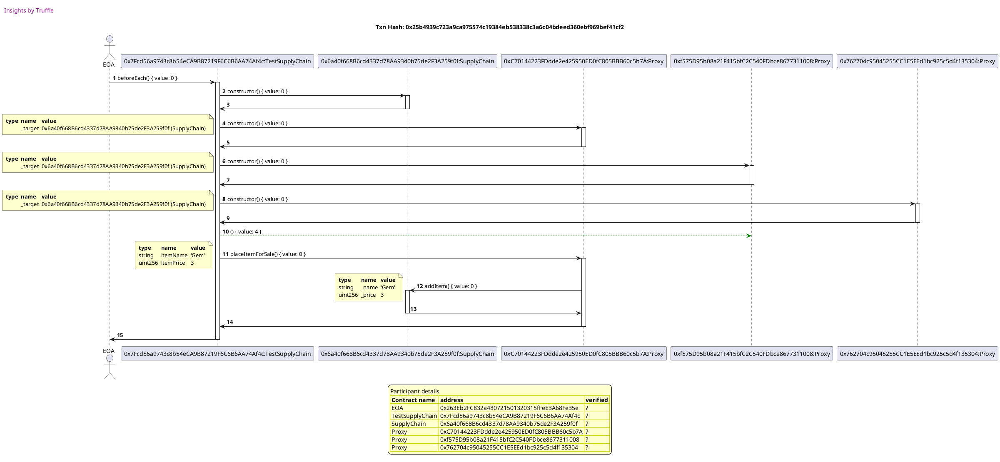

Tx: 0xdbdbb0e966cd03750981faa452fb53d8d4a3f2d27307cff78f39e661e30dc657

### diagram 2

[SVG :telescope:](https://www.planttext.com/api/plantuml/svg/xLbTTvis6BxdL-Yq5zbEbqn82B1FbXMmMNkrd3cxsjb91NgnES7WWUZYrltl4_W3so6DapXrUXPVM4QM7ZtlXnu9wMqXUIxBSQ9fl9HPMeu3o3Mjk8hJ2S_v62KmX5IuFBmQvbcP2YzBiXozzlj-t-jhscaXfmcSQTe8k80SVTOGUfVbyQSibJnnadYOZY6L2YQIwYzVLSyH9cK-IM1HDOW_0T8DzNJEXOZJ8TAnzaMX_xo4N-A_JujuE9852gRe8Y-ZI65eCfO9e8lh5BtZnQYByBK8H11Ww9XcA32r6ExOUiIvmKWKC2fiON0Q4K4iYgqmYYmxeXqmJHqe5g79BEMDK2gM_TyTn0lqIfMlDEKG6OVnX2jxBg2GWt8oIQRUYCVf9TRhTlZQyaF1JDwn31hQ0JF0SpgkRH6zuvkUwPgEOnbEP8JTBOHD-FCykvuse16pMA_30cnpelk6peB88nupiDyBGh1DowAwZh7ThVjjGhMoDBc18zEqNUKVWr9BMBRZTAY10ui983vr2Ej4EEhUnP0i03qBwuP12FLxGW60eVeptE_XoBCnSrtNn24BBAUDeLCKaCi7k73UiGtCpRAa0MJCyoZqZ1ur6BQ5fqfYzKd7wXkMJPb1UYQXWHLrcyxj3Cd30Dl0_epJTPEPoooV11Jt8hqVshsERTkcotINEHtRP8mBst0mxJQTsndIXm6-qhGgrO_FsXBxpPikaghQBQUGUpmTW7mlOUmKVq08yKSGF_o8FgEFF2b1pJtqHMl1KCYhdAxmrFGFHxo02cYxUvf9g0LZ9JEdYny_BSgpsIz8JYU0L9doSLtM06YcpL2fl4EOYMQek2hLDzwgpQ98ASaC6QfUQHkgnjEq5Jr5jSK1GJdTvcey4TU6qxOJ_tezp07Ilnjl4jH5wvoeudHtBtshbzxIQwtnyN4NRVYdBS1Lc_jve_52e6QSCbxczNDZVtiYDNfH1IOkr3e0off7nsB18cYOgAZ8l5gEPcWCHS67gX8TdVDO83a256Pv3g54apmEuUJav6Y3V4DpnNafIzy1xoNLLkwNEKooNEwHV0v5cSXlOq6TghUqgMRKawJo6loXvyzAEgfG5gDuygr4-8ROabl4zZ2alkAfTGKaBmeuW2HHIsZ8qpfKA5QnKlEII_IlsduKMIAUknO-q89dgOhxjkL57zSsglbyZtimYRnjFtemNY_xn5qrfdvVcazBaCk0FNDTt9dpirJ2nxF_lslVBQ__m_ah_q1okPTqR2Jc4gudQYSFOj2YDUqSM_X58CFHqshXvMvYkE_mhTByw3SO7srnsZxPeAtFLSET3-YQ7hiUEZuignxbb4qBxxSEm3ybJ_QRmxp5zS6ghasegbHLcxMiJ0GA07rOdgHzk7DvM9uRVf-cBDctcdEeLMC_5goj73VQLEUoJxfoqCEl7FNvSJMSfitlZBJpjVDf0PB7IR4sSW_tCCRLo5wMofo7SXL7BeIAN56pWJoEOX2AmEcAR3rM9L74fFs0-9vD2JTiR16TOPqIJ7KM-T2dZcdxG5aLvLyt4RPigD5slNUuYLRlUUyfcjiOssnslQBv6flTHNyROvvOghvC1KHnMaMWlOqxpvBTBqKUCrWri-Qnsl5-unw3gPHT9Axwl5LbTIlw7m00)


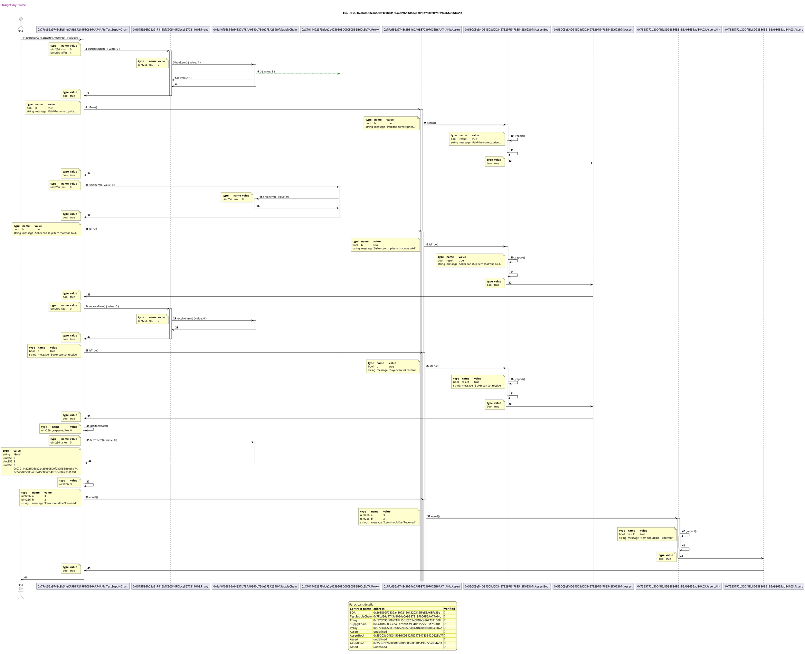


## testBuyerCannotReceiveItemNotShipped
Tx: 0x6320ef3c685c7d97554f947b2fe000fdd2bf9103127b55cc1eb80726e1c2e60f

### diagram 1

[SVG :telescope:](https://www.planttext.com/api/plantuml/svg/rPRVRzis4CVV-LSGxKDRjCNuGwGa8yigozBQbor0ybOK0KKTRQ6oP53K4BVk_pvATJmdiLCls1wg5yewyyFxtl5uVDSvPLs_h15IlMkRVbc0HQZxN3KhPTKIrp27ffmg_NbksxufqxPkBNwUPtcMPWYTTMvTmpb22r0bMFmLOVo-jTMNjd6gJkfgtYoXSHvZd3Vb_lDtmggtgngsdowhBu1fu7zTgBAicZcc17tpz5zkyRVy3qrNpHUkmyKQNzdU6Cz0hd8ruAkR1hzNtMA2oOtaZ83XMaP2XsKS2X6OE0WBPe0GOigI5IQcX5CM5a9eJQ68ICWaKCr04kEZePttClipmQh3p_pu3Fc0k4fNA-NrN47dBllLgbwd2rKrruIE_oCtOQvB8LKS1bn7XGWWJU9f538QvpALKvaaOP2OG4_k4UxY3w9BHKGy4ymGFkEIYK3DmjY0P64aYZYbqrBEWYWoawFO2zlUhFy1Pf88O74kw4nmEgKY52dXCPMHHn9fkA4gYqmu6USTHB4jIl181JGGa4H2we1pIcOaWIYNHEP1ehaIKSoBnr1yYmgoM3CAh2oJ8XGcesaOSfOI5KWU5Hc9f7_qLDwYq92aj-U7KlBwzGGNO5eBcTABbw_mL_oNgdlmMmH_GmScUCm1X6wRpjb-s17t6G_d7wA-dU0Zg-qoyeDrcjR1M4IxqZlRlhpPZkURNx5Rhm3xiL7BSHm1U8Cs66_mjQ_qEJZ_TlfMmY_tN7xbIVuim8Cl2EqyVwfczjDgPa_Mp7zQpVpVQlxuV6u1ca_x2P_WVRt1qHgyKnMhMcduu62Pj_PIrV1VXyodOkWu6rpvDVuOpVZ5xx1yCLhxgd5CoAtvmbPwiFEZfN3W-F0jRN3_V_FxkZdkzFNgeCUFX7nCwDEBUpoC1pD2twyEw6Blg2_1gQhkzfJEV9yWP52Q-ek0zMrt9zN7pKBNZQh1LgQ2qeiusmLdN6lOvKpoh61v6d6cWg6FKq6elm5mAamE6Kzab0CNGnX-kqkufs6adTh17zBkaqwklWUaCVuZuzGU_HZZrERy6EFKhhnb-CHlq--VTtuShfX_0m00)


```plantuml
@startuml

autonumber

skinparam legendBackgroundColor #FEFECE

<style>

header {
  HorizontalAlignment left
  FontColor purple
  FontSize 14
  Padding 10
}

</style>


header Insights by Truffle

title Txn Hash: 0x6320ef3c685c7d97554f947b2fe000fdd2bf9103127b55cc1eb80726e1c2e60f

actor EOA as "EOA"
participant TestSupplyChain_01 as "0x7Fcd56a9743c8b54eCA9B87219F6C6B6AA74Af4c:TestSupplyChain"
participant SupplyChain_01 as "0xda059D52f03D36254aD79fe62785b9C1Bd6D488f:SupplyChain"
participant Proxy_01 as "0xE605e29F51D531B1575C03916827806f3f1aE8f7:Proxy"
participant Proxy_02 as "0x538a4145eA856c43310D0Ae8F606F4Ac3a5893b7:Proxy"
participant Proxy_03 as "0x4E9c21e2ddAb75fE1C7732C0a4638bE086666cB6:Proxy"

EOA -> TestSupplyChain_01 ++: beforeEach() { value: 0 }
TestSupplyChain_01 -> SupplyChain_01 ++: constructor() { value: 0 }
SupplyChain_01 -> TestSupplyChain_01 --: 
TestSupplyChain_01 -> Proxy_01 ++: constructor() { value: 0 }
note left #FEFECE
<#FEFECE,#FEFECE>|= type |= name |= value |
|  | _target | 0xda059D52f03D36254aD79fe62785b9C1Bd6D488f (SupplyChain) |
end note

Proxy_01 -> TestSupplyChain_01 --: 
TestSupplyChain_01 -> Proxy_02 ++: constructor() { value: 0 }
note left #FEFECE
<#FEFECE,#FEFECE>|= type |= name |= value |
|  | _target | 0xda059D52f03D36254aD79fe62785b9C1Bd6D488f (SupplyChain) |
end note

Proxy_02 -> TestSupplyChain_01 --: 
TestSupplyChain_01 -> Proxy_03 ++: constructor() { value: 0 }
note left #FEFECE
<#FEFECE,#FEFECE>|= type |= name |= value |
|  | _target | 0xda059D52f03D36254aD79fe62785b9C1Bd6D488f (SupplyChain) |
end note

Proxy_03 -> TestSupplyChain_01 --: 
TestSupplyChain_01 -[#green]-> Proxy_02 : () { value: 4 }
TestSupplyChain_01 -> Proxy_01 ++: placeItemForSale() { value: 0 }
note left #FEFECE
<#FEFECE,#FEFECE>|= type |= name |= value |
| string | itemName | 'Gem' |
| uint256 | itemPrice | 3 |
end note

Proxy_01 -> SupplyChain_01 ++: addItem() { value: 0 }
note left #FEFECE
<#FEFECE,#FEFECE>|= type |= name |= value |
| string | _name | 'Gem' |
| uint256 | _price | 3 |
end note

SupplyChain_01 -> Proxy_01 --: 
Proxy_01 -> TestSupplyChain_01 --: 
TestSupplyChain_01 -> EOA --: 


legend
Participant details
<#FEFECE,#D0D000>|= Contract name |= address |= verified |
<#FEFECE>| EOA | 0x263Eb2FC832a480721501320315fFeE3A68Fe35e | ? |
<#FEFECE>| TestSupplyChain | 0x7Fcd56a9743c8b54eCA9B87219F6C6B6AA74Af4c | ? |
<#FEFECE>| SupplyChain | 0xda059D52f03D36254aD79fe62785b9C1Bd6D488f | ? |
<#FEFECE>| Proxy | 0xE605e29F51D531B1575C03916827806f3f1aE8f7 | ? |
<#FEFECE>| Proxy | 0x538a4145eA856c43310D0Ae8F606F4Ac3a5893b7 | ? |
<#FEFECE>| Proxy | 0x4E9c21e2ddAb75fE1C7732C0a4638bE086666cB6 | ? |
endlegend


@enduml
```

Tx: 0xde4b1d8ba51e04b7e0c43a929b09a6f1aa3bc347c2354f5b1a9332c7b42d4b65

### diagram 2

[SVG :telescope:](https://www.planttext.com/api/plantuml/svg/vLbRSvj657xdL-mu3sudjGiioqNZka4WchoqdifzwdJi1GuIOmGK5e-KAF-z1om9YP14lYYEfthmYjNkTxvpsM-NzPjIy49KiqIIU2Moj9hvK4XIUHEdEI_uZ2GmWJGSyk1cKcHL6ZfPaXNabJVoHiv8aivAiKZWN9Acm4Ceo0U9aBTP4R_FKi4JEuadwGnIWJ2Hm9yyxBv3oAiYJs3LDOxV0r4qVBhWOHYd4wB8qaT4_taDlyP_bvRnP2fAuY_8PL554M988XO9aCjvIjxoSZeWyZm4pLT2q-TC0Ldp3P03ZN9BjNpPudgaS4xzW6f6e5AcHSnNk4Mf6XY-feQQhpECHY2GvUWFc_2I765x9650H1p4EKT_Bg4KuohFauKpvN5w9IlDE7bkU478T6uP6WrCdsdWsDRGD5J5ydH77-gsRMXsf0M33i8k_4MHpHSjAACcrnIDWMqo7JsXYkpADfYUBkkUPWUKCzEYlZ5evkr2zR8CkSmibwcHJ5sggqpZhc55eAk6oNpBKOQXxcgc6Gs-nb1T0OvqcO5gUKnn6LM62ZEO8rDBqKs4bFM8Oin7PjJBq2vBACG3GdWtiGzic6N9LlYOur1mDPTgJ3P31rlL6AcMCT8C4mj0TNKLenSDsidz3DM70VQ1_HMdsowp8JCyrQUo6ocZm7GjqpJr8LE6pBPCdJ4Ucfejqq4xkPyXVHZWaIJLfNvotbVOhryFYC3kORM0mk5fcea_8O3u5ju9cFsUYV4qpdC8V_YHV22tFAa0bo3vAFL0eO5DQTUmg0B1b9SDK7Swce56DpPgSxRwyjEgFL_-GiGY1u9jocTDsm2GfRGa5GP9PJfPalAcmhzofpUB8XIK9T6m7oMErFOaQKCFgVR4mQyMNQxQWRYsdBf1_FlLf018_scZgP81sUP4aTFNPocTMKhFhAt19oS3iXEVlWJNO-uNZJOAFYuyT5uKpNFhVtyXjR9H9oOkSJi0zERHkLYny5icc1LHrBlIaioWBFa4Eydn1Oz38gP0Wgme810aB-80JazFZtV8jpGtdDVgz09uhwdsShyg8CyAyOJa2oYhH7mR3vfI_SoOUaKTf9Itu9zx_Um8ST4A-hVGuRtrzhlWTQ0yHJmfuKj2Fp_PIbCTYrki7InpAGGydiQt7CtlJjbJAhtQyXDhpjgR_YNRd1r8mDFQqtLM2Jx6c5bSonoFzDTbbeJNzrJFb-RAToce1tBf_wwmdpbBJq3KUZOMk7wV8jMja5t1FCVz4C9nZwBrS-pX5u48feTLtAjzZhbFdxvDxH__1hFZ3gVk-m7jF2lDSprmxxVTTiQ-R_0Fgwf71MNNm_kTkk7VYYTFMyDy4-gspz_qzQbNNQgad6PL4X8VoFLuhsra_GB-yjnOC-zrvRcsaCUptzejFXbJNsmSTBUWpxzRD1SmjJb9khjqbIwsBdX243nEoYtBBYg8BDUMdImL1Pu8DpdaOOXPAnisKCHH324IEDkGRMpLigJgTEIhdcDIbMkcRAWAanMgobHXaGSZQkkc1vJL6Vvr5w7ZGuEsxyNTfsZD8VUUGjd5wBBPzuxpIsps5_eknbrXON-LXX35QPs1_Z73kohP_rRnCSRgbNMNgpql2EzX34jsLRZuUODj_M-5_m00)


```plantuml
@startuml

autonumber

skinparam legendBackgroundColor #FEFECE

<style>

header {
  HorizontalAlignment left
  FontColor purple
  FontSize 14
  Padding 10
}

</style>


header Insights by Truffle

title Txn Hash: 0xde4b1d8ba51e04b7e0c43a929b09a6f1aa3bc347c2354f5b1a9332c7b42d4b65

actor EOA as "EOA"
participant TestSupplyChain_01 as "0x7Fcd56a9743c8b54eCA9B87219F6C6B6AA74Af4c:TestSupplyChain"
participant Proxy_01 as "0x538a4145eA856c43310D0Ae8F606F4Ac3a5893b7:Proxy"
participant SupplyChain_01 as "0xda059D52f03D36254aD79fe62785b9C1Bd6D488f:SupplyChain"
participant Proxy_02 as "0xE605e29F51D531B1575C03916827806f3f1aE8f7:Proxy"
participant Assert_01 as "0x7Fcd56a9743c8b54eCA9B87219F6C6B6AA74Af4c:Assert"
participant AssertBool_01 as "0x55CC3eD4D34508dCD3427E297E4783542D623b7f:AssertBool"
participant Assert_02 as "0x55CC3eD4D34508dCD3427E297E4783542D623b7f:Assert"
participant AssertUint_01 as "0x75B57F2b30Df1Ec8D98886B51B5A98655ad84A03:AssertUint"
participant Assert_03 as "0x75B57F2b30Df1Ec8D98886B51B5A98655ad84A03:Assert"

EOA -> TestSupplyChain_01 ++: testBuyerCannotReceiveItemNotShipped() { value: 0 }
TestSupplyChain_01 -> Proxy_01 ++: purchaseItem() { value: 0 }
note left #FEFECE
<#FEFECE,#FEFECE>|= type |= name |= value |
| uint256 | sku | 0 |
| uint256 | offer | 4 |
end note

Proxy_01 -> SupplyChain_01 ++: buyItem() { value: 4 }
note left #FEFECE
<#FEFECE,#FEFECE>|= type |= name |= value |
| uint256 | sku | 0 |
end note

SupplyChain_01 -[#green]-> Proxy_02 : () { value: 3 }
SupplyChain_01 -[#green]-> Proxy_01 : () { value: 1 }
SupplyChain_01 -> Proxy_01 --: 
Proxy_01 -> TestSupplyChain_01 --: 
note left #FEFECE
<#FEFECE,#FEFECE>|= type |= value |
| bool | true |
end note

TestSupplyChain_01 -> Assert_01 ++: isTrue() 
note left #FEFECE
<#FEFECE,#FEFECE>|= type |= name |= value |
| bool | b | true |
| string | message | 'Paid the correct price...' |
end note

Assert_01 -> AssertBool_01 ++: isTrue() 
note left #FEFECE
<#FEFECE,#FEFECE>|= type |= name |= value |
| bool | b | true |
| string | message | 'Paid the correct price...' |
end note

AssertBool_01 -> AssertBool_01 ++: _report() 
note left #FEFECE
<#FEFECE,#FEFECE>|= type |= name |= value |
| bool | result | true |
| string | message | 'Paid the correct price...' |
end note

AssertBool_01 -> AssertBool_01 --: 
AssertBool_01 -> Assert_02 --: 
note left #FEFECE
<#FEFECE,#FEFECE>|= type |= value |
| bool | true |
end note

Assert_02 -> TestSupplyChain_01 --: 
note left #FEFECE
<#FEFECE,#FEFECE>|= type |= value |
| bool | true |
end note

TestSupplyChain_01 -> Proxy_01 ++: receiveItem() { value: 0 }
note left #FEFECE
<#FEFECE,#FEFECE>|= type |= name |= value |
| uint256 | sku | 0 |
end note

Proxy_01 -> SupplyChain_01 ++: receiveItem() { value: 0 }
note left #FEFECE
<#FEFECE,#FEFECE>|= type |= name |= value |
| uint256 | sku | 0 |
end note

Proxy_01 -> TestSupplyChain_01 --: 
note left #FEFECE
<#FEFECE,#FEFECE>|= type |= value |
| bool | false |
end note

SupplyChain_01 x--> Proxy_01: revert...
deactivate SupplyChain_01
TestSupplyChain_01 -> Assert_01 ++: isFalse() 
note left #FEFECE
<#FEFECE,#FEFECE>|= type |= name |= value |
| bool | b | false |
| string | message | 'Buyer can not receive an item thats `sold`' |
end note

Assert_01 -> AssertBool_01 ++: isFalse() 
note left #FEFECE
<#FEFECE,#FEFECE>|= type |= name |= value |
| bool | b | false |
| string | message | 'Buyer can not receive an item thats `sold`' |
end note

AssertBool_01 -> AssertBool_01 ++: _report() 
note left #FEFECE
<#FEFECE,#FEFECE>|= type |= name |= value |
| bool | result | true |
| string | message | 'Buyer can not receive an item thats `sold`' |
end note

AssertBool_01 -> AssertBool_01 --: 
AssertBool_01 -> Assert_02 --: 
note left #FEFECE
<#FEFECE,#FEFECE>|= type |= value |
| bool | true |
end note

Assert_02 -> TestSupplyChain_01 --: 
note left #FEFECE
<#FEFECE,#FEFECE>|= type |= value |
| bool | true |
end note

TestSupplyChain_01 -> TestSupplyChain_01 ++: getItemState() 
note left #FEFECE
<#FEFECE,#FEFECE>|= type |= name |= value |
| uint256 | _expectedSku | 0 |
end note

TestSupplyChain_01 -> SupplyChain_01 ++: fetchItem() { value: 0 }
note left #FEFECE
<#FEFECE,#FEFECE>|= type |= name |= value |
| uint256 | _sku | 0 |
end note

SupplyChain_01 -> TestSupplyChain_01 --: 
note left #FEFECE
<#FEFECE,#FEFECE>|= type |= value |
| string | 'Gem' |
| uint256 | 0 |
| uint256 | 3 |
| uint256 | 1 |
|  | 0xE605e29F51D531B1575C03916827806f3f1aE8f7 |
|  | 0x538a4145eA856c43310D0Ae8F606F4Ac3a5893b7 |
end note

TestSupplyChain_01 -> TestSupplyChain_01 --: 
note left #FEFECE
<#FEFECE,#FEFECE>|= type |= value |
| uint256 | 1 |
end note

TestSupplyChain_01 -> Assert_01 ++: equal() 
note left #FEFECE
<#FEFECE,#FEFECE>|= type |= name |= value |
| uint256 | a | 1 |
| uint256 | b | 1 |
| string | message | 'Item should be `Sold`' |
end note

Assert_01 -> AssertUint_01 ++: equal() 
note left #FEFECE
<#FEFECE,#FEFECE>|= type |= name |= value |
| uint256 | a | 1 |
| uint256 | b | 1 |
| string | message | 'Item should be `Sold`' |
end note

AssertUint_01 -> AssertUint_01 ++: _report() 
note left #FEFECE
<#FEFECE,#FEFECE>|= type |= name |= value |
| bool | result | true |
| string | message | 'Item should be `Sold`' |
end note

AssertUint_01 -> AssertUint_01 --: 
AssertUint_01 -> Assert_03 --: 
note left #FEFECE
<#FEFECE,#FEFECE>|= type |= value |
| bool | true |
end note

Assert_03 -> TestSupplyChain_01 --: 
note left #FEFECE
<#FEFECE,#FEFECE>|= type |= value |
| bool | true |
end note

TestSupplyChain_01 -> EOA --: 


legend
Participant details
<#FEFECE,#D0D000>|= Contract name |= address |= verified |
<#FEFECE>| EOA | 0x263Eb2FC832a480721501320315fFeE3A68Fe35e | ? |
<#FEFECE>| TestSupplyChain | 0x7Fcd56a9743c8b54eCA9B87219F6C6B6AA74Af4c | ? |
<#FEFECE>| Proxy | 0x538a4145eA856c43310D0Ae8F606F4Ac3a5893b7 | ? |
<#FEFECE>| SupplyChain | 0xda059D52f03D36254aD79fe62785b9C1Bd6D488f | ? |
<#FEFECE>| Proxy | 0xE605e29F51D531B1575C03916827806f3f1aE8f7 | ? |
<#FEFECE>| Assert | undefined | ? |
<#FEFECE>| AssertBool | 0x55CC3eD4D34508dCD3427E297E4783542D623b7f | ? |
<#FEFECE>| Assert | undefined | ? |
<#FEFECE>| AssertUint | 0x75B57F2b30Df1Ec8D98886B51B5A98655ad84A03 | ? |
<#FEFECE>| Assert | undefined | ? |
endlegend


@enduml
```

