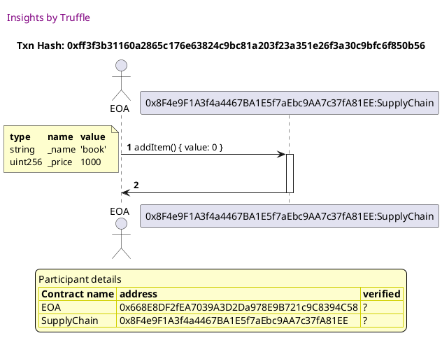
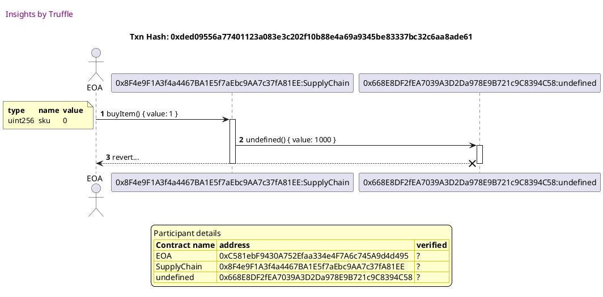
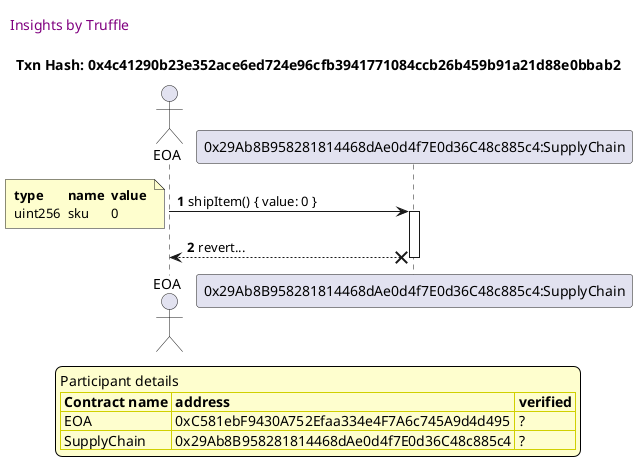
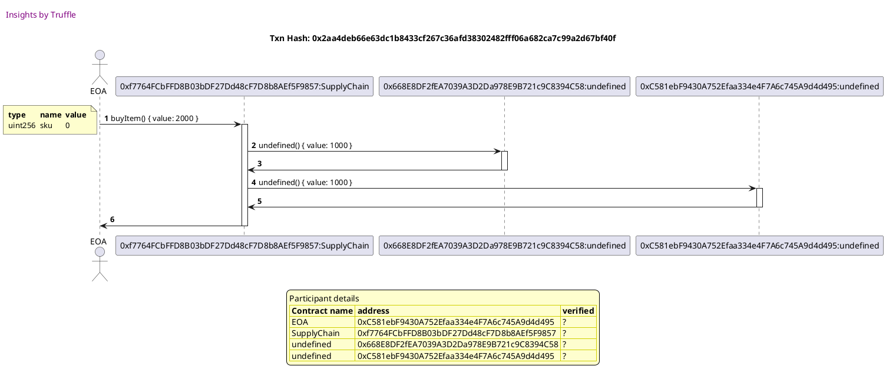
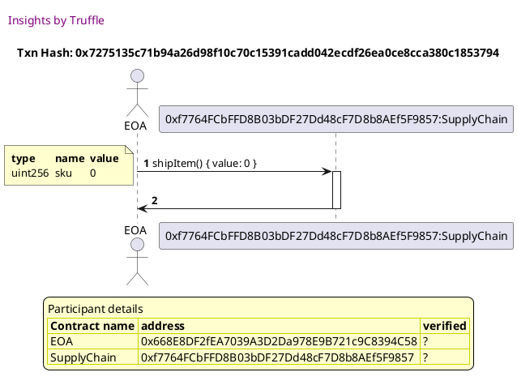
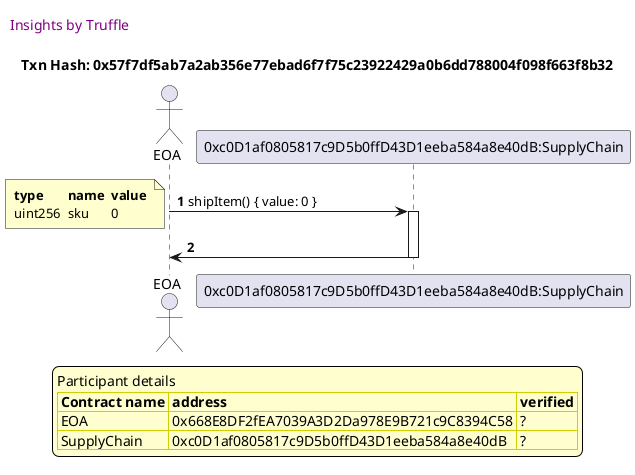

Test date: 2021 Jan 23


## should add an item with the provided name and price
### diagram 1

[SVG :telescope:](https://www.planttext.com/api/plantuml/svg/ZLFBRjim4BppAnRf8ItIeDIRCbmtjYmZEJL0SWz8Yh89IvH0KOMTEF_UbUmORaxLPIKEDJipIzvrZblNrnKXl7UDwMkXB27TLfkMMrv3fTRA50ikjslRzAR8cggny6MLh_8i9sJQkNsbPeHi52-KXJS2SDzO_TeOnwjvfTUcLiOXJUaGMk7oaQ7jRLkfqzAJVbNWXVZro8j2cpLubBmZ-uyF-W_-1zFfzSPr8FRmRFkoH0xYjAiKFEyCtFDkCm6waqhmC61bAYHLXQIbObuIKP-LD0fuu776WaW4OI9YNaYMobH4WXLfuRCa5Bx0DAH3bVdlEV0Ehh1U4Gp4QQbRZdwU-hQjzjc6Q_D2lN4FtKKqeI6ZShvOoSYVXpo8aqMWX6InoYEQXG5F0uyj9XT_Nn4oDBcTVQQykPa0Xl7WLFtr6xp17rxr2ht1Ep6DKsEYvpbCJo_VJtLs-0bktoh0QdWzrf403kG0dRD3nWTuEM9mBPfcUprYlJREZ-81RAsM0-fHIX73Om13Pq8-AKNjeuNR2U2WZWU6F5w4LIZ7TTLTg5pI9P8EAZCSlyMmppBHirLTDofMLfTQ5TXyUZOszZhWZEEOvMovyijydj0WdGTBVydJXENf8l4zcMOiICCiOhZvrxyC5_f7fl-Tsua9xPrCudE7TRW-Vm40)


## should emit a LogForSale event when an item is added
### diagram 1

[SVG :telescope:](https://www.planttext.com/api/plantuml/svg/ZLFBRjim4BppAnRf8ItIeAJUD5mtjXv8JWsGt0DAecp24YLGL64dphzt9Jk6crDrMOb3pixCKdUz5SOEJKs866ohXoQNXf1-gtGdZ6YWbckfovKejclJ3hgCsxery2LBipHE2PdtTb_B1I4RAKffu8q0tBT6lRRQYdfPgxLkfBP8Krc4Cbm-CdI3wMfvMdfIhnAOXr-FeYoLNWEZv1tPVtpGV_0_w5wjDxQ7V0_FPgWgv21MsLh2yqx3lUWtCw2xA2fomKhk-1pFkTAdKILyHZcZLUX7qlTOKUPL51HK25OmdtgCKJUik0pyl70nZSAYolJt4aGFLrYl20PYLQ4wWNwUXgwhz_56AFr2sRI7xhWNENmLoj39mfYkM9Z5Jf378KyA9uZ2eEGfzxqodLsSlY9aR7Ax-4nvSpC33EF1okRhDtY3Fw8U97g3Tw9RAwT4ptEOdrw-d-hYy1FilfE0LOjcgXC17CW1Ucl6Z0_mSiJWEc_RxVM43KfRnmz6i3Eg6556AKKChm6CdGdvf1IrJnPkPu23EbuOydWHLYcjK7L_eJAX2PAEAcCSly6mppBHiv5zFocMHbLAbjXyVZOszJhWZ8CWIgCaSwfq6LANBzt4IGGFenH7uB22nv7BlTYFSFElVnakz4zC_pkt4nFQEvd4vmxh-Fly1G00)


## should allow someone to purchase an item and update state accordingly
### diagram 1

[SVG :telescope:](https://www.planttext.com/api/plantuml/svg/ZLDDRwCm5BpxLpobX-wghTPyGvJDbX2YzhILsdjbi9rO0OECMILj-j_tGT8eszF2uO77p9kPP-uxoupjwueGrjj6ztKX327TLkcM6LP39TP2ymKhjslJz9fdJTKOk5hbgppB2PbrTb-9EI4RmRWmy4u07XgZtXfjMPLMQgrheItII8lG2fUF36rlsagSbfxLcm37nxSdnhdIQt0e-K3s7v_qd_oFkbFhZUsWsCEBwQL43cALhGIyx3Gyi6up1RgBd41wGdgySFtIAmBEHHH9HpgKnH5tAGjznZnFX16ZJXmNU9T5M9JKzmCk6CKqIeigyzyfi0ucM2S40x6gL2r3FyzzsrRxRCEKVgNEk8VkabAwZkSlmhHSo23FmomBeY1qWpZqKx-GKRGgKpUCfnTVJmWPcjpDlrBUt4m1mtYqelxs7TxX3wjwWTxWW-Z6YZ7HynncfuVRKvqVVeBTjmAmQbQFTII00pb0PysGyG5UZnXS5qsplHwnNcdh1k40jaQL0-fGIX73Om13PqA-A4NjeuMxAU2WZWU6F5s4nOLbgkekL2xf4aa7bHcEts3OPvdesOYk6nKBewGI79lFpiR6NWUSSHZ6URnSkJ9F8-ebgRTqboo9uZnPHAvJ9bdi9NuMnBZvrxyC5_f7fl-Tsua9xPrCudMFTVXz_W80)


### diagram 2

[SVG :telescope:](https://www.planttext.com/api/plantuml/svg/bPJVRvim4CVV_LTOsykchfen_W5HrvKGKFkqIktxPB19h1A3m4nDc_xlkz0qIrfjItdWm9m_T_Vr7HUzLvqVbZL2Ql2D6vQ5wH3gxwnhLQUMk3Ppu_HKbNVphXcSJfkwwV37FCkpD4FehFUhsfmZj31Acmu_8emlcyu-DCwhEgdjt2sDyu2fF7pAOVcPq0vTMvljqerzC3XWy7QjjBPkZWE2de3-zGN_mhzolPqlV8-B5RxjXge21lBMrmRVtZjygVh519Dx6SKqPB6A2EMbren50HCXhMGXezBmK1P4SAACe9oRWWijY91bmAGkIYeO0JLA3rbcFnAiUlm1x0S4WdXRsbP1FJT3szQhTA6i-qc2qOVSnsL5Wv1DHL9EAvvb8asvv10Z4YnXHILbNYPKH9EztOTO4DXKrXdz1of4b4Mpd5PP8aaO9-6CpbGieooUIXgKSHg5CKjvDDdj_IkIRf7W7PWYZrb84ibfLYaLXiomN2QYb8mdiMQQnNmVYJPId9w_BlpaP8ABONNbpVBJP_o8VwbwC1DC2I7u2Rd6c_7eTmrpjdtuihNdws_Ohrg3mJgr7Et8m6kqneDrddA1rxY_6-1EO1Mw4M-u2BrA1P8xa6-JscvXFxdWERa3vxULdPvEyBz3qFU4eCU769NUV4BeUVhGzTvvQkELhViz9MTa1k4sIgOmInrqxavAcAREzFsegkbiPOq62Szsue-nGDUZMmASlnyIzl8VISSEmLlIJgsHSspV_u_ppif0xgteS5s0tVmRVmC0)


## should error when not enough value is sent when purchasing an item
### diagram 1

[SVG :telescope:](https://www.planttext.com/api/plantuml/svg/ZLDTRvim57tthxZg7hgfgsRpJPHb9GJKFgrI-ruPi1ChO90nKzAc_tqNaaPPdyRBDJxct7FEDNUzvSOEJKq87sohXwOGXf1-gtJ73M-W5ckXgoKljslJ3hfAsxery2NFyYpD29dtTb-B1I4RmIjXu8q0tBT6lRRQyZgfrLetGbkaaHQX7BUF3DrWkbgSjfxKgm3cuTiZhogbry0eUKVs7n_q7_mFkbVhZUsXsCEp6QH43cALhGKyxpJSytup0xgJqfLkuJ8MKEv4WL-oC1216pbU6HTbnBX3NUcutFMPS0A92ug0B0CP-RJm0qoZjAWo-vq0x-4AwnN1GAmgLSVHpzFGTVK-tN2bNoYRpj1Tb7iYpbdYIezxNX0k4vRvCkHPKSP94fPkA9E8PTdiukihGiOcjulFb3StCy0m7gneldw3D_Z3wq6WDtWdkhLYIlGyX_bfyVrK5uUVOFUT0AoQDrET2E103j1RCsPyW9SZ1jT5sswl9snGsZf-C8ATKUM8CaefOdWDOEnCo2Ubg7soS3i37DJnmf37Yx0gORcg-mkLAxf2qb5bYkCt6FPP9desekydnS8egKI5pUTdOrEl0yuu2A8iMkMEp9AGkd7YhfmLZyCeYvUXmyeuZTpOI_q83__wb-52_yJqltCxCQ6zaqbyxh2ElyzV)




### diagram 2

[SVG :telescope:](https://www.planttext.com/api/plantuml/svg/ZLHDJzj04BtlhrZHIoiANNlNNn6bcCGMd8e4zsfiZvCLpjfQhr42uRztOaAQq0i-UEBnxCjxRvvyrJkmRbWsZC7WMZCi2xICzO_QT61XoHkSewckeNoSstOmrRHjMik_v5cUJJF6BdgtRl2IiGL2XPQ_CCvlMgkVM-EWIHizDqiqZc1gHwzoQhyXT8Fj6jorxlKpSa_HqnrKbJPpxWdsIkW_tk7VyMzDh-SBr_DYpH_iKDU4mPns3VA7bU4tq2ycNAmgh4GI1254aHAUvqiGiKHP-iAlFL74CIe84qYa2WgCfPHHKKg_305Y-flG8pTAHooptoc7dfzGFM5aYDEbxe3qt0zTrwod2z3cZ_366R6ASuL9xgMoLg1K65sdNXRK4MH5cQHfLCgeJcClooO7fuzXoM2ijS7g7sWOnbayo_qwIoCXarJE_1aaKPmbrv7lbSaqbecQ1l5aV_Q4iItliykFB4zF9xmOrhSEbr-_yHV-1Cs04-xnLsPQX-EIzgkzsFtulgkNcv_ShJlaL0qinpe2y0tRy44RvmSXt_3-SQ2xe2xbXczn6Vl0WvWT2TtosZUEc0aXYDpHyEgCZfE-2RVuXDQTdv-p2cbT-Wb8m-7iOV-O0WNgBTZixi3z2XtefZ-GFXCpeh2LFgMOMaBRQwUWMkpxqGQqkjPOaUQBlLjZTiY85Ut6mo9Fb1Hf5FXP3I2bGfL7QLX6AaYJIbKg2MZurp720USHwRFv-Xzfxyg8yzb8xN38ffrPT5rHtNuk_W80)





## should emit LogSold event when and item is purchased
### diagram 1

[SVG :telescope:](https://www.planttext.com/api/plantuml/svg/ZLFBRjim4BppAnRf8ItIeAIUbE6wiVL0Scg0v1vG4cKJbYY1eWexSVwzAzant9ogoqeSQdPcbhphhJ1sQ6f2n61RFJIvD8JqMwKxOKG3jLnBNQv4iLsRTj1btDQjWIzPcgLnIiYyj_jQBWZPI55A0sy4uBurwhNLLjJBMgrr8xL5cieYbE7oaQ4RJ5VBqzAJUfN0FFnw56Mfz1eO9U_8_kE3_eF_GVTglR4zv7juDaDL8GUnojOIddSQxaM_cG7TSOTvd5BXXavL5659fU_nY8cSkuuZAjzt6USizCeeeeNB0qzmxeuhVkH95Z1Cex2eClsz1D735TOhWe5OLQXEe9-deUlgVRmHIhzGDksXEoSLp8iowgpA88ZS9A1-mLPkG7d8QHRaiHluUSgYsSNVLuICJMuNdoblRcQ0OJnOsNpz1c_mHzI3H6_mJdHhvPJeUGxpqyltKrqSVeBTTnAmQj5CTIA00pb0RysOyG5UZXXSvssxlPwmGMdh-C48TaOL8yeefOZXCO2nCo6VbABsoSBj371GnmD37Y_2AgKLgkulL2OqGT9HPOpZDnZsMIPwDhBl9yNIg4h94flFpyQcNWUSSH3mb2UPKwNBaBhHqasSH4GXJwDLwB0YYhaRUR7FSVElVnakz4zC_pkt4nFQEvd4vmxhU7t-0W00)


### diagram 2

[SVG :telescope:](https://www.planttext.com/api/plantuml/svg/bPHHRvim4CVV_IbEsykchfenO73KTIK4r3wjKli-6MmIgyGWC5FJfjzz5vfcIQjjAGyScFFlxlw-uw9tidF3iYP43gwnmxBG7I7zdR6jxEGIQZtNLarbUJVlci6gjAcR3ZxcMPwb6I5dlLlL-foGXPPAT_1802wRpZmqriawgStSBhLrYAaSVifn-PdG3brRw-tIZNdGu0NuTYsLCdOE7YLFIF_wWd_XNzdUp1UkXs85jzrGLSWWphXQm-szXKlPBoP0xqDQC2QzK4ILBygY43BmMHMLNb6fKl8mvbJvOL39Y0kgE2sBs5TQbbuLXa9gZcgK3hFCVYGWU_Y0zWD1GPmfJIkndfkXRUjLkf36_gJUw4FlMIQzGEIKJHNdmfzn6fRUrESqZcAQyoBrULXadfZixJx4ei2wCbQhFr3EuooUvQpAaeZw8l5dR2P556TY6Z6l56diYo0Duybkxr-HR8j4RqyNkGXycaGXooefVJ_GGHubl8o2C14gK848zv5a8yNf-Ul2JqucK0ohAwUNdpx38_oIzQ0dm2Yby4Hiu_HuzBk6ETi-VDdQy_KtSAjM0rehbwCT6R0cQnYCTIpai8R-Ri0xnLNiHjXm2NcL2YPt8DycjTt2VdBUSt87pcyhEpsTmBz3iFU4OCU769NUV2BaUVh8zTvvAksagViz9MTqXk4sIgOuInrsxavAdAPEz_segkvCPRH22Szsue-nKDUZMmATlnyIzl8VISSEmLlIJgsHSspV_u_ppifGxgteU5sWtVmRVmC0)


## should revert when someone that is not the seller tries to call shipItem()
### diagram 1

[SVG :telescope:](https://www.planttext.com/api/plantuml/svg/ZLDTRvim57tthxZg7hgfgsRp5HDbMGaXQfzMgNsl33Q95J38c2bfq_--2qcZh4_ZvOAFVUuvvvgxpWdh-heYHFIkCNsTAqj8jzMc5LRKKAcrCd8XYktQDhsHQLCr5hwiibMMPeJCEhUlr9oGZH9IMNWZ0FUDrQ-DSQ9AAhqsjJ8EQKg7q0gNZmnjRzjAdPQUzAi25k3Nev1IcpKmIjwH_SS7_GV_W-dqUkCwoFVmRFkoH0xYjAiKFEyCt8jkCmMwOuno6STAvI4LGSXAYSUvnsWUbfG54nQAY36HIr_5il3zqfEiu3JcmWzvw0MOHk5GPVOx0T715TOhWe4uNUXMe9-dlcshVReHshnGDkwXEozEShw8G-vnnbaGH5mcYigWd6HK-b4Qy8Bpi0Yc5wUl21cQtCu_KzxSJ073U72g_leDtk2Fg7g5tk2TcCQfCT7p76Qdb--dEZ_y1BTl5M0reXxhI007Se3EsI7Z0xmSCRZEcsPxFMAzDiuBem5ihIu6b55A4SDh04DdGZufHUsZXTifuA2E5uOyNeGbbHEwwYvKBkaIIGULAOxVOjXdcUZPgguR5IkhIwqaDf-TZOsz3ZZZAE8PNwwyCaicr8yJV-ajHJpXMRoOUAo8K-x7GHfotFphNuOB_IFJ_yxjn8JsJYRnkSCw_3v_0G00)


### diagram 2

[SVG :telescope:](https://www.planttext.com/api/plantuml/svg/bPHHRvim4CVV_IcixcLJLyqO0tQKTQM4g7rQfVPzCjXEh123m4nDctxtNMYQ9UswPJnmS9n_lllxZelEozRtomeXsVlQzSj2jmXr2-iQsSebhlHCEtKfoyMihNkdihggM_nXca_pB4TetFbLfSyHcckfT8iV4SPNTMiVQkTbbLPsvfRQUS0O3v-cu7ucD7tRL7hhkhKF6WSCtcwaKjRDS43G4z2_lE1V-DUkixEvxt2nmdTjRmmmaBU-qlZktk4hsSr7cDmN4HUQ1IQcfZGq2OmMAgIHCAe8OcEY8eauAOJYcXF1OXFnkAHCopXEefWR1cgK7hBClwTOTlW4x0a2GRmjRIEXdjk-QQfLDfVM_I3144FkgKWBVYaYJdd00yPYhb9D53D9JbGOPuoNd4Sb6-sjFiI2mDfOfzLlQ1ppd4-crEHfGaAHXXCwaIBXkRXCQ52AZ8U2PH4VxTQ-YwHR94G7kfWA5f8qYMXkf0n3fjaqIUCoOL4g55DCHFj8j97YxFnruQUd8rpqgsklbny_uKVyKrQz7i7n4OAVaAkz7ev-rp3ZxSFdhJrVVyL-rMWCridbO0S6NgCrxgtpD8hn6dUB7ku4lD2DUCD5w5KgaDo1V9lKTeu_97SG_BQoixCH_liMzFqjNl7fyVn1viqdX9v73zti7QRINjggsvDnGYPGpaR630QfXRRTwGYZrEgk6oJLhJLMAz1ll5D-s0j4FReV8FZR8M4l_u5qx0Iy9UtK6ZZ7Dls_EFzP6SYz5Hsk2x2R7-Cl)


### diagram 3

[SVG :telescope:](https://www.planttext.com/api/plantuml/svg/ZPDDRwCm443l_XMZx6LNtMODcAyecorDYThJLchlAuE7n0eno9WgQTF_tWbDexIdvS30O1vlPinLvwHr_QPcJFQkCVscGCjOjzQcbLPkeCOb6dKjo_NIDhrHywPkB7nRv8jydZCsxToknXbZAvGABRmmWDl6wkV6E5bdjLwQ3Hf7cChHemMbtmbjRziQZwa7_OpW2RgxbqffimIFirUY__h0V_3lJAUNAzT1iOD7srSLCPZJhaPut1gubTrg0dmhIk7vAI_y08FGboL6g69VO1gLLH6amejZZoUYB0i_AaIO5gadVKyb2VAYa8LFtIWTMUP_Cv0TZ2YE63N4wLAtakfvwDkstirNKfj_t1lMyAsVPaLodOQ9dtY99qIKg0ov4bMSSnL4Sv6KIHAMOdBszeYnmqSkPr-H5nSJw5QwlNEu-Vu3Nk19rZrISV3AJEDmQEbf4DFZnSzZdEr_Wzkr21IDt0nn0C2UxQ7NnlbX17lerZsTEMLfod3WClP5P7j9SkGu0OjFQDruF6OAgJ_wIPB6vzKqgVSTm-xFkgNGILrtPvOt_8PpVh2Sq_mjqKwQj0CiTjrWZ5PN6XNfJK-53KCXv-qyJ3mi5ga8U1Q7Vbv96GG2nIBEeZ8MOPOgeKGQqk8_dmbdpWFfVmTt955vnoBfkA9u-7_U0000)





## should allow the seller to mark the item as shipped
### diagram 1

[SVG :telescope:](https://www.planttext.com/api/plantuml/svg/ZLFBRjim4BppAnRf8ItIeBIUbE6wiVL0Scg0v1wG8cKJbYc1eWexSVwzAzant9ogoqeSQdPcbhph7BUktzQ4yDurfjyAPGdfDjgqtF8jr6gbZ5poShEoJMzasjIDXIz5NkHfJiYiS_jQpGbPAowLXJS2SDzO_TeOn-j5hLTcgun3cieXLE3oaQ7jRLkhqzAJVbKm2V3haKkfpGecbBmZ-uyF-W_-1zFfrTfr8FRmRFkgGWxYjAiLFEyCtFDkFGMwAsKGoT2hX62K9ruieYhnHEYBH5GXzOB8fr5P9L86p9USiK0enMHKIiKg5l8GqoWTgin_Bu1tS8NrYc0WJfUwvUZdgM_RUf-kkJOlT3BkeRigZgEWI4LHP6n9VP4LNfnXYxA8CoRO8g_28c5XFBtu-ugGeSdj_3FbpSqKC8m7fxPVly4R_E5rhz0Rl1FJE3KcUfx3xFJo_LJdXv_Wzgq2h8PlnpeIm84Se7DsoFW0BqSChaNJRAv7hDV6UM4qWAtLvO1EAAM8uJ60eJCXdvIYzj72xHHmKCS3GnulmfBASLrt5oepcY7fe3B5yLiC-omJFLlLTQDYPNMbbSJcixEniTS1Pnn5B6SOSPKlOked2p_pCfx4B4-MiJSfavJvIP2633V_-fVXGl_8zBzpEp6XlPD9VEwm3jVdBm00)


### diagram 2

[SVG :telescope:](https://www.planttext.com/api/plantuml/svg/bPHHRvim4CVV_IcixcLJLyqOWqtKTQK1r3wjKli-6MmdLeb1OAQcJRzxBpJDabRRKXuuCEVVtVrzntdlPUU7HOsG77pZXaMfEuJwE-jQsSa5hlLCEtKXgxjPrmnEJPkwwV2d8Y_oQOxGQU-NjJv3QAwbqXr-H1XVDfrzQ9oNTLhRcLjevm5ZF7mgOFc5q0vTM-lDqerzq3XWy7OjbR9kXWE2de3-xHN_ohzolPtDVO_B9Rxj1cE0WRprjSQtzmvVodu-mUIUIicKBkDOnw6gWbAmCAmCZNaLnjAeK8I4Ca6DCIIMiQ2Lv5MIIAfYNXf63AXHUSWo_vbYsUCZi4S81F6sigs4Ucw6jgsNqxcqxXS9HXzoRpYFMJ4jYo8J5oGiiuBoJ35H5JmJfKXp4nM9YFXaP_S-5WJMnZgj_a3ZMEG2I2PFEGcJDCne9XCkykI2qw1AfY9Cs3GIa-tUloBf1WdUWIwBX8KavH7DZPHXo3GhU1fNd4LfefXYIRIBH6ifJixU5dvyFC7biBpoUl7v2tx4lsKzw0ccX13yX5pZzNZqsuOvtJnytTYprNVibwt6O9rSZ7Pau1LQuS4wJwCOht1_Dy2Tm2fq8rvp4NgJ2YIt9zywjUt2RdB1It9xpkyhEpcPu7-7e1y9GGyFCIgz_eJGo_IXwvtpLDfBM_SxIcOaWt1h9QSmInrqxbPAcAPEz_segkwiiLg1XATRySTOeEl1BG7EF_O9E_cFf4E7u3rfgzR8ERJl_yVvO6KWzqPqkCx1hl-Dpm00)




### diagram 3

[SVG :telescope:](https://www.planttext.com/api/plantuml/svg/ZPFBRjim44Nt_8f1kccH1gMUf0pNZQq7abK39Fk2eYYRi4G955NOYVFl6IkEuMPLBJJIa3fpvuvuEpXXtTWsX8ZHTMPiIsK96RRQzCAA5XgrLgPQ2RbTssuqLTerdOKlHLxaQKx8V73xHYq8sIXHAGil1E2ki_gvCquqoqQlJQkCGqpjSAd0z3kX7stVg5FgKJyhy49yUn1LfSqQF4fUaVxZ0__1lpU3Nc_S0EKUdknOryWWJhj6mTFEm9qODZEWE-Qpo0iYoRmo2OKVLmclFIePbLuK99x4AZJqbQngFrQ2IiMb5077PHu5B0dH3UbGPVvx2MA0AunN10rnMkfUO3-FOzyt-tGZjFb3lMaFtTMCnM6HbaMHyHKDogpmMLQ5N1OiuoLVvdLK93nYiuklhmWv5hbPV4PUNyzWsEZ-tgdswpTuWR-Y6HKs1w_4T4vDbfu7CJyzV3_5nU4dk7sl0ACHxHGd01p80KPjd1_5S81XE-ATOXQd34Sk8P-4eBH9uSqCS0xl_mDvkF2YKaxePhZGaD6CKdhKaE9qBNfv5e7EMpKCanvbTQrLXSNdPzbJBLIqYsEUStImpfUC1iaooFnC98pdoOhvdanI7YHX6d7S_EjVmeN-YVI_OpcHiBrJatZTOZoUZZS0)





## should emit a LogShipped event when an item is shipped
### diagram 1

[SVG :telescope:](https://www.planttext.com/api/plantuml/svg/ZLFBRjim4BppAnRf8ItIe1JrDbmtjYmXEJL0SWzM4cKJbYc1eWexSVwzAzant9ogor8SQdPcbhhhB1hRRsl6iBUDxhUvD8nr6wLRDBY5MgwaBXTOR5QcwNMPD7LZu4kMPccICZRjxBwMCyRM4ajfu8q1t3T6lJRQOZslrKflfRP4Krc2Cje-ChIzQMjvsdfIhn8SZzuUiIoLNe73sJkn__YW_-1_q9rQhMq7-HwUJLzLnC6iihM4vvs6U-pM4-2xAlGaHXY5t2z2MkIEz8M7bIEAeXGO-4uLv7aOnWKMHLY5mlUaSFCOqULvYGMbKLXIcVwU0tPmHVMAKI1M5Qf5ylFKjsszJzQez0jtnZDyvsKO2CyBkN0Jv14FeXI3g1GBuLSyyl8eyn9E7IONNrynDZIvdNsclBcP08NnOENswpTuWpzOzvAymJlJZPLZekSvJ4-BxwSwE_m4ksybKDMu7Uj800TsWCwQ8UC3l1mnkCwRPdCzOhtILlZ10BP65GFgSCu9esi0GsV6FYabxQE5smdGe8uNXZrUX5LAYwhkBbGk-P981vK9ZTzGs6UPvDd8hXiLIwCg9KjgFZqR6tiTQCO1nHijCr6byv2xyTnTYYN6OPJ6Yr0uHPn4RkmbVaI7V_tBSA5_PFhVkPsOoDx993rtL8VVvoy0)


### diagram 2

[SVG :telescope:](https://www.planttext.com/api/plantuml/svg/bPJVRvim4CVV_LUSkfTDNJLZp0z7MLTAGEtJAhNlauDDOeKO16PgslH_xuMcMT9gMye31-RykRklxxZed6nTlwm8aRshRR-SwfQGRc5i8rkvX4hFj5MNibZCshgtAgshkeLFUPPdQKR8k7EhIfyJCjTIwHOU2S1LtPg7sZfP9PMPsQMs3Z6bmqyvBhyGchvjAhrTkZKF6ZoERpTIAMDdu57oXFHlh_XN_hNjp6pkEfYkuAxjon8Pn1bNQRYxjt0bk_a8w7rKnChtFCa36KGHrq9HxeVSev96GZ7Emg2GMWebD1E1poEgLAauP-WW18jGZS9XbjdF16G79sXF20hYJ64QYVNSzarJhTAvDFONzGOVUizp6JAECEQdaiOqZ3CPnefTig2aCP_6EK-fzEbeR_SX5WNMfR5Q_O66I8adEIkp9AA-IFm9cqWHnPcuZ9XNY3Js1K-3UBJR-rSasoBHszFJN72V9b70ib9At-UQvr4I5X4F4g6uuYBOHvAD56VdRmi_FHt1j5zTExty_0KUuRUiUZq2HYc59s9hfuUZtpNCUFlmTMlFrz_1hHeDQArS3dPWm9gieJVMiI24DNIB7kyKLx4ROSCbv4qgcDo1V9lKTWlxoNaloHqulw_ix6m4_mx1FXA27HzYK7hpYP2NwICtU-Ufj9EcwlQKdD09XjiecU8ijTYvEobncbhTTOEgkZMbqGeb7E_47sAXhaUt13h_E2JivJ-GZXs2zwITMWFdsBx_7-U3bQ7SMz7nka2x-JS-0m00)


### diagram 3

[SVG :telescope:](https://www.planttext.com/api/plantuml/svg/ZPDFRvj04CNl-ob6wQLL6dLP_YsMwyR6eEJKICcz6c2nLyOBOfVAJfpldZ5nB3UdSc1WMNxpvZsujGvxDsmRnd1mhHcsXUePinjjEknn2urQALCjiDoi-dOmLTesRGzVyYpFqeongNNxHiqOMokiL0yl3E2kxVLpQnmsyqQlp5OPHvZQqQESbjy9tT1tZJejFUfd1Lv0TmzOLTgimEFibUW_Fl0V_7jZzMhjB1HxUEg7kYO6Szer2fvs1kxGhYV0Tm9bX5w4gWpBKAX0I8-7WQYy82ZYqCUwIi8YgPDQ2lIJkCAInweINCca20iXo8tIaShiznpGmXNLAqQ6E5tg3ccUnw7hcdswHct-S6_SmtT1Zf48WfWBFqKkUIGpZ6Gb5YAikGmAcGSfHvzFBjw-OkpOv6Rs6NbzFG6xrjszKzklt-05_c8pA1eENfbfdHejFGSnFLryFzNPuIUuVQU0gi7jM4S07DW11csS22CuWDqCTEQqIYd3aSlO9o4aRLHuCm7AuVrxO0yNNbJAeMxiXOObNtBEZnfIIhSdByyYADzUMJlgKRskjQge-VGiU-n5YdOHkIUNkQYpUSpzPEulnHAJM6R98XPUcQJIJu8qbBJvrx-42_qZwNzZEP5elDEGTDnIFVuTRm00)


## should allow the buyer to mark the item as received
### diagram 1

[SVG :telescope:](https://www.planttext.com/api/plantuml/svg/ZLF1Sjem4BthAtRIGzf9CvKn1fcXD83D9ATc9hbdP6i56cpP8yiTICY_Tsq8GtEgBslhoM_VUolTDLuwtvO5OxBrbMtB31rZpTROMZfPGe5hj6eXy-tQLQrLowge77nPfQjqcJ8sRVo-m1bZ6vGA7RmnWFlAcTVAUbdC2xEs9LfFDDeJjABb8qFTkhh0qzAJUKK8XlJrA9KoTWq1P-_4_kE3_eF_mJPclV4DP7juTgtMnC6yyGN2yyx2lMms4-0x5V18eXg9F112nC58PLcaXD0emu6ED9TH6CTvfXKE8iH0Z72OvvesZ_DOSavfv9vKfh_d81kuedh5A11lSbDBylFKrdMnNswaiIyywFVmNSwJG6ekU2G2uacYZ6kT3CCaGCna98PIu92hnUJYxol6kYQtiy-KDpSJe30UF9PVly4R_955Y-GDtfcjFFQ9dkSmFRryFzNPuIVuVOr0rSgohpq17DW16k-wZ0_mSiJWEgkgxNMFjSRwGJJgmDgPl4C3pZbXT0oWwypO9wMalRTmEm4QrF70iCUBi1HwQOhcGcN24oBjL2vf_8x2FiiapmwRfbUCpcY3YffFpyRwNWUQyMWaKf6i1ZgTZtaOpyDaaCXuBD9uCHu4URmKOJnSHe8s__gNuK9_p_I_SpinaRsJINhkg7RNvoy0)


### diagram 2

[SVG :telescope:](https://www.planttext.com/api/plantuml/svg/bPJVJzim4CVV_LUSsCicXkRyJggE4PfKy3GaU9-S-DnQJPqeSIOAvN_d6ahNWhQLFEIIo_bpvw_lSj5PqTf-MJ4cUbkRVbbWorYtqAOHhLX2XJCqybAKYrbRzqPEwgfkuTCqd-QJdB5nPrSLdZCsHo6nXKS6S5Mt-g4sLbHffMTcYSOIHbdwD2Nt2w7fswR2hUjMFo0uFhtT22crcO73sHFHlxtYN_dNfjEpkUsWMC5Tsoj536QrhH3kxWrSYMu-0duVoZ0gOuUxNYBTH8N2AMHP-08ZT2DPX8KJIQL298V7tSI90bNoICQU2aiU9YMfKLggCl-PWkZWXEm98q6iBdKZQ3-tVTDKgybSQFEBEqCClozvvWZ5Onx4JbGcML1mfJBVonp4GWInBsBqkRmSxQq-n9B0gBH1-GSQXd4UPrDNvMd4lIJrCZSJIHJdoMNaEcKoYRt4dmJnQBVshqXtYwHe1ujfudiyZG8tLq9ude_-D4h3ClA3D96-z9DW7yasKfoTlztuwUa8YdvrRN7v-GiymczHzJW2btCEJypK5eUZtpNCUFlmTMlFrz_1hXe4iaOi1pimOCtMq6jZtI24DNIBdkwSlDIDiE4ozgOKAkv0larfEyT-SSvBSGV1xtTsTZQ2VwTmFvB2FJx5eFJc4sClqyTkzivJeXMwwlQKp7X6wJPAJcYMMkhSdPGqJIrstQ0gjbffb2JXU2V-a8jqFRebAFZ78M6l_e5qx12y9-tK6ZZ7zlt_E1_S6Scz5Psk2xARV-Cp)


### diagram 3

[SVG :telescope:](https://www.planttext.com/api/plantuml/svg/ZPDDRzim38Rl-XL4TzdG5PE_vI3BciGEsjCAjFT1jgH4Y2qRaZmaRVhVoxXfaFKq7qoRaX--v6lTEi-j7zg643xupWnj9IqXRgjDporleP5hQSI2rzkrxGOZbbtJMVYoAbVbiYHawlo-aJD2Df8BQU650DnrLZztnlDctkYrQQNnY54UbrQOVYVqW-qRUKezwcS9GOnl3rm8RTOGKFAAz1yV-0_-lN5wlV4EgZqysK4fP12lVIFXQMVWZhlD1EWkoLGcLCAhZ8UyYf9KPfcik4WLBYHr6ELX68SvfrKgHCOOfR6YELDf6YbMHI5Ee_Qeilmz1-xW2kCLmO5uNUkUOp-FGzyt--M6Q_E71kCUkgjf4N156KrOaDLvaLHKgIAEYa1YyOJ5dCcOYiNaukihGev5RcQVaTVN4t0RtTzxsNxz1Y_mbpU3nERWbPZEot6aPoEcfuVlfpWx_0I_xoLWDBmTumY00pd0e8qFanGEuBO3tYbcqMKuSWdv90IbZGfl9e0-lFyFvE5Y5a9whXjteQ6W1QNqg669xbgSvLa4-ckbSwCUQRNIKc3nwLdsM0iLxTAKbQnOXQgSPpJAvr4H5ZpFM9aliZ2eyoMBydYPCDpywr_2XVwHzB-sd4ZOtgb9l6un7a_76m00)




### diagram 4

[SVG :telescope:](https://www.planttext.com/api/plantuml/svg/ZPD1Svim48Nl-XKxxgMTD5C1aa4UrurZx4bEpKnoxmXOR8r1C49axCJvxrqJn-FcL0ui2F7js_VWflFQ-Rwk6DEzRsnVP-WOwxR6jjhf6YfSeorkTRvTkwQtnQAf6WTVLilLSh5aRDhvVOKpnZQe2tJmoW3k6cTU6kjrDQ_CsjPeFM5AJuzMjFnEQ7lNLdXQUZGl286WkmTT5CQk8U3iZUW_Fl0V_7lRcVN6Tv3juSdrPKaCvesl49vs5kvqjva0tuLIb2Y4Y6GeGXMf8aYq3lbOgoI9rJWgf0X4DbOunYYFSv5p4Kkbb8nGnfbIv4RkIUNoznnq1oEg8qQ6U9ERLjCyZttRLll5HXlxXmV37hxBUHheaYTS9a6SgrHcl2nJ4QK1OgPb8dI2WXUtauktHumTcrpFFYElhYRWC4VpZFSUww_Vu1MUTTKZpGTlp3OU1rVFMKnF5zzFTNRu2NxV8b2rkXxg0803Eq1lh0_b60xGRNiwSrgbeE78PUoJ5b8tYBoU04Nn_acmXmix2lJQLDs5XfIddFEZXWK5xCZEimYAs67N3NhGcT9WGSsdPzb3BrAqMv2FcAsKYFWybk6or3gA18fLF1_diP1pLOX2A4cRV_rBkD0_aFutcHE9nZiDISSDrUCFyXS0)


```plantuml
@startuml

autonumber

skinparam legendBackgroundColor #FEFECE

<style>

header {
  HorizontalAlignment left
  FontColor purple
  FontSize 14
  Padding 10
}

</style>


header Insights by Truffle

title Txn Hash: 0x254fe44435242939d18aa206a9887963d5414b69e6e3c7c4c047599953e57b99

actor EOA as "EOA"
participant SupplyChain_01 as "0xc0D1af0805817c9D5b0ffD43D1eeba584a8e40dB:SupplyChain"

EOA -> SupplyChain_01 ++: receiveItem() { value: 0 }
note left #FEFECE
<#FEFECE,#FEFECE>|= type |= name |= value |
| uint256 | sku | 0 |
end note

SupplyChain_01 -> EOA --: 


legend
Participant details
<#FEFECE,#D0D000>|= Contract name |= address |= verified |
<#FEFECE>| EOA | 0xC581ebF9430A752Efaa334e4F7A6c745A9d4d495 | ? |
<#FEFECE>| SupplyChain | 0xc0D1af0805817c9D5b0ffD43D1eeba584a8e40dB | ? |
endlegend


@enduml
```


## should revert if an address other than the buyer calls receiveItem()
### diagram 1

[SVG :telescope:](https://www.planttext.com/api/plantuml/svg/ZLF1Sfim4BthAtRIGzf9CnN2WF2uRcp0avoQcUIU4R3O6cF12D6n4-VVkn0du-PKBWjwukrxRwMRpYdh-btDcEfTO_fTZfQnRgjDgwpQGOrhDELI5TkrRNfJ9atTMFYoobPPaZ4swzoXnZbZ6rGbMdXX0BUDrS-DSQfUr7fjTcWSqLIEe1Kjlp6qlMrhF2qzw6S4Rq9VzweijLc3nzahiVzuft_dlpETNczS1_a17crVLSJ1d7OrmkFUmAtgDbFWUmoYm9TUKAcW4fCyaW7wLH7w4ouBBYAXF5458fQeYhWGKfPXaIFwKOMJgCGWfZGAHogptmjG7LnGlM0KYDE5RXNvUUZRjZua6wND4_V6FNmVO2HAFwoYsECeqohFWwM7eKX25GO-bqBYAbs6V7hszmLZGvFh-MVAgwifK1Xt3dTVly4B_55rZ-GDNfbf78w9VinXTdhvVghpuqzmXnQ1gb6xiOu4S6H7w9mTCZx2qni6btdJR2z7hDV6YI0SmDRgOa0zpZbXT0nWwCpO9wMaVRHmFGKQrDk1OVTdOPNebAwxCvKfJubqK9dG-2s5_I6JF5likb4nMbrfBAdvxCFOsEj8Cmv3cSbq9Qfi4N4_NlYfI5KSoInUHi8huaJwyIG996t-zI_3cVwHwN_dTc8YUoUJzDnG7QxFNm00)


```plantuml
@startuml

autonumber

skinparam legendBackgroundColor #FEFECE

<style>

header {
  HorizontalAlignment left
  FontColor purple
  FontSize 14
  Padding 10
}

</style>


header Insights by Truffle

title Txn Hash: 0xe5753815fa5f24b785e3fc63408c0272a12f5298eac9c288d6cbee37fe47de59

actor EOA as "EOA"
participant SupplyChain_01 as "0x5e72d36f7910e8Dfbb5B1e62C6a6530828eFDB60:SupplyChain"

EOA -> SupplyChain_01 ++: addItem() { value: 0 }
note left #FEFECE
<#FEFECE,#FEFECE>|= type |= name |= value |
| string | _name | 'book' |
| uint256 | _price | 1000 |
end note

SupplyChain_01 -> EOA --: 


legend
Participant details
<#FEFECE,#D0D000>|= Contract name |= address |= verified |
<#FEFECE>| EOA | 0x668E8DF2fEA7039A3D2Da978E9B721c9C8394C58 | ? |
<#FEFECE>| SupplyChain | 0x5e72d36f7910e8Dfbb5B1e62C6a6530828eFDB60 | ? |
endlegend


@enduml
```

### diagram 2

[SVG :telescope:](https://www.planttext.com/api/plantuml/svg/bPHHRvim483V_IkixMLJLyqOC11rNKa0jK-hrBvF1fyJgyGWC5FJflzz5vfcIQjjAGyS6FFT-UFCHUzavuPbJOWSN6E7PGaT8VsTiQtiv9BMC0UhfhAwctVDODMigPkEVYpo8f_bX9prRbN3EI4Ba0ew-aWelMmwyz1O9-kqDdEx1EiGenq-Ad3ucT0ENLl3TkZ6F03r0hoxbaePEwSU8qz8__g2V-5VsTxC5wwdvOhUTeFMo23Ek1hexRsbbx9VJ2YxZo9TLPKd_8fhK4mAq5A6e5KWLC8JcOH-60eTLg3AKZ2b8rc100LQbB5COhHHEQmo_v5IsTCF63yG5E9CPLg9wxaPshPUpHRIs9_C6-Um-n0YhdoXeyHZ46UwBCEf1uBFX1IXps8UGv5D1PlilNs8HS6WZGNr1of4dCTPmNMUHinFKZ_ZcKoYE4-c4VUgP1RxIJ0BuydktRyY-HQ9ipqeYoJmMHg5F4StlXz0K4IfgA8WJ1CLg209zv5ae-Bq_FN2Jqucj1nMLmwMdpxJH_fBrWDCA6UCqITY6mVZfzyrpDdsuiisdg-_KRTgWMAqSZd6aK7NP4q7OnqF1LtJ_cx0CyDHx4QwuHBogXGixa3VfhJTm7vntdDn1vFVhkpqT4B_dOA_9mK_FiLeUlE8aEVTHwxtlgS29qtTxvdCM8RfDYPdk9SwxDoTIjnD7VJzQ1KwemqeL7Ysap_cGgz7jmHE_dv8sAj_91sx2TwIThP6ph5z_p_EErU6khVIyRZ0kFat_WO0)


```plantuml
@startuml

autonumber

skinparam legendBackgroundColor #FEFECE

<style>

header {
  HorizontalAlignment left
  FontColor purple
  FontSize 14
  Padding 10
}

</style>


header Insights by Truffle

title Txn Hash: 0x77fccc163c2fed0a6efaa5efd46d929a953556f5cedbb60df7ace6edef6b8a98

actor EOA as "EOA"
participant SupplyChain_01 as "0x5e72d36f7910e8Dfbb5B1e62C6a6530828eFDB60:SupplyChain"
participant undefined_01 as "0x668E8DF2fEA7039A3D2Da978E9B721c9C8394C58:undefined"
participant undefined_02 as "0xC581ebF9430A752Efaa334e4F7A6c745A9d4d495:undefined"

EOA -> SupplyChain_01 ++: buyItem() { value: 2000 }
note left #FEFECE
<#FEFECE,#FEFECE>|= type |= name |= value |
| uint256 | sku | 0 |
end note

SupplyChain_01 -> undefined_01 ++: undefined() { value: 1000 }
undefined_01 -> SupplyChain_01 --: 
SupplyChain_01 -> undefined_02 ++: undefined() { value: 1000 }
undefined_02 -> SupplyChain_01 --: 
SupplyChain_01 -> EOA --: 


legend
Participant details
<#FEFECE,#D0D000>|= Contract name |= address |= verified |
<#FEFECE>| EOA | 0xC581ebF9430A752Efaa334e4F7A6c745A9d4d495 | ? |
<#FEFECE>| SupplyChain | 0x5e72d36f7910e8Dfbb5B1e62C6a6530828eFDB60 | ? |
<#FEFECE>| undefined | 0x668E8DF2fEA7039A3D2Da978E9B721c9C8394C58 | ? |
<#FEFECE>| undefined | 0xC581ebF9430A752Efaa334e4F7A6c745A9d4d495 | ? |
endlegend


@enduml
```

### diagram 3

[SVG :telescope:](https://www.planttext.com/api/plantuml/svg/ZPDHRvim4CVV_IbEtSkchfg1OEmeove0KVkqIktxPE18h811OAQaJRzxBpIDiZwD1nySvdV_kx-vxPtkt51NZEd1DNQeC-mOwxV6jhhJDLIuHbiiTRvTTyrWYxYfcWw-hD9L6gUCpNgtht3Es0PrWHsyC82xfZFFZNMwMbHcRMkqZZ2berShIhyJsg5hApob7iqpWZUXfmTT5CQkmUFibUW_Fl0V_7lRc_N6zP3juQaRof8Op1bN8JpjBDpfVZC5lXE-yYEjLUwZo8JGeio2W8jGJeGAlOdsyr3oY0VUH9KgA6MGPoMYftsfGgwZdAQHErAP_bw0xk6AuXMZWJYJcrPJFuz3srRxUAED_SEzSG_VXHZvHI3AI7aSPL9cMRZqKFWn2GW3Bds9gsGf-FJYwol6ZaLkvf-HrzTJw3UclNTOV_q6B_1NLmDIS_3AREDm7EdPYDdfvlifpWy_mUrR18fMrsCS0N1W1nYCTNueu03zTg2LKvPSXYENiKz2IDgey6OAvCFxUM0F5xCeq6bJzHSQ4fvmpeyQOdAtercUHP2_7VRzg0SxKneigFZiB7kiTJXQA6GgavLVfWioIYs2n4-qYcIgbf7lvIgMWPh4eQJDl_ubNEWVIVzhoub4xPsQfEkMul7lU0C0)


```plantuml
@startuml

autonumber

skinparam legendBackgroundColor #FEFECE

<style>

header {
  HorizontalAlignment left
  FontColor purple
  FontSize 14
  Padding 10
}

</style>


header Insights by Truffle

title Txn Hash: 0x62927aa9c2e6b66a6fb330658469514a2c580703149f93f83cbfee1a28950a7c

actor EOA as "EOA"
participant SupplyChain_01 as "0x5e72d36f7910e8Dfbb5B1e62C6a6530828eFDB60:SupplyChain"

EOA -> SupplyChain_01 ++: shipItem() { value: 0 }
note left #FEFECE
<#FEFECE,#FEFECE>|= type |= name |= value |
| uint256 | sku | 0 |
end note

SupplyChain_01 -> EOA --: 


legend
Participant details
<#FEFECE,#D0D000>|= Contract name |= address |= verified |
<#FEFECE>| EOA | 0x668E8DF2fEA7039A3D2Da978E9B721c9C8394C58 | ? |
<#FEFECE>| SupplyChain | 0x5e72d36f7910e8Dfbb5B1e62C6a6530828eFDB60 | ? |
endlegend


@enduml
```

### diagram 4

[SVG :telescope:](https://www.planttext.com/api/plantuml/svg/ZPF1RgCm443l_efHzxAhRhC60fWecsq2HErfAxNtbOE7n0eno9WeQTD_xuIcKThJSc30cEStC_PjwwHrtQPYJ7QkDjrcWPQnTgrD8wtSG8LBD6ecY_NIrfrHQLtL5hxDytcUveoDMxUlSCBO2gL22oyCuAws-hasJbRJIY_D1eqZJEdeqvo6tmbDPviAJqEF-Xd16zBRWrHAcoLudBqI_TS7_eD_RrgzNBaM5djuibrP4eCvxIg4fvs1EzckHi1tClJZP3XKSUB5g4eHH1WCvI8Hk0ZBaWUnAaCXLH8d8X9nmUEm32Dlg08k0ryK2LMZS6IP_vs2RE6AuXMZWZXTw4PIFezTqrJxT2Mr-SUzVWxVXHZxAeXAMfMZoCh58fnv6Fbf9ACmuC8NECzc4HzT_7t5s76HcybNvFNr22mMgBTuxt3p_GUym5PM7L9-yCfCxR2lwhaNuzF3prES77w3spS858tSzB47m84TeDF6-M441sZN7TqvZLAZuSXbx8lBxeRyIFDej4Nh1eC1KqWbqbj96fzdKxFUDmrxk2YOGYTrrLvOPZpZd1yjKze2bcXdJTe45jksDqQhIusAzCRdnFg-aFCkYaGkihbVvjEO1yaqoFnC9h78ardiUqMIYY0Pfg6WoNy-4owSUzB_zkv4elHEIT9rI_5uXDu0)


```plantuml
@startuml

autonumber

skinparam legendBackgroundColor #FEFECE

<style>

header {
  HorizontalAlignment left
  FontColor purple
  FontSize 14
  Padding 10
}

</style>


header Insights by Truffle

title Txn Hash: 0xa527944d7917edf836e34ab98eb5ff037df58ad9798687c075f5614d30a328c9

actor EOA as "EOA"
participant SupplyChain_01 as "0x5e72d36f7910e8Dfbb5B1e62C6a6530828eFDB60:SupplyChain"

EOA -> SupplyChain_01 ++: receiveItem() { value: 0 }
note left #FEFECE
<#FEFECE,#FEFECE>|= type |= name |= value |
| uint256 | sku | 0 |
end note

SupplyChain_01 x--> EOA: revert...
deactivate SupplyChain_01


legend
Participant details
<#FEFECE,#D0D000>|= Contract name |= address |= verified |
<#FEFECE>| EOA | 0x668E8DF2fEA7039A3D2Da978E9B721c9C8394C58 | ? |
<#FEFECE>| SupplyChain | 0x5e72d36f7910e8Dfbb5B1e62C6a6530828eFDB60 | ? |
endlegend


@enduml
```


## should emit a LogReceived event when an item is received
### diagram 1

[SVG :telescope:](https://www.planttext.com/api/plantuml/svg/ZLDTRvim57tthxZA7hgfgsRCXo7AikO3r3wjKljU6MmIAs2GCLFJflzz5v96MP_6oyK-vjnppZMtdHFMzNL5YEXTO_ewLvQGRgTDAwoeeL8RPUHI5BkDRNeZLqtLMFYIfLcwIWcPTMvVgJaXMoMail160EuQgryRuqIrgFJ6rCeuf2aTGXbk7ndQthQLEcqzwbS5Ne2h1o6bDXlmA7b7zXyVz1_yzwRJcwth8D_3a-tB4Zc8qwvIyFHYu4vqsodGbu1JoLXOnbBuKSG2AOAyz4EfkFIfoWEUvro49OqapnbBYb0mpXXFWaZ5HK0ffb4uL9d-Ne3eO89rGZ0GfmlT2lJpsBTjjLzjXJRFr1lFODVGovVP8acZAFHyvkUS5hxY75UbO8BIC8XIcIsc5rzF21cQtCm_KrvVJm73k7Ug_leDtk2Fg7g5tk2TcCQfCT7p76Qdb--dEZ_y1BTl5M0reXxhI007Se3EsI7Z0pmVCRZAcsPtDMAzDew5qG2sLXS3wb5A4SDh04DdGZufHUsZXPifuA2E5uOyN8GbbHEwwYvKhkaQIGULAno_nR3FCj6pLLqtAbPMbrf9R3ux6njx7N36KHIdyJfZPRhWr4yM_fgjHSBZD5bovXN9AlQJO1N6UFZNlmmN-aUc_vtRYGdjdKpYSujr-7t-0W00)


```plantuml
@startuml

autonumber

skinparam legendBackgroundColor #FEFECE

<style>

header {
  HorizontalAlignment left
  FontColor purple
  FontSize 14
  Padding 10
}

</style>


header Insights by Truffle

title Txn Hash: 0x470d225f8da36624da4bf35de7d30eb47bb7a5f06d7b229c5a27227946e8c400

actor EOA as "EOA"
participant SupplyChain_01 as "0x451bBFA9E6651323b70c3e77651fa2a00546EdFA:SupplyChain"

EOA -> SupplyChain_01 ++: addItem() { value: 0 }
note left #FEFECE
<#FEFECE,#FEFECE>|= type |= name |= value |
| string | _name | 'book' |
| uint256 | _price | 1000 |
end note

SupplyChain_01 -> EOA --: 


legend
Participant details
<#FEFECE,#D0D000>|= Contract name |= address |= verified |
<#FEFECE>| EOA | 0x668E8DF2fEA7039A3D2Da978E9B721c9C8394C58 | ? |
<#FEFECE>| SupplyChain | 0x451bBFA9E6651323b70c3e77651fa2a00546EdFA | ? |
endlegend


@enduml
```

### diagram 2

[SVG :telescope:](https://www.planttext.com/api/plantuml/svg/bPJVJzim4CVV_LUSsCicXkOupWzN7IEqYU1fIF0-ER7JMasTA74c2kL_vnfAruAsbJpaREVykVFNTxded6nTlwm8aRshRR_CTKj8jp2saQrSGgLdsgfBMIncRTrRDQchkeLFMPgbavIGSUTMbJudPAwbqYqy4e2hkZKFjNMoIYepiqjj7M9AXvyoN7uXD7tRL7gxT6iUD7WSPpTIAMDdu57oXFHlh_XN_hNjp6pkEiXNSDVsPOaCueohDDpTMxYItNm4zBuCUP4h9W8bFCOy9QF0voANSUbn5OSqe5J70aT1IFqeAd8FdVsSXxIa7cKArIWSPfd-J41sS8BsXA0WpXIcaNYUsxvfgjLaBetzHRt1XzxpmCiliqIaOHXuFlFpY1Q-ZYASbP99IWCUfYfBHdkx3x4ei2wDrUeFD0pZD9vch4oJYFeYyQTiAaKKf-8oObuX9h4l-2I8HxkzVqMoBHAzFPrdWliqYGAMbbBwFjSyYvAmY7YG2CKL5y4-acoaE3j_U_3Jqn7a_UhQwUNdB_08lsNLwn4mIYay4LixFLpzhc36sy7NhJrVVmUtQZIWjN8vs841QxA6tbZ7WX3Mq2rwV5DSnMg43PUGDwbWSWVoRLBRBUmdvxqaT-3y_cHdPoFuTmZsaH3i-123qfjFXBnq7xdPkq-bdJHLjwVab4unt4R92VPIYvMxanAxgTLTDwYgMrCQhL32yKxy8HRgUdH9eFEFGy9U_WFfs2PuJzgfDN2EhVl_SJvuCfHxApe-5sWt_yPd)


```plantuml
@startuml

autonumber

skinparam legendBackgroundColor #FEFECE

<style>

header {
  HorizontalAlignment left
  FontColor purple
  FontSize 14
  Padding 10
}

</style>


header Insights by Truffle

title Txn Hash: 0xf64cbd295d91221da75349ba8f14d860500e89d86560377cb1d293b460f0102d

actor EOA as "EOA"
participant SupplyChain_01 as "0x451bBFA9E6651323b70c3e77651fa2a00546EdFA:SupplyChain"
participant undefined_01 as "0x668E8DF2fEA7039A3D2Da978E9B721c9C8394C58:undefined"
participant undefined_02 as "0xC581ebF9430A752Efaa334e4F7A6c745A9d4d495:undefined"

EOA -> SupplyChain_01 ++: buyItem() { value: 2000 }
note left #FEFECE
<#FEFECE,#FEFECE>|= type |= name |= value |
| uint256 | sku | 0 |
end note

SupplyChain_01 -> undefined_01 ++: undefined() { value: 1000 }
undefined_01 -> SupplyChain_01 --: 
SupplyChain_01 -> undefined_02 ++: undefined() { value: 1000 }
undefined_02 -> SupplyChain_01 --: 
SupplyChain_01 -> EOA --: 


legend
Participant details
<#FEFECE,#D0D000>|= Contract name |= address |= verified |
<#FEFECE>| EOA | 0xC581ebF9430A752Efaa334e4F7A6c745A9d4d495 | ? |
<#FEFECE>| SupplyChain | 0x451bBFA9E6651323b70c3e77651fa2a00546EdFA | ? |
<#FEFECE>| undefined | 0x668E8DF2fEA7039A3D2Da978E9B721c9C8394C58 | ? |
<#FEFECE>| undefined | 0xC581ebF9430A752Efaa334e4F7A6c745A9d4d495 | ? |
endlegend


@enduml
```

### diagram 3

[SVG :telescope:](https://www.planttext.com/api/plantuml/svg/ZPDDSvim48Rl-XKxwQMTD5E9RtbSDnZ39ATc9hbt10XROn2C93fsulpth8dZSNCg1nOjujbtzqMtrWdZngubH8okrsDNIaE8tIez22CwQELQwdefgktQzAEkixxj3NmfyYBFSaBcrkrRkI1a8qKj3RmGWBlUgETUEz6chLhhJcg7cCRXgmBJxuHXD4ChJwb7zIo11RXw47Mjz1eO9Qz8__61_-3VQwlM6sUXtCEJ6Pi66SGfrqfusccu4tOp0xhpH48zIKl6azWFU9M8WClOApt6ahXAUD14NiKQ8SDGLAMCV1xY3b_6F6AqvWodKJbKcVzEGLYumdX5S21ELMeGsC_ZE0pjFji8fVzGDksXko1avR98UHv58VCzlunfXSmOLutm1ALX4ELraSuklhuYv5ZaPl4PUNqz0xjHmxsJtTTly09_HJjAR0vUYUwTd4PwDc9-UlX-Yel3Jt3xGG96BRefJW0ua0ECIZilZE00TZlYdM8MNOOZbv1FGb3QfF1c1kZ3-_z07YvcKKidL6ilDApeYb9wr92XkmPdUHQ1_XffxQH76jKeMMFn-LdsL0iLxQ8eoPDLuJLv6bEVf_xAMmaU9pbVnXwhU9RuFCZ213V_-fTmeNyY_Qyj9nAsTseIhrkCnzFn1W00)


```plantuml
@startuml

autonumber

skinparam legendBackgroundColor #FEFECE

<style>

header {
  HorizontalAlignment left
  FontColor purple
  FontSize 14
  Padding 10
}

</style>


header Insights by Truffle

title Txn Hash: 0x2a802e0b1987349c8a49e72b21187c894f62c1fae55acbe6395a493e79610d91

actor EOA as "EOA"
participant SupplyChain_01 as "0x451bBFA9E6651323b70c3e77651fa2a00546EdFA:SupplyChain"

EOA -> SupplyChain_01 ++: shipItem() { value: 0 }
note left #FEFECE
<#FEFECE,#FEFECE>|= type |= name |= value |
| uint256 | sku | 0 |
end note

SupplyChain_01 -> EOA --: 


legend
Participant details
<#FEFECE,#D0D000>|= Contract name |= address |= verified |
<#FEFECE>| EOA | 0x668E8DF2fEA7039A3D2Da978E9B721c9C8394C58 | ? |
<#FEFECE>| SupplyChain | 0x451bBFA9E6651323b70c3e77651fa2a00546EdFA | ? |
endlegend


@enduml
```

### diagram 4

[SVG :telescope:](https://www.planttext.com/api/plantuml/svg/ZPDHRvim4CVV_IbEtSkchfe16qAKPQKfg7rQfVPzSl2HM063ZAcIDltkkz0qoleq7ZXycD_zx_xuklVA-Q6f6LE3R-tGBD4nrc-CxPHJ3TIuGgjlLBbPkNQmUj7MhOClHLxaYvonMUztDSuPMwFIwE2L0TorphoqrgiwgytADcWzOIfFhmfAlnEwmNKr7bEFvWKX4BHwK5eRkuA0ipUY__Z0V_3lRMzMQz_3SWTFRgWgOZ1lV8tmjBLmf_hr5FWsZij4onYvgD9IA1t5IHdpYIZ3QbBAYPIH2CKahAearYeIYLnE8WnL46YKQSWJcaRfIMN-EmFLmmN52qO3yQOqdQ9-7eUkgtUBjJBs3m_6FNmhPB2yAR8qZsCPH66qJ7WPOPBGgbAXuboAEDT5DZtx-eAnGv6h-MVavUKK79Pedl7UO_Fr6xp2iwe7fFxWZTdMupZLanUpuyFtOvplVuBVTGWKhMh6E09Wp_Om6Ej36SCU-ir0TqvPCXeENCO-QI5reyYhAP0Lxxy4UpWRXqQlJDsVQRZbjvppWuO56Uned2SHPB73lX_re3ELGKt5PoVPOorIj5t8IO3B8XKHpn8PvfLIKIHG54b6_WgPfLfeaKhQ_EjVmfd-aVI_pXn9rDwnIRgkAHuEo5y0)


```plantuml
@startuml

autonumber

skinparam legendBackgroundColor #FEFECE

<style>

header {
  HorizontalAlignment left
  FontColor purple
  FontSize 14
  Padding 10
}

</style>


header Insights by Truffle

title Txn Hash: 0x66c7d56e04f9c4ad367c6084c2f8c5855342482ff76da3475b83e2a11de59207

actor EOA as "EOA"
participant SupplyChain_01 as "0x451bBFA9E6651323b70c3e77651fa2a00546EdFA:SupplyChain"

EOA -> SupplyChain_01 ++: receiveItem() { value: 0 }
note left #FEFECE
<#FEFECE,#FEFECE>|= type |= name |= value |
| uint256 | sku | 0 |
end note

SupplyChain_01 -> EOA --: 


legend
Participant details
<#FEFECE,#D0D000>|= Contract name |= address |= verified |
<#FEFECE>| EOA | 0xC581ebF9430A752Efaa334e4F7A6c745A9d4d495 | ? |
<#FEFECE>| SupplyChain | 0x451bBFA9E6651323b70c3e77651fa2a00546EdFA | ? |
endlegend


@enduml
```

